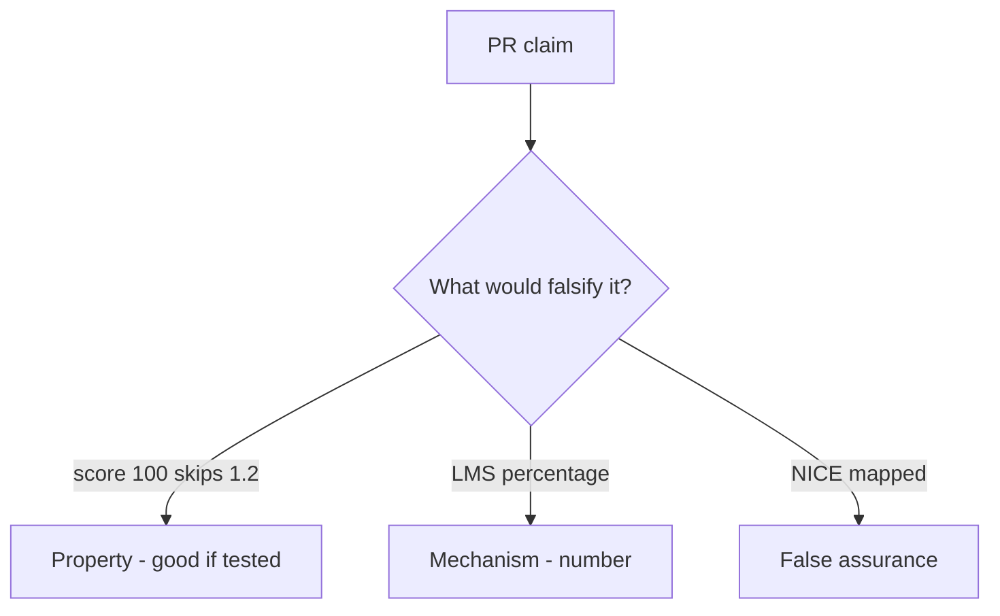

# 0.2-LO-08 — Review quiz-as-skip as a PR

**Kind:** code-review
**Loop step:** Review
**Standards:** NICE as vocabulary. Gate 1 evidence rules.

## Review the fixture as if it were the course placement service

Review `labs/0.2/0.2-bridge/vulnerable/` as a SecureCollab / course-tooling PR. Your job is not to count suspicious lines. Reconstruct whether `quiz_score_grants_phase1_skip(100)` still returns true, compare that with the module invariant, and write changes a developer can verify.

Intended findings live only in `content/assessment/keys/0.2.md` — not here. Do not open the keys file until your review has been evaluated.

## Mental model: if score >= 80: skip_phase(1)

Start with this seeded smell: **`if score >= 80: skip_phase(1)`**. Label it property, mechanism, or false assurance before you accept the PR.

Classification starts at the protected effect (Phase 1 skip denied). Everything that is not an always-false skip at that call is a candidate ambient path.

## Seeded smells (label them yourself)

- `if score >= 80: skip_phase(1)`
- No link from diagnostic to 1.2 evidence
- Badge screenshot as Gate 1
- Adaptive path hides 1.4 accessibility residual

Also reject: live LMS attacks; keys in lessons; claiming Gate 0 or Gate 1; “they’re a senior hire”; treating a Git-bridge skip as a 1.2 skip.

## Misconceptions this module refuses

- Placement is a security clearance
- Fast learners skip invariants
- Tool fluency is threat modeling
- NICE competency is a 1.2 allow cell
- An LMS percentage is ASVS coverage

## Practice

Write three review notes a maintainer could act on. Each note: observation, property or false assurance, suggested structural change, residual you will **not** delete. Tie at least one to `test_high_quiz_score_is_not_authorization`.

## Transfer

Clinic PR that “added an onboarding quiz and NICE mapping” without keeping 1.2 required is an incomplete mediation review. Name the independent falsehood that would still keep score 100 from skipping isolation labs.

## Non-goals

Do not merge by adding a comment “advanced learners may skip.” That comment is a residual without an owner. Do not attack an LMS to prove the finding.
