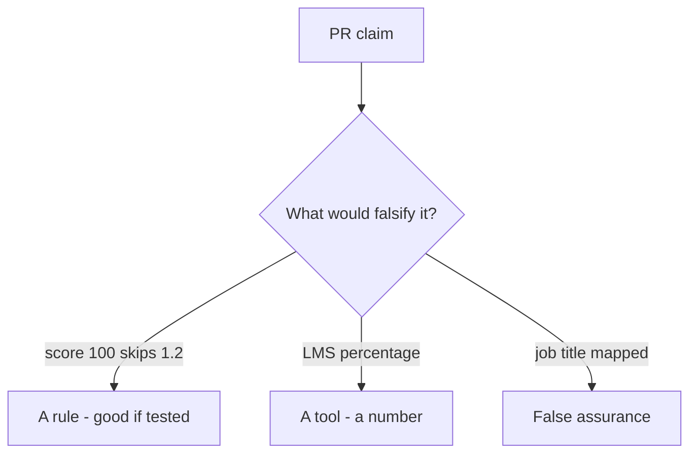

# Would you merge this quiz-as-skip?

**Kind:** code-review
**Loop step:** Review
**Standards:** NICE as vocabulary. Gate 1 evidence rules.

## Review the practice files as if they were the course placement service

Review `labs/0.2/0.2-bridge/vulnerable/` as a pull request for a course tool. Check whether `quiz_score_grants_phase1_skip(100)` still returns true.

The answers are not on this page. Do not open the keys file until someone has looked at your review.

## Picture: if score >= 80: skip part 1

**`if score >= 80: skip_phase(1)`**. Label it a rule, a tool, or false assurance before you accept the change.

A part-1 skip still has to be denied. If the change never checks an always-false skip, that leftover path is still open.

## Problems to find (name them yourself)

- `if score >= 80: skip_phase(1)`
- No link from diagnostic to 1.2 evidence
- Badge screenshot as check-in 1
- Adaptive path hides 1.4 accessibility leftover

Also reject: live LMS attacks; keys in lessons; claiming check-in 0 or check-in 1; “they’re a senior hire”; treating a Git-bridge skip as a 1.2 skip.

## Common mix-ups

- Placement is a security clearance
- Fast learners skip rules
- Tool fluency is threat modeling
- A job-title competency is a 1.2 allow cell
- An LMS percentage is industry-list coverage

## Practice

Write three notes a maintainer could act on, and tie at least one to `test_high_quiz_score_is_not_authorization`. For each: what you saw, whether it is a rule or false assurance, a structural change, leftover risk you will **not** delete.

## Use it somewhere new

A clinic change that “added an onboarding quiz and a job-title mapping” without keeping 1.2 required is a skipped-check review. Name the independent falsehood that would still keep score 100 from skipping isolation labs.

## What this page is not doing

Do not merge by adding a comment “advanced learners may skip.” That comment is leftover risk without an owner. Do not attack an LMS to prove the finding.
