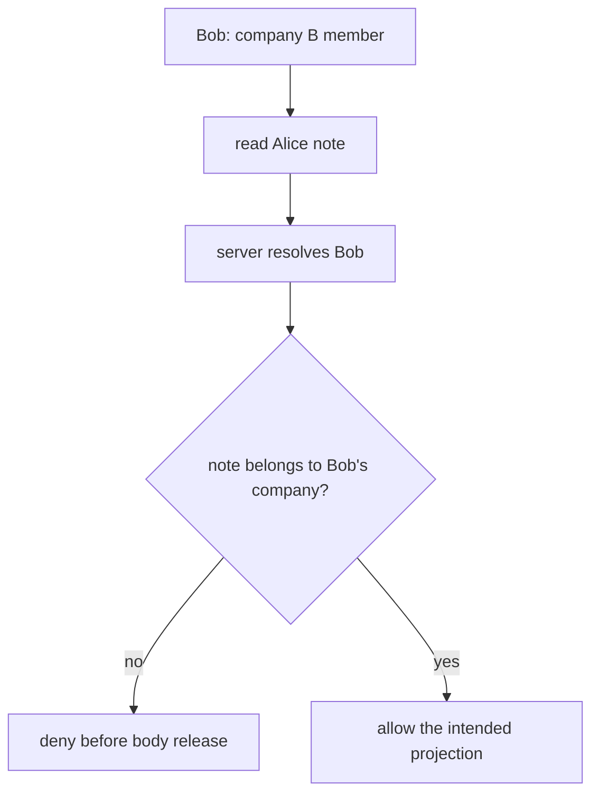

# Start with a note that must stay private

**Kind:** concept-model
**Loop step:** 1 Property

## Make a prediction before naming a tool

SecureCollab is a notes app used by two companies. Alice belongs to Company A. Bob belongs to Company B. Alice creates a note and Bob sends a valid request for that note.

**Prediction:** should the server return Alice's note body to Bob? Write “allow” or “deny” before reading on.

The answer is **deny**. Bob may have a valid login, but that only tells the server who Bob is. It does not establish that Bob may read this particular note. The rule is:

> A current member of Company B must not receive any Company A note-body bytes through an in-scope read path.

That sentence names an asset, a subject, an action, a boundary, and the result that would disprove it. “We use TLS” names a tool; it does not answer the prediction.



## A worked example and a partial row

| Field | Filled example |
|---|---|
| Asset | Alice's note body |
| Subject and action | Bob requests `read_body` |
| Attacker capability | Bob changes request identifiers and fields |
| Trusted source | Server-resolved member and note relationship |
| What must not happen | Company B receives Company A note bytes |
| Evidence | Cross-company negative test |
| Leftover | Logs, exports, backups, and workers need their own checks |

Complete this row before opening the next page:

```text
Asset: Alice's note body
Subject/action: Bob / __________________
Attacker can: change __________________
Trusted source: __________________
What must not happen: __________________
Evidence oracle: __________________
```

**Feedback:** if your answer says “Bob is logged in, so allow,” you have described authentication but skipped authorization. If it says “TLS prevents it,” you have named a transport control without an object-level rule. If it names the note, company, action, and negative oracle, you have the shape needed for the catalogue.

## What the tool cannot prove

A password hash can protect stored password verifiers under a bounded snapshot assumption; it cannot prove note authorization. TLS can protect a channel; it cannot stop the server selecting the wrong note. A scanner can find symptoms; it cannot supply the missing product model.

## Practice

Write one new negative case: Bob changes the note identifier, or Alice's membership is revoked before the read. Say which part of the rule stays the same and which state must be checked again. Then continue to the catalogue page.
