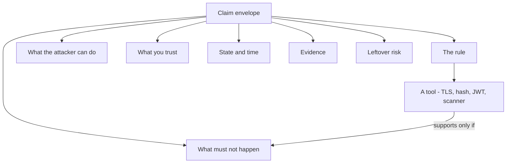

# Security is a claim about what must stay true

**Kind:** concept-model 
**Loop step:** 1 Property 
**Standards:** Saltzer and Schroeder (1975, seminal) for named protection principles; NIST CSF 2.0 (final) for outcome functions, not a control catalogue.

## The question that comes before tools

Suppose a design review begins with: “We use TLS, bcrypt, JWTs, a web application firewall, and a weekly scanner.” You still do not know what security means for the product.

Those sentences name tools. A security rule names an outcome that must stay true while a stated attacker acts, a part of the system fails, or time passes. A useful rule is precise enough that a reviewer can imagine a counterexample.

For the notes app, compare these claims:

| Claim | Type | Why |
|---|---|---|
| We use TLS. | A tool | It says nothing about note bodies in logs, backups, browser storage, or a response sent to the wrong company. |
| A member of company B cannot read a company A note through any public API operation. | A rule, but incomplete | It names an actor, object, action, and forbidden result. It still needs assumptions, time, and evidence. |
| Company A note bodies stay unreadable to company B members through the public API, the application logs they can reach, and retained exports; the browser is hostile and the API policy layer is trusted. | A rule you can check | It names channels, what the attacker can do, what you trust, and what you still keep around. |

A tool is valuable only after you can say which rule it supports, under which assumptions, and how you will know when it stops working.

## The envelope around a rule

A useful rule is more than a slogan. Treat the rule as the center of an envelope:

| Element | Question it answers | Weak version | Stronger notes-app version |
|---|---|---|---|
| Asset | What is valued? | data | note body, membership record, audit event |
| Subject and action | Who may do what? | users can access notes | a current company A member may read a company A note |
| What the attacker can do | What can they control? | malicious user | a signed-in company B member can change every browser request and guess identifiers |
| What you trust | What must behave correctly? | the server | the FastAPI authorization path and PostgreSQL role are trusted; the browser is not |
| State and time | When must it hold? | always | during a request and across retained logs, exports, and a backup restore |
| What must not happen | What observable result disproves it? | breach | a company B response contains any company A note-body bytes |
| Evidence | How could a reviewer challenge it? | scanner passes | cross-company negative tests, log-capture tests, and restore-path review |
| Leftover risk | What remains outside the claim? | none | a cloud administrator with a database snapshot is out of scope for this part and triggers a later encryption review |

The envelope stops universal claims. “No unauthorized person can ever read a note” sounds strong but is not testable until unauthorized, read, note, channels, time, and trusted pieces are defined.

## Picture: a tool sits inside the envelope, not above it

If you start the review at *the tool*, you never reach a counterexample. If you start at *what must not happen*, you can ask whether bcrypt, TLS, or a scanner even belongs in the picture.

## Eight useful names, not eight checkboxes

The names below are prompts. They overlap, trade off, and depend on the product.

| Name | Notes-app shape | A counterexample |
|---|---|---|
| Confidentiality | A note body is shown only to people allowed for that note and company, over the channels in scope. | A support log contains the full body. |
| Integrity | Note content and membership change only through allowed transitions; corruption is detectable. | A retry applies the same membership removal twice and leaves an invalid state. |
| Availability | One company’s expensive request cannot exhaust every company’s ability to read existing notes beyond the stated recovery goal. | An unbounded export starves normal reads. |
| Authenticity | Security-relevant actions attributed to a person have evidence tied to the authenticator and service path used. | An internal header supplied by a browser is recorded as a worker identity. |
| Authorization | Being signed in never grants an action by itself; the current person-object-action relationship is checked at the enforcement point. | A signed-in company B member reads company A by changing a note identifier. |
| Accountability | High-impact changes produce privacy-safe evidence enough to reconstruct who asked for what and which policy decision occurred. | A company-admin role grant is stored with no actor or correlation identifier. |
| Privacy | Collection, retention, inference, and disclosure stay within the stated purpose, even if storage is confidential. | Deleted note titles remain in analytics indefinitely. |
| Safety | Failure and recovery do not create unacceptable harm to people or surrounding systems. | Account recovery exposes a coerced user or permanently locks out someone who needs an accessible path. |

Do not force all eight into every row. If a name is not claimed, record that as out of scope and the later change that would make it relevant. Leaving it out on purpose is different from forgetting it.

## A worked example: “passwords are hashed”

Start with the tool claim: “The notes app is secure because passwords are hashed.”

1. **Possible rule supported:** a database snapshot alone should not reveal reusable plaintext passwords within an assumed work factor.
2. **Attacker and preconditions:** the attacker obtains stored credential verifiers but not the application’s live memory, password-entry logs, or reset channel.
3. **Tool:** a slow, salted password-hashing construction and safe parameter management.
4. **What the tool cannot do:** weak user passwords can still be guessed; an application log may capture plaintext before hashing; a reset flow can bypass the password; hashing says nothing about note authorization.
5. **Impact if the original slogan is trusted:** reviewers may incorrectly mark note confidentiality, session security, and recovery as covered.
6. **How you stop it:** narrow the claim and design each unrelated rule separately.
7. **How you notice:** review logs and telemetry schemas for credential fields; watch unusual authentication attempts without recording passwords.
8. **How you recover:** invalidate exposed credentials or sessions, remove captured sensitive data, notify affected users when required, and repair the capture path.

The root cause is not “bcrypt is bad.” It is treating a bounded tool as a universal rule.

## Protection principles shape which tool you pick

Saltzer and Schroeder’s principles help test a proposed tool after the rule is clear:

- **Keep the mechanism small:** can the enforcement path be smaller and easier to review?
- **Fail closed:** is a missing or ambiguous decision a denial?
- **Check every path:** is permission checked on every relevant access, including retries and alternate routes?
- **Open design:** would disclosing the design break the rule? If so, secrecy has become an unrecorded assumption.
- **Least privilege and least sharing:** can what you trust, and how far a break can spread, shrink?
- **People can still use it:** can legitimate users complete the secure path, including recovery?
- **Record a compromise:** when prevention is incomplete, is useful evidence likely to survive?

The principles do not prove a design. They are reasoning tools for finding hidden assumptions and unnecessarily large trust.

## Outcome labels are not proof

NIST CSF 2.0 groups outcomes under Govern, Identify, Protect, Detect, Respond, and Recover. The sequence reminds you that prevention alone is incomplete. A Protect tool does not satisfy a rule merely because it maps to a framework label. Evidence must still show that the system-specific “must not happen” is prevented or bounded.

## Practice: turn a slogan into a bounded claim

Choose one slogan:

- “We encrypt everything.”
- “Only admins can do that.”
- “The framework validates input.”
- “We keep audit logs.”

Write six lines:

1. the asset, subject, action, and what must not happen;
2. what the attacker can do;
3. what you trust and what you do not;
4. state and time horizon;
5. one piece of negative evidence;
6. one leftover risk or out-of-scope note.

A peer should be able to invent a concrete counterexample. If they cannot, your claim is probably too vague. If their counterexample is outside your recorded scope, your claim may be precise — but the scope must be defensible.

## Check your model

Before continuing, you should be able to explain:

- why confidentiality and privacy are not synonyms;
- why a tool can support one rule while failing another;
- why “always” usually hides channels or time;
- why noticing and recovery belong in the claim when prevention is not absolute;
- why a secure framework default is not an application guarantee.

The next page turns this vocabulary into a versioned list of rules for the notes app.
