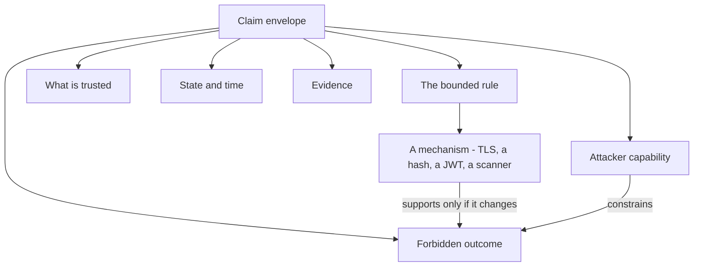

# Security is a claim about what must stay true

**Kind:** concept-model
**Loop step:** 1 Property
**Standards:** Saltzer and Schroeder (1975, seminal) for named protection principles; NIST CSF 2.0 (final) for outcome functions, not a control catalogue.

## The claim this lesson defends

Here is the falsifiable sentence the rest of this module exists to defend: **a sentence that names a tool — TLS, a password hash, a JWT, a green scanner — is not a security invariant, because the tool can be fully present while the outcome it is assumed to guarantee still fails somewhere else.** A tenant's notes can stay unreadable in the login form and still leak in a support log the login form never touches; a signed JWT can prove who issued a token and say nothing about whether the reader who accepts it enforces the right tenant boundary. If a claim cannot be made false by some concrete, describable event, it is not doing the job a security claim exists to do, and naming a mechanism is the single most common way a claim ends up unfalsifiable while still sounding rigorous.

Suppose a SecureCollab design review opens with: "We use TLS, Argon2, signed JWTs, and a weekly dependency scanner." Every one of those four things can be true on the day a Tenant B member reads a Tenant A note through a support export the scanner never inspects, because none of the four claims says anything about exports. The review has described tools. It has not stated an outcome that would be false in that scenario, so it cannot yet be checked against that scenario, and a mechanism list that cannot be checked against the failure it is supposed to prevent has not yet become a security claim at all.

## The envelope a rule needs to be checkable

A checkable rule is more than a slogan with a subject and a verb. Treat the rule as the center of an envelope of the following elements, each one narrowing the claim until a reviewer can imagine a concrete event that would break it.

| Element | Question it answers | Weak version | Bounded SecureCollab version |
|---|---|---|---|
| Asset | What is valued? | data | note body, tenant-membership record, audit event |
| Subject and action | Who may do what? | users can access notes | a current Tenant A member may read a Tenant A note |
| Attacker capability | What can they control? | malicious user | a signed-in Tenant B member can modify every browser request and guess note identifiers |
| Trust | What must behave correctly? | the server | the API's tenant-policy check and the structured event constructor are trusted; the browser and every client-supplied label are not |
| State and time | When must it hold? | always | across a live request, retained application logs, and generated tenant exports |
| Forbidden outcome | What observable result disproves it? | breach | a Tenant B response, log line, or export contains any byte of a Tenant A note body |
| Evidence | How could a reviewer challenge it? | scanner passes | cross-tenant negative tests, log-capture tests, and export-path review |
| Residual risk | What remains outside the claim? | none | a cloud administrator with direct database-snapshot access is out of scope for Phase 1 and is recorded as a review trigger |

Each row removes one place a universal-sounding sentence hides an assumption. "No unauthorized person can ever read a note" sounds strong precisely because it hides all eight rows at once; it becomes checkable only once unauthorized, read, note, the channel it travels through, the time horizon, and the trusted component are all named, and it is at that point — not before — that a reviewer can propose the concrete counterexample that would break it.

## A worked example: "passwords are hashed" as a mechanism-only claim

Start with the tool claim as SecureCollab's SECURITY.md currently states it, in the exact shape the vulnerable lab fixture uses:

```yaml
property: We are secure because we use TLS
because:
  - Passwords are hashed
  - We use TLS
  - The scanner is green
```

Read that block the way a reviewer has to. The `property` field names a mechanism and calls it done; the `because` list adds two more mechanisms and a scanner result, and none of the four lines names an asset, an attacker, a trust boundary, or an observable outcome that would falsify the claim. Follow one of those mechanisms through the reasoning a bounded claim requires. The possible rule a password hash could support is narrow: a database snapshot alone should not reveal a reusable plaintext password within an assumed attacker work factor. The attacker who matters for that rule has obtained the stored credential verifiers but not the application's live memory, its password-entry logs, or its account-recovery channel — a materially different attacker from the one who matters for note confidentiality, who never needs the password database at all. The tool that supports this narrow rule is a slow, salted hashing construction with honestly recorded parameters, and that tool cannot do several things a reviewer must not assume it does: it cannot stop a user from choosing a guessable password, it cannot stop an upstream log line from capturing the password in plaintext before hashing ever runs, and it says nothing whatsoever about which tenant a signed-in member is allowed to read notes from. If the original four-line slogan is trusted as written, a reviewer can mark note confidentiality, session security, and account recovery as "covered" by a control that never touched any of them, and design work on all three quietly stops. The repair is not a better hash function; Argon2id was already correctly chosen. The repair is refusing to let one bounded mechanism claim to answer three unrelated questions, and deriving a separate, checkable rule for each one instead.

## Picture: a mechanism sits inside the envelope, not above it



A reviewer who starts at the mechanism box and works upward never reaches the forbidden-outcome box, because nothing about a hash function or a TLS handshake forces the question "which observable result would prove this wrong." A reviewer who starts at the forbidden-outcome box and works downward can ask, for each mechanism proposed, whether it actually changes that outcome — and that ordering is the entire difference between a design review that catches a false-assurance claim and one that rubber-stamps it.

## Eight names, used as prompts, not as a checklist to complete

Confidentiality, integrity, availability, authenticity, authorization, accountability, privacy, and safety describe different forbidden outcomes for the same SecureCollab system, and treating them as eight boxes to tick produces eight shallow claims instead of the two or three that actually matter this phase. A note body reaching a support log the design never intended is a confidentiality failure; a retried membership removal that leaves a tenant in an inconsistent state is an integrity failure, because the object changed through a path the design never authorized as a single clean transition. Authentication answering "who is this" is not authorization answering "may this identity do this action on this object" — a signed-in Tenant B member changing a note identifier in the URL is authenticated the whole time, and the forbidden outcome is entirely an authorization failure, not an authentication one. Do not force all eight names into every catalogue row. A property that is genuinely out of scope this phase — safety, for a text-notes product with no physical actuator — is recorded as a non-goal with a review trigger, and that recorded omission is different from a name nobody thought to ask about at all.

## Saltzer and Schroeder's principles test a proposed mechanism, once the rule is clear

Saltzer and Schroeder's protection principles are reasoning tools for a mechanism a rule has already produced, not a substitute for stating the rule. Keeping the enforcement path small asks whether the tenant-policy check can be made narrow enough that a reviewer can read all of it in one sitting. Fail-safe defaults asks whether a missing or ambiguous authorization decision denies rather than allows. Complete mediation asks whether every relevant access is checked, including a retried request or an export path that reaches the same data through a different route. Open design asks whether the rule would still hold if the policy code were fully public, which is the question that catches "the scanner is green" hiding an assumption that nobody has actually read the policy logic. Least privilege and least common mechanism ask how far a single compromised credential or shared parser can reach. None of these principles proves a design correct; each one is a question that surfaces a hidden assumption the mechanism-only slogan was built to hide.

## Outcome labels are not proof either

NIST CSF 2.0 groups outcomes under Govern, Identify, Protect, Detect, Respond, and Recover, and the sequence is useful precisely because it reminds a reviewer that prevention alone is an incomplete answer — a Protect-labeled control does not satisfy a rule merely because a framework maps it to that word. A green dashboard tagged "Protect: password hashing implemented" is exactly as mechanism-only as the four-line SECURITY.md above; the label changed, and the missing forbidden outcome, attacker, and evidence did not. Evidence must still show that the SecureCollab-specific "must not happen" is actually prevented, or bounded, and detected when prevention is not absolute — a claim [06-operate.md](06-operate.md) returns to once a mechanism exists to operate.

## Practice: turn a slogan into a bounded claim

Run this only inside `labs/1.1/1.1-invariant-catalogue/`. The data is synthetic; every note body, tenant name, and identifier in the fixtures is a fixture label, not a real credential or real personal data.

Choose one SecureCollab slogan — "we encrypt everything," "only tenant admins can do that," "the framework validates input," or "we keep audit logs" — and write six lines: the asset, subject, action, and forbidden outcome; what the attacker can control; what is trusted and what is not; the state and time horizon; one piece of negative evidence that would falsify the claim; and one residual risk or non-goal. A peer who reads your six lines should be able to invent a concrete event that would break the claim as written. If they cannot invent one, the claim is still too vague to be a rule; if the event they invent falls outside your recorded residual risk, the claim may already be precise enough, but the residual-risk line has to defend that boundary rather than merely assert it.

## Check yourself

Before continuing to [02 SecureCollab's first invariant catalogue](02-securecollab-catalogue.md), you should be able to explain why confidentiality and privacy answer different questions, why a mechanism that supports one rule can be irrelevant to another, why "always" almost always hides an unstated channel or time horizon, and why a secure framework default is not automatically an application-level guarantee. The next lesson turns this envelope into a versioned catalogue naming SecureCollab's actual assets, actors, and forbidden outcomes.

## What this page is not doing

This lesson does not claim SecureCollab has a deployed service, a production tenant boundary, or a real customer's data; Phase 1 is the product model only, and the vulnerable fixture quoted above is a course fixture, not a real security disclosure. Answer keys are not on this site.
