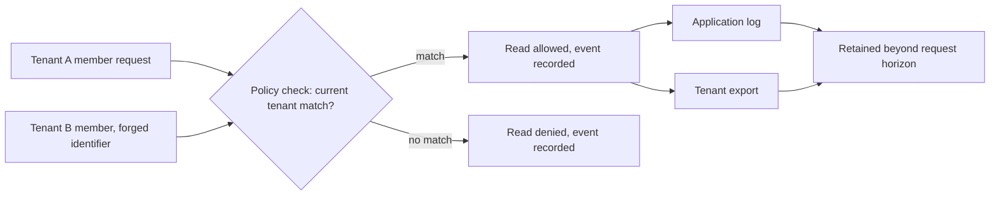

# Build SecureCollab's first invariant catalogue

**Kind:** design-exercise
**Loop step:** 2 Model

## What a catalogue row has to name

The previous lesson stated the claim: a mechanism is not an invariant. This lesson turns that claim into a construction rule for **SecureCollab**, the tenant-based notes product this curriculum builds toward, at the point in Phase 1 where only the product model exists — no deployed service, no production database, no real tenant. A catalogue row is testable only when it names the asset, the subject and action, the attacker's capability, which components are trusted and which are explicitly not, the state and time horizon the claim covers, and the forbidden outcome that would disprove it; a row missing any one of those six elements is not yet a claim a reviewer can challenge, it is a sentence waiting for the missing pieces. This is the model step of the loop, so the output is a catalogue, not yet a mechanism and not yet an implementation — [01-property-vs-mechanism.md](01-property-vs-mechanism.md) already showed why skipping straight to a mechanism produces a claim nobody can falsify.

SecureCollab's Phase 1 model includes tenants, tenant membership, tenant administrators, text notes, and privacy-safe security events; it deliberately excludes files, public sharing, support impersonation, background workers, webhooks, and any real personal data, because none of those exist yet and a claim about them would be a claim about nothing. The minimum adversaries a Phase 1 catalogue must consider are an unauthenticated internet client, an authenticated cross-tenant member who fully controls their own browser, a stale or over-privileged tenant administrator, a faulty or abusive authorized client, and an operator with ordinary log access — a privileged infrastructure administrator is recorded as a residual risk rather than defended against, because Phase 1's trusted computing base does not yet include the isolation controls that adversary would require.

## Two claims that look alike and are not

The two discriminations below matter more than any single row, because they are the two ways a catalogue looks finished while still being empty.

The first looks incomplete and is actually fine: "cloud-administrator access to the database is out of scope for Phase 1" reads like an admission of failure, but a claim that names its own boundary and the review trigger that will reopen it — a later module introducing backup access, say — is a bounded claim doing exactly what a bounded claim should do. A catalogue with five rows and five honestly recorded non-goals is stronger than a catalogue that silently claims to cover everything and covers nothing precisely, because a reviewer can check a non-goal against the current design and confirm it is still true, while a silent universal claim gives the reviewer nothing to check at all.

The second looks complete and is not, and it is the more dangerous failure because every field is technically filled in:

```yaml
property: Notes must never leak to an outsider
assets: [notes]
attackers: [a bad actor]
trust: [the server]
untrusted: [the client]
forbiddenOutcomes: [notes leak somehow]
evidence:
  normal: [thing works]
  negative: [thing is denied]
```

Every key the schema requires is present, every list has at least one item, and the property sentence even uses the word "never." Read the content instead of the shape: "a bad actor," "the server," "somehow," and "thing works" name nothing about SecureCollab specifically — the same five lines would validate against a claim about a photo-sharing app, a payroll system, or a chat client, because nothing in them depends on tenants, notes, or membership at all. A reviewer testing this row the way the previous lesson's envelope demands cannot invent a concrete falsifying event, because there is no concrete anything to falsify; "somehow" is not a channel, and "a bad actor" is not an attacker capability. A catalogue built from five rows shaped like this one satisfies a naive count of "at least five rows" while teaching nothing, and [03-local-hashed-claim.md](03-local-hashed-claim.md) shows what a reviewer — and the lab's validator — has to check for instead of field presence alone.

## Naming actors, principals, components, and channels without collapsing them

| Word | Precise question | SecureCollab Phase 1 answer |
|---|---|---|
| Actor | Who or what takes part? | A tenant member, a tenant administrator, an operator, or an attacker acting through any of those roles |
| Principal | Which identity is used for a decision? | The current member's authenticated identity as resolved server-side, never a client-supplied tenant label |
| Component | Where does the logic or data run? | The API's tenant-policy check, the persistence layer, the structured event constructor |
| Channel | How does the data travel? | An in-scope API response, an application-log line, or a generated tenant export |
| Trust boundary | Where does an assumption change? | Where a client-controlled request field stops being trusted and a server-resolved tenant identifier starts being trusted |

These words are not interchangeable, and collapsing them is how a catalogue row quietly widens its own claim. "The server is trusted" answers nothing about which component inside the server the claim actually depends on; the policy-check component and the event-constructor component can fail independently of each other, and a row that says "the server" instead of naming both has hidden a place the claim could break without anyone noticing which piece broke.

## State, time, and what can change between the check and the use

A claim about SecureCollab notes has to say which of several time horizons it covers, because the forbidden outcome can appear at any of them even when the request-time check is correct. The request-time horizon covers the single API call a member makes right now; the retained-log horizon covers what a log line still holds a year later, after the request that produced it is long forgotten; the export horizon covers a generated tenant export a member downloads once and can re-read indefinitely; and the restore horizon covers a backup that reintroduces a note or a membership record whose deletion had already been recorded as complete. A membership removal checked correctly at request time can still leave a stale grant usable if a concurrent request read the old membership state before the removal committed — the check happened, but the state it checked against was not the state that mattered by the time the use occurred. Naming which of these horizons a row covers, and which it explicitly does not, is what stops "we checked authorization" from silently meaning only the first of the four.

## Picture: one authority decision, several places state can diverge



The diagram earns its place by showing what the envelope in [01-property-vs-mechanism.md](01-property-vs-mechanism.md) already demanded in words: the same allowed outcome fans out into two retained channels that a request-time-only claim never mentions, and a catalogue row that stops at `Allow` has covered one of the three places a Tenant A note body can end up.

## Practice: draft one full-envelope row

Run this only inside `labs/1.1/1.1-invariant-catalogue/`. The data is synthetic; every tenant, member, and note in the fixtures is a fixture label, not a real account.

Pick one SecureCollab asset from this phase's model — a note body, a membership record, or an audit event — and write a complete row: property, assets, attackers, trust, untrusted, time horizon, forbidden outcomes, and at least one item in each of the four evidence modes the next verification lesson names in full. Before you check it against `fixed/security_claim.yaml`, run it past the second discrimination above: could every field in your row be copied into a claim about an unrelated product without changing a single word? If yes, the row is shaped correctly and says nothing yet, and the fix is to replace the generic nouns with the specific ones — which member, which tenant boundary, which log line — that only SecureCollab's own model can supply.

## Check yourself

You should be able to name SecureCollab's Phase 1 assets without checking this page, explain why "the server" is not a trust statement a reviewer can act on, and give one example of a claim that looks incomplete but is bounded correctly, and one that looks complete but names nothing specific. [03-local-hashed-claim.md](03-local-hashed-claim.md) takes a mechanism-only claim through the module's actual lab and shows exactly which of these gaps the validator can and cannot catch.

## What this page is not doing

This model describes SecureCollab's Phase 1 product intent, not a running service; no tenant, member, or note in this lesson or its lab fixtures is real. Answer keys are not on this site.
