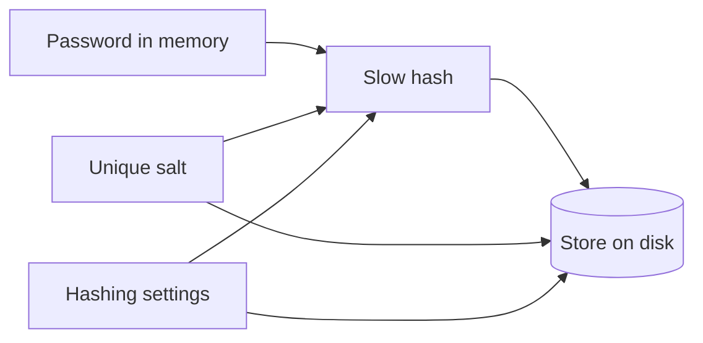

# The smallest honest password store

**Kind:** design-exercise
**Loop step:** 4 Build

## The rule

A local password file may be written only as a **slow hash**, a **unique salt**, and **honest hashing settings**. Checking a password uses a **compare that does not leak timing**.

That is the whole mechanism for this week. Not a session cookie. Not OAuth. Not "the framework hashed it."

## Picture

**Minimum fields**

| Field | Why |
| --- | --- |
| Hash | What you compare against. Never store the password. |
| Unique salt | Two users with the same password must not look the same on disk. |
| Hashing settings | So you can raise the cost later without pretending an old file was stronger. |
| Optional pepper | Extra secret, not in the same file as the hash. If you skip it, say so. Do not claim it exists. |

**How you check a password**

1. Load the row for that user.
2. Hash the typed password with **that row's** salt and settings.
3. Compare hash bytes with a function meant for secrets (`hmac.compare_digest` in Python, or Argon2's verify). Do not use `==` on strings if you can avoid it.
4. On success, you may set a **local** flag. That flag is not a server session.

**What you refuse**

- Base64 or reversible "encryption" of the password.
- A fast hash (plain SHA-256 of the password) as the password store.
- One salt for the whole app.
- Logging the password, the salt, or the hash.

## Frameworks are not the rule

FastAPI does not hash for you. Next.js does not hash for you. If you call `argon2.PasswordHasher().hash(...)` and write the result plus salt plus settings, **you** kept the rule. If you write `password=` into JSON, **you** broke it — no matter what the README claims.

Pin a real algorithm (Argon2id is the default in this practice). Do not pin a wish.

## Check yourself

Sketch the store record. If you cannot point to hash, unique salt, and settings, the sketch is not done.

Name the compare function you will call. If you cannot, you are not ready to merge.

## What can still go wrong

This store does not encrypt the disk. It does not survive a stolen laptop by itself. It does not become a server login because you reused the same JSON shape.

## Where this shows up later

Auth topics will move this pattern behind an API and add sessions. The fields do not get to disappear — they get a new attacker.
