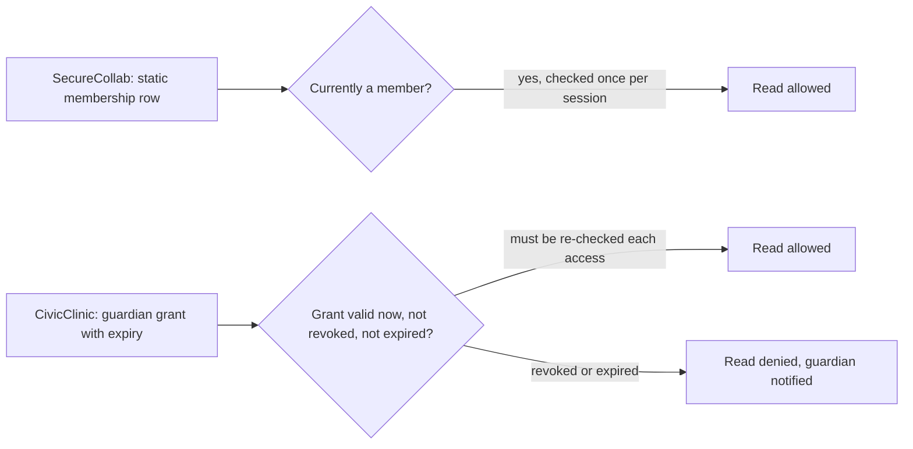

# Transfer the method to a changed system

**Kind:** transfer-challenge
**Loop step:** 7 Generalize

## Renaming nouns is not transfer

The temptation at this step is to take `fixed/security_claim.yaml`, replace "tenant" with "clinic," "note" with "appointment," and "member" with "patient," and call the result a transfer exercise. That version would still validate against `catalogue_validator.py`'s shape checks, and it would prove nothing about whether you can apply the method — asset, subject, attacker, trust, time, forbidden outcome, evidence, operations — to a system whose actors, authority relationships, and time horizons are actually different, which is the entire point of a generalize step. This lesson's target system, **CivicClinic**, is a scheduling and records product for a medical clinic, and at least three of its structural facts have no SecureCollab equivalent at all: a guardian's authority over a dependent's record is delegated and revocable rather than a static membership row, a household frequently shares one phone number across several patients, and an appointment slot is a scarce, human-scheduled resource rather than a unit of compute capacity a server can simply provision more of.

## Which SecureCollab claims survive, and why

Cross-tenant confidentiality survives in shape: CivicClinic needs a row stating that Guardian household A's records must never be returned to Guardian household B through any in-scope response, log, or export, for the same reason SecureCollab's row exists — an attacker who is a legitimate, authenticated user of the system but not of this specific record should not be able to reach it by manipulating an identifier. The structural reason it survives is that both systems draw a boundary around "which authenticated party may reach which record," and that boundary question does not depend on whether the record is a note or an appointment. Accountability survives for the same structural reason: any high-impact change to who may act on a record needs privacy-safe evidence, whether the record is a tenant-administrator membership grant or a guardian-relationship grant.

## Which SecureCollab claims break, and why they break

Membership integrity does not survive unchanged, because SecureCollab membership is close to static within a session — a member either belongs to a tenant or does not, and that fact rarely changes mid-task — while guardian authority over a dependent is designed to change: it can be granted for a fixed window, shared between two guardians, or revoked by a court order or a custody change, and a claim that treats "is this person a guardian" as a fact checked once and cached is a claim that will be true at check time and false by the time it is used, exactly the check-to-use gap [02-securecollab-catalogue.md](02-securecollab-catalogue.md) named as a time-horizon question. Confidentiality's trust list breaks at a different point: SecureCollab's model can treat "the browser" as one untrusted client controlled by one attacker, while a shared family phone means the device, the session, and the human using it at any given moment are three separate facts that do not move together — a message or a session left open on a shared phone can be read by a different family member than the one who authenticated it, which is a failure mode SecureCollab's single-user-per-browser assumption never has to model. Availability breaks hardest of all: SecureCollab's row bounds compute capacity, and a fix for compute scarcity is more servers; CivicClinic's scarce resource is appointment slots a human scheduler allocates, so the forbidden outcome is not "the system slows down," it is "an automated retry or a bulk rebooking script consumes slots a human triage process should have kept available for an urgent case," and no amount of added server capacity touches that failure at all — the mechanism has to be a fairness or priority rule in the scheduling logic itself, not an infrastructure change.

## Worked contrast: the same row, two authority shapes

Read the two claims side by side rather than in the abstract:

```text
SecureCollab (fixed/security_claim.yaml, SC-INTEG-01):
  property: Membership and note records must change only through an
            authorized transition, and a denied or retried operation
            must leave no partial forbidden state.
  trust: [policy decision and transaction share the same authority context]
  timeHorizon: from authority check through commit, retry, revocation, restore

CivicClinic candidate:
  property: A guardian's record access must reflect the CURRENTLY valid
            delegation at the moment of access, not the delegation that
            was valid when a session began.
  trust: [the delegation-status check re-runs on every access, not once at login]
  timeHorizon: from delegation grant through revocation, court-ordered
               change, and any access that occurs between those events
```

The SecureCollab row's `timeHorizon` already mentions revocation, but its `trust` line only has to hold "within one sequential model" per the fixed fixture's own residual-risk note — membership rarely changes mid-session, so checking once per session is a defensible simplification there. The CivicClinic candidate cannot make that simplification: a guardian's authority is designed to be revoked mid-session, sometimes urgently, so the trust line has to say the check re-runs on every access, not once — the property text alone does not force that difference into view; only tracing the `trust` and `timeHorizon` fields against what actually changes in each system does.

## Picture: the same decision point, two different revocation shapes



The diagram earns its place by showing what the prose above argued: the decision node on the SecureCollab side answers a question that barely moves during a session, while the CivicClinic side has to answer the same-shaped question against a fact that is explicitly designed to change out from under it, which is why "checked once per session" is a safe simplification on one side and a forbidden shortcut on the other.

## Success criteria for your CivicClinic catalogue

Write at least five rows using the same envelope [01-property-vs-mechanism.md](01-property-vs-mechanism.md) and [02-securecollab-catalogue.md](02-securecollab-catalogue.md) required, and satisfy three conditions a reader can check without you present. First, at least three rows must depend on a CivicClinic-specific fact — delegated and revocable guardian authority, a shared household phone number, or human-scheduled capacity — in a way that changes what the mechanism or the evidence has to be, not only what noun appears in the property sentence. Second, name at least three explicit SecureCollab assumptions from `fixed/security_claim.yaml` that fail for CivicClinic and say exactly why each one fails, the way this lesson did for membership integrity, confidentiality's trust list, and availability above. Third, for at least one row, design a recovery path a guardian without reliable internet access or without English as a first language can still complete, because [06-operate.md](06-operate.md)'s point about accessible human recovery paths applies with more force here, not less — a clinic's guardians are not a self-selected population of engineers who can be assumed comfortable with a technical support flow.

## Practice

Run this only inside `labs/1.1/1.1-invariant-catalogue/`; write your CivicClinic catalogue as a new YAML file in a scratch location outside the lab's `vulnerable/` and `fixed/` directories, since those are graded course fixtures and not yours to edit. The data is synthetic; do not model a real clinic, a real guardian, or real medical information.

## Check yourself

Before treating your catalogue as finished, ask whether a reader could tell it was written for CivicClinic and not for SecureCollab if you deleted every proper noun. If the answer is no, at least one row is still a rename, and the fix is to trace that row's mechanism and evidence back to a CivicClinic-specific fact the way this lesson traced membership integrity to guardian-authority revocability.

## What this page is not doing

This lesson does not model a real clinic's scheduling system, a real guardian-patient relationship, or real medical data; CivicClinic is a synthetic transfer target for this exercise only. Answer keys are not on this site.
