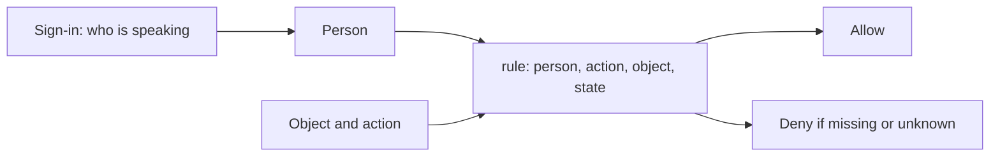

# Who is allowed is who can cause a specific effect

**Kind:** concept-model
**Loop step:** 1 Property
**Standards:** Saltzer and Schroeder (1975) on fail closed, checking every path, least privilege, and two independent conditions.

## The rule

For the notes app at this stage:

> A change to a note, a membership, a company record, or a permission record may happen only when a current rule on the server says this person may do this action on this object in its current state. Missing or unknown permission means no.

What must not happen is not only “a request with no login succeeds.” Bob can be signed in as a company B member and still must not read a company A note. An admin of company A must not become admin of company B. A person whose membership was removed must not keep acting just because an old login still names them.

Sign-in answers *who is speaking*. Who is allowed answers *whether this effect may happen*. Sign-in can be correct while who-is-allowed is completely wrong.

## Picture: a badge is not a decision

Treat who is allowed as a relation, not a badge:

```text
decision = policy(subject, action, object, state, grant, trusted_context, time)
```

- A **subject** is the person or program you are judging: a human, a service, a worker, or someone acting for someone else.
- An **action** is the effect: `read_body`, `list_summary`, `delete_note`, `grant_membership`.
- An **object** is what changes or is revealed: a note body, a title, a membership row, a company record, an export.
- **State** is facts that change the answer: ownership, membership on/off, published vs draft, a revocation version.
- A **grant** is where the permission came from: ownership, membership, a hand-off, a capability, an approved emergency path.
- **Trusted context** is attributes the server resolved. A company label from the browser is data to check, not permission.
- **Time** matters because a grant can start, expire, be taken back, or go stale between the check and the use.

This tuple is a thinking tool, not a required function signature. A database rule, an operating-system capability, or a graph of relationships can store it differently. The rule stays the same.



A valid session cookie fills *who is speaking*. It does not fill the table. **Leftover permission** is permission that comes from the surroundings rather than from a grant for this action — a signed-in user, a process-wide database login, an unscoped admin flag — used as if it were a yes for this person, this object, and this action.

## The access matrix is a big table

Imagine a large table. People are rows. Objects are columns. Each box holds allowed actions and conditions. That **access matrix** is the abstract who-is-allowed model.

| Person | Object | Action | Condition | Decision |
|---|---|---|---|---|
| Alice, current member of A | Note A-17 body | read | note belongs to A | allow |
| Bob, current member of B | Note A-17 body | read | no A membership or grant | deny |
| Admin A | Membership A-9 | revoke | admin is still current in A | allow |
| Admin A | Membership B-4 | revoke | admin of A is not admin of B | deny |

Real apps almost never store that literal table. They compress it.

### ACLs

An access-control list stores permission next to an object: “these people or groups may do these actions.” It is the table, written from the object’s side. You then have to ask: how do groups expand, what is inherited, what is the default, who owns the object, and how do you take permission back.

### Roles

A role bundles many permissions so people can administer them. “Company admin” might expand into membership-read, membership-grant, membership-revoke, and some note actions. A role is a compression of table rows, not magic. If you drop the company bound, `role == admin` becomes leftover permission over every company.

### Relationship or attribute rules

A rule may say a member can read notes whose stored company matches the member’s current company, or that an editor may update a draft but not a published note. These calculate table rows from trusted relationships, attributes, and state. If the attributes come from the requester, the fancy rule does not help.

### Capabilities

A capability is an unforgeable reference. Holding it is meant to be the grant. A random note id is not automatically a capability. For possession to be the grant, the design must deal with forgery, scope, who may present it, copying, shrinking, expiry, taking it back, and leaks.

Knowing `/notes/7f3...` is not permission if the product rule is company membership. Making the id harder to guess raises work. It does not change who is allowed.

## Hand-offs must shrink permission

A hand-off lets one person authorize another for a bounded action. The grant should record at least:

- who issued it and who received it;
- the action and the object or object set;
- limits and intended audience;
- issue time and expiry;
- whether it has been taken back, or a version that says so;
- whether further hand-off is allowed;
- what evidence you need at use time.

The receiver cannot honestly get more permission than the issuer can grant. If Alice can read Note A-17 but cannot delete it, a grant from Alice should not create delete permission. If Alice’s membership is removed, the design must say whether existing grants also die, and how soon. “A share token exists” is a tool sentence. The contract answers what the token means.

## Leftover permission has no grant for this action

Leftover permission comes from the surroundings rather than from a grant for this person, this object, and this action. Common shapes:

- a global `current_user` treated as permission on every object;
- a process-wide database login that can read every company;
- an unscoped `admin` flag;
- a worker account whose broad storage access stands in for the person who asked;
- a cached “allowed” reused after membership changed;
- a recovery shell that skips the ordinary rule with no extra conditions.

Leftover permission is convenient. It is dangerous because it is available to operations that never justified needing it. Least privilege asks whether the person and the tool can hold less. Checking every path — textbooks call this complete mediation — asks whether every effect is checked. Fail closed asks whether a missing case becomes no, not yes.

## Principles come from failures

These names are not slogans to paste on at the end. Each one answers a failure shape.

| Failure shape | Derived principle | Design question |
|---|---|---|
| Unknown person, action, or object is allowed | Fail closed | What positive fact creates permission? |
| List, export, worker, retry, or restore skips the check | Checking every path | Which stop guards every in-scope effect? |
| Company admin acts on every company | Least privilege | Can permission be narrowed by company, action, object, state, and time? |
| One stolen credential does a catastrophic export | Two independent conditions | Which independent conditions should be required, and are they truly independent? |
| The rule works only while attackers do not know it | Open design | Would publishing the rule make it fail? |
| Administrators cannot understand or take grants back | People can still use it | Is the secure admin path understandable under stress? |

Two button clicks by the same person are not two independent conditions. Two checks that depend on the same stolen identity may not be independent either. The question is whether one accident, deception, or break is enough to cause the protected effect.

## Why it happens, what it costs, how you stop it, how you notice, how you recover

Bob reads Alice’s note by choosing `nA1`.

| Slice | For this rule |
|---|---|
| Why it happens | The read path treats a signed-in identity as permission on the object and skips the person–object rule |
| What has to be true first | Bob has a valid company B identity; Note A-17 exists; Bob can choose an identifier |
| Trigger | The read reaches storage without a current yes for Bob × read-body × Note A-17 |
| What it costs | Company A note secrecy fails. The identifier may also reveal that the note exists |
| How you stop it | Resolve person and object on the server, judge the exact action, and enforce the answer before release |
| How you notice | A privacy-safe decision record may show repeated company-mismatch attempts |
| How you recover | Take stolen permission back if it applies, repair every affected path, remove exposed copies where you can, tell owners, and re-check |

Calling this a known weakness family can help you talk to other people later. It does not explain why the rule failed, or which other paths share the same cause.

## What the framework does vs what you still have to check

FastAPI can reject a bad credential. Next.js can hide an admin control. PostgreSQL can enforce row rules if they are designed and used. None of that alone proves the notes-app who-is-allowed rule.

You still have to state:

- which identity and object attributes are trusted, and where they are resolved;
- which rule covers the action;
- which stops cannot be skipped;
- what happens on unknown state and policy failure;
- how taking permission back becomes real;
- which checks watch for what must not happen;
- which paths and administrators remain leftover risk.

Industry verification lists ask you to write function, data, and field rules and to enforce them. They are a checklist after the table, not a substitute for it.

## Practice

For each statement, label it **identity evidence**, **who-is-allowed rule**, **tool / representation**, **leftover permission**, or **unsupported claim**. Then rewrite unsupported claims as a bounded table row.

1. “The request has a valid session cookie.”
2. “A current company A member may read the body of a company A note.”
3. “The route uses `Depends(get_current_user)`.”
4. “The worker uses the application database role, so its export is allowed.”
5. “The note ID is random, so anyone who has it may read.”
6. “Admin A may revoke current memberships in A, but not in B.”

Your rewrite works when another learner can name the person, the object, the action, the positive grant, the state/time condition, what must not happen, and what must deny. If they have to ask what “admin,” “has access,” or “secure” means, the row is still too vague.

## Use it somewhere new

A later background job receives a signed message saying “export company A.” Do not decide from the signature alone. List the person who asked, the worker who runs, the action, the object set, where permission came from and how far it reaches, issue/use time, what happens if permission is taken back, what you trust, and one thing the tool cannot do.

## What this page is not doing

Live targets. Treating a “top ten bugs” list as the course. Ready-made attack recipes. Answer keys are not in this file.
