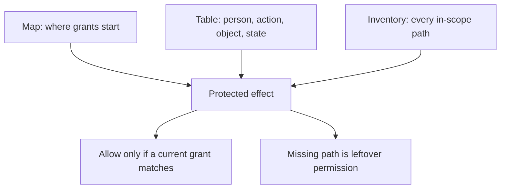

# Draw the map, the table, and every path

**Kind:** design-exercise
**Loop step:** 2 Model

## Could someone else turn your drawing into checks?

A who-is-allowed diagram is useful only if it predicts allowed effects and what must not happen. “Member → API → note” is a data-flow sketch. “A current member may read a note body only when the membership company the server resolved equals the note’s stored company” is a table row you can check.

Your work on this page has three connected parts:

1. a map showing where grants start and where decisions are enforced;
2. an access matrix describing the who-is-allowed relation;
3. an inventory listing every in-scope path that can cause the effect.

The table says **what** should be allowed. The map and inventory say **where the claim can fail**.

## Picture: map, table, and inventory must close



## Freeze the product version first

The notes app at this stage is still a design model. It includes companies, current memberships, company administrators, text notes, and privacy-safe who-is-allowed events. It does not yet include files, public sharing, support impersonation, workers, webhooks, caches, mobile offline state, real people’s data, or production deployment.

Name deferred features as later review triggers. Do not add them to the current allow table by accident, and do not pretend they are already protected.

## Step 1: name people without hiding scope

Start with concrete person types and attributes.

| Person | Trusted who-is-allowed attributes | What this person controls |
|---|---|---|
| Unsigned-in requester | none | request path, identifiers, order, volume, client labels |
| Current company A member | signed-in principal ID; current A membership resolved on the server | browser, request fields, known or guessed object IDs |
| Current company B member | signed-in principal ID; current B membership resolved on the server | the same abilities, used across companies |
| Company A administrator | current A membership plus a scoped admin role | legitimate A administration requests; not B permission |
| Removed former member | signed-in identity may remain; current membership is off | old session and previously seen identifiers |
| API policy path | policy version and server-resolved person/object context | the security decision; therefore in what you trust |

“Backend” is too broad. The browser is not trusted merely because your code rendered it. The API is not wholly trusted merely because it is on the server. Name the smallest behavior the rule depends on: for example, “the policy path resolves current membership and note company before release.”

Keep **the person who asked** and **the person or program that actually acts** separate when one operates for another. The notes app at this stage has no support impersonation or worker feature, so record those as absent. A later transfer page introduces a machine principal on purpose, to test whether you can keep that distinction.

## Step 2: split objects at security boundaries

“Note” may be too coarse. A note has at least:

- identifier;
- title or summary metadata;
- body;
- company binding;
- lifecycle state;
- who-is-allowed decision evidence.

Different actions or fields may have different rules. A list view might expose identifiers and titles without exposing bodies. An API that serializes the whole database object can therefore leak a field even if its route-level decision is correct. Industry lists make that field split explicit; they also ask an application to return only required fields.

Other current objects are the company record and the membership record. Exports and emergency sessions are modeled high-impact cases, not shipped features.

## Step 3: name actions as effects, not URLs

Use verbs that describe the protected effect:

- `note:list-summary`
- `note:read-body`
- `note:create`
- `note:update`
- `note:delete`
- `membership:view`
- `membership:grant`
- `membership:revoke`
- `tenant:bulk-export`

`GET /notes/{id}` is a route. The same read effect may happen through REST, GraphQL, search, export, cache, notification, restore preview, or an administrative tool. Checking every path follows the effect across those routes.

## Step 4: write rows with positive permission

Use `allow`, `deny`, or `out-of-scope`. Never leave a blank box if the action is in scope. Blank silently becomes whatever the code happens to do.

The following is a worked subset, not the full deliverable:

| Person | Object | Action | State / grant | Decision | Why |
|---|---|---|---|---|---|
| Current member A | Note A-17 body | read | current A membership; note stored in A | allow | positive same-company rule |
| Current member B | Note A-17 body | read | no A membership or hand-off | deny | cross-company is what must not happen |
| Removed former A member | Note A-17 body | read | identity valid; membership off | deny | sign-in is not current permission |
| Current member A | Note A-17 summary | list | current A membership | allow | summary is explicitly in member view |
| Current member A | Note B-4 summary | list | no B permission | deny | aggregation is still access |
| Admin A | Membership A-9 | revoke | current scoped A admin | allow | narrow administrative grant |
| Admin A | Membership B-4 | revoke | admin role not bound to B | deny | no leftover global admin |
| Member A | Company A bulk export | execute | no export grant | deny | ordinary membership is not enough |
| Admin A plus Admin A2 | Company A bulk export | approve | two current distinct approvals; a stated time window | allow for this practice’s design case | illustrative two independent conditions |
| Any person | unknown object/action | any | no positive rule | deny | fail closed |

The two-approval export rule is a practice assumption, not a universal industry requirement. The reasoning job is to justify why the impact warrants independent conditions, define what counts as independent, and describe failure and taking permission back.

## Step 5: add state and time

Static rows miss the hardest who-is-allowed failures. Add transitions:

```text
invited -> active -> suspended -> revoked
                 \-> expired
```

For each transition, ask:

- who may cause it;
- whether old sessions, grants, caches, or jobs keep permission;
- when the change becomes effective;
- which decision version is recorded;
- what happens if the policy store is unavailable;
- how recovery or restore treats old permission state.

A removed member may remain signed in. A cached allow may outlive the membership version that justified it. Immediate invalidation can be technically hard, but “eventually” is not a design. State the maximum window, affected actions, compensating detection, and information that cannot be recovered after disclosure.

Some industry lists treat applying authorization changes immediately as an advanced goal, with named mitigations where that is impossible. Use that as a later review anchor, not as a hidden requirement for every learner system.

## Step 6: map permission sources and stops

Draw arrows from permission source to decision to enforcement:

```text
identity evidence
      |
current membership + role ------> policy decision <------ stored note company/state
      |                                  |
grant / approval record -----------------+
                                         |
                   +---------------------+------------------+
                   |                     |                  |
              read-body path       list-summary path   admin mutation path
                   |                     |                  |
                   +---------- protected state / output ---+
```

For each stop, record:

- operation/effect;
- where decision inputs come from;
- policy version;
- failure behavior;
- alternate paths;
- evidence;
- who owns the current check;
- when you will look again.

Do not write “all routes use middleware” without listing routes and non-route effects. Middleware may sign the requester in while object permission still belongs at the service or storage boundary.

## Worked example: why list is not a harmless cousin of read

Suppose `read_note` correctly checks `note.tenant_id == subject.tenant_id`, but `list_notes` returns every note and the UI filters the result. The direct body-read row is enforced. The list-summary rows are not.

The cause is not that the UI filter is buggy. The server released objects before a trusted policy decision. What has to be true first is a signed-in requester who can call the list operation without the official UI. What it costs depends on returned fields: identifiers may enable enumeration; titles may disclose content; whole objects may disclose bodies. The structural repair is to bind the server-side query or result construction to the current who-is-allowed context and return only allowed fields. Hiding the list page, randomizing IDs, or adding a client filter does not change the release.

This example is why the object and action vocabulary must be precise enough to predict the failure.

## Hand-off worksheet

For one hypothetical “Alice asks Cara to review Note A-17 until 17:00 UTC” grant, record:

| Field | Required entry |
|---|---|
| Issuer | Alice, including the permission that lets her hand this off |
| Grantee | Cara’s stable person identity |
| Action/object | `note:read-body` on A-17 only |
| Constraints | company, audience, purpose if enforced, and no further hand-off unless justified |
| Issue/expiry | explicit trustworthy time basis |
| Revocation | current status/version and maximum effect delay |
| Use evidence | issuer, grantee, object, action, decision, policy/grant version, correlation ID |
| Limits | copyability, endpoint compromise, offline copies, or unavailable revocation check |

Do not assume a bearer link satisfies this record. Decide whether possession is intentionally the permission and, if so, how the capability properties are achieved.

## Practice

Write a one-page note containing:

1. product scope and explicit deferred people/paths;
2. concrete people and trusted who-is-allowed attributes;
3. objects split by field or state where rules differ;
4. actions as effects;
5. at least twelve allow/deny rows, including cross-company, removed, list, admin, unknown, and high-impact cases;
6. at least five stops or named future gaps;
7. one hand-off record;
8. three permission-lifecycle transitions;
9. leftover risks and when you will look again.

## Check yourself

Give the page to a peer who did not help write it. They must be able to:

- turn at least six rows into check names without clarification;
- identify the trusted source of every policy attribute;
- find every blank or implied default;
- name one path that skips each stop;
- explain when a grant or membership stops authorizing;
- tell a policy decision apart from identity evidence and from a UI control.

Mark each challenged row **checkable**, **too vague**, **leftover permission**, **stale**, or **out of scope on purpose**. Revise every too-vague, leftover, or stale row.

## Use it somewhere new

Add a field-level rule: members may list note titles, but a restricted note’s body needs a separate grant. Which original rows split? Which query or serializer becomes a stop? Which checks now need to distinguish summary from body? If your table cannot answer, it was too coarse.

## What this page is not doing

Do not use live targets. Do not pretend deferred features are already protected. Answer keys are not on this site.
