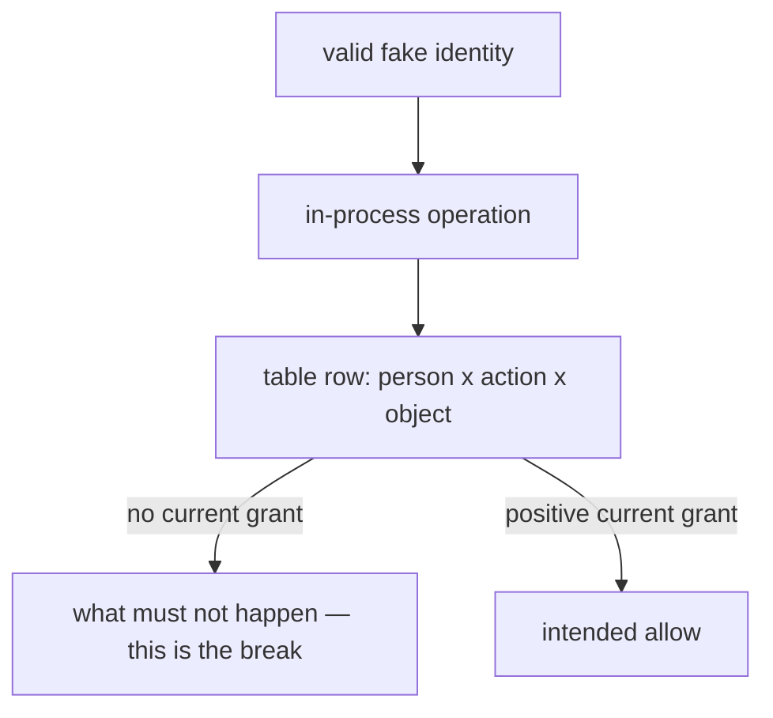

# Try leftover permission on your computer

**Kind:** mechanism-lab
**Loop step:** 3 Break

## Try it

The practice is not a website you attack. It is a small local model that gives legitimate fake users too much leftover permission. There is no HTTP server and no real account. The failure happens inside a small in-process model, so you can see cause and effect without turning the exercise into a target walkthrough.

> Every in-scope operation must obtain a current yes over person, object, action, company, and relevant permission state. Unknown cases deny.

The broken files violate that rule in several ways. Do not shrink them to “missing if statements.” Group them by who-is-allowed failure.

## Picture: a valid identity is still a table counterexample

Sign-in succeeding is a precondition, not a grant. Each failing check is a table row: a person who is allowed to exist, an action that happened, an object that should have been unreachable. Map the failure to the row before you open the repaired files.



## Where you may practice

Only files under `labs/1.2/1.2-authority-matrix/` are in scope. The users, companies, notes, approvals, and timestamps are fake. No socket is opened, no credential is used, and no outbound request is needed.

Do not adapt the exercise to a public site, employer system, classmate deployment, or real company. The in-process calls provide all evidence this page needs.

## Run the pair

From the repository root, create a throwaway environment and install the pinned lab dependency if needed:

```text
python -m venv .venv-1-2
. .venv-1-2/bin/activate
python -m pip install -r labs/1.2/1.2-authority-matrix/requirements.txt
```

Then run:

```text
python -m pytest labs/1.2/1.2-authority-matrix/tests --impl vulnerable

python -m pytest labs/1.2/1.2-authority-matrix/tests --impl fixed
```

The broken run must fail selected checks for what must not happen. The repaired run must pass. A syntax error, missing package, import failure, or wrong path is an environment problem, not security evidence.

## What to read in the practice files

The suite contains both allow and deny rows. Expected allow rows matter: a policy that denies everyone is fail closed but does not implement the product. Expected deny rows reveal overbroad or stale permission.

The broken files are designed to expose these failure shapes:

| Failure shape | Who-is-allowed question |
|---|---|
| Cross-company direct read | Why did sign-in become permission on this object? |
| Cross-company aggregate listing | Which other release path skipped object/field checking? |
| Cross-company administrator delete | Where was company scope lost when a role compressed the table? |
| Removed member read | Which stale identity or cached fact survived the permission change? |
| One-person bulk-export approval | Are the claimed independent conditions actually required and distinct? |
| Unknown action allowed | Why did absence of a positive rule become success? |

Do not open the repaired files immediately. First map each failing check to a row:

```text
person × action × object × state/time -> expected decision
```

Then identify the attribute source. A decision can have the right shape and still fail if the company, role, or object classification came from the requester.

## Why it happens, what it costs, how you stop it, how you notice, how you recover

For each failed check, complete this table.

| Slice | Question |
|---|---|
| The rule | Which exact effect should not have happened? |
| Why it happens | Which who-is-allowed relation was absent, leftover, overbroad, stale, or default-allow? |
| What's already wrong | Which legitimate identity, object state, role, or approval already existed? |
| Trigger | Which operation and input caused the effect? |
| What it costs | Which secrecy, integrity, accountability, or company-isolation rule failed? |
| How you stop it | Which positive current rule and stop would restore the row? |
| How you notice | Which privacy-safe decision evidence could reveal the attempt or success? |
| How you recover | Which permission, data, alternate paths, and checks must be repaired or revisited? |

“The check expected `None`” is not the cause. “The function did not compare companies” is closer, but still incomplete if the larger issue is that each operation invents its own policy. State why the missing comparison represented permission, where it belongs, and which other paths need the same meaning.

## Trace one example without jumping to the patch

Suppose Admin A deletes Note B-4.

- Admin A is correctly signed in.
- The role `admin` may legitimately allow selected high-impact actions.
- The object belongs to company B.
- The broken decision expands `admin` without company scope.
- The state change that must not happen occurs because the role became leftover global permission.

A denylist for Admin A would block this one practice case but fail for Admin A2 or a future company. A client-supplied `tenant_id` comparison would let the caller choose the permission context. Hiding the delete control would leave the operation reachable. The structural rule must bind the current server-resolved admin membership to the stored object company and exact action.

## Compare the repaired decision path

After completing your diagnosis, inspect the repaired files. For each repaired case, find:

1. where the current person is resolved;
2. where the stored object or target company is resolved;
3. where the action is explicitly matched;
4. where state such as current membership is checked;
5. where an unknown or invalid case denies;
6. where the operation consumes the decision before exposing or mutating state.

The repaired file is intentionally small. It is not a production policy framework. It does not prove that a FastAPI route, PostgreSQL query, worker, cache, or mobile client would use the same rule.

## Why the illustrative export case exists

The practice models a high-impact company export that requires two distinct current company A administrators. This is an exercise policy chosen to make two independent conditions observable. It does not assert that every export in every product needs two people.

The broken files accept one approval. The repaired files require the documented conditions and reject duplicate, inactive, cross-company, or insufficient approvers. The lesson is that “two-person approval” must become a checkable who-is-allowed relation. A second button, second field, or repeated identity is not independent permission.

## Practice

Copy the repaired directory to a temporary location outside the practice folders. Make one change at a time:

1. remove the current-membership check;
2. treat all admins as global;
3. change the final unknown-action branch to allow;
4. make `list_notes` return storage results before policy filtering;
5. count duplicate approver IDs as separate approvals.

Run the suite after each change and record which property check detects it. If a meaningful defect is not detected, record a coverage gap. Do not add a superficial assertion merely to turn the suite green. Add a table row and a property check.

## Use it somewhere new

The practice files have no cryptographic capability, no network boundary, no session cache, no transaction, and no distributed worker. A process with full access to the in-memory dictionaries remains powerful. Passing the suite shows that selected service operations consume the modeled policy correctly.

Imagine the same decision is made once, placed in a queue, and used ten minutes later by a worker. Which person is acting? Which permission version applies? What if membership was removed in the interval? A signed queue message may establish message integrity, but it does not by itself answer those who-is-allowed questions.

## What this page is not doing

Do not use live targets. Do not use ready-made attack recipes. Do not use real people’s data. Do not “fix” the practice by deleting the check.
