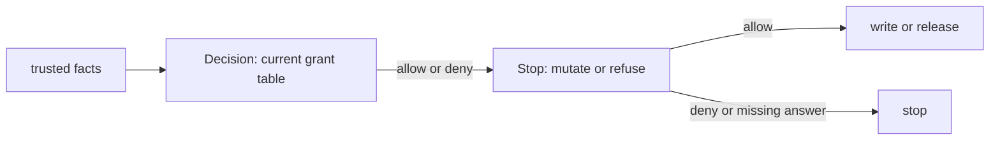

# The smallest path that checks every time

**Kind:** design-exercise
**Loop step:** 4 Build

## The rule

The answer is not “install an authorization library.” The smallest trustworthy design has two connected jobs:

1. a **decision step** resolves current trusted facts and returns yes or no for one person–action–object request;
2. a **stop** prevents the protected effect unless that decision allows it.

Textbooks call these a policy decision point and a policy enforcement point. Here they are the answer and the stop. The policy can be logically centralized without becoming one physical service. The stop can sit near the service operation, query, database, or protected subsystem. The architecture is correct only when the policy meaning is consistent and no in-scope effect skips the stop.

## Picture: the answer, then the stop

The smallest restore is not a library import. A decision step returns allow or deny from trusted facts. A stop is the only path that mutates or releases. If the stop proceeds without an answer, the split is pretend. If the decision answers from identity instead of from a grant, the split is still pretend.



## Start from what must not happen

For a cross-company note read:

```text
what must not happen: a company B person receives bytes derived from a company A note body
```

The cause in the practice files is leftover sign-in without an object rule. The relevant state is current membership and stored note company. The smallest positive rule is:

```text
allow note:read-body only if
  person is a current member
  AND person.tenant_id == note.tenant_id
  AND note is in a readable lifecycle state
```

Unknown person, missing note, unreadable state, policy error, and company mismatch do not satisfy the rule. They deny. Whether the response distinguishes “missing” from “not allowed” is a separate disclosure and usability decision. It does not change the internal who-is-allowed result.

## Resolve who-is-allowed attributes on the trusted side

The client may submit a note identifier. It must not choose the facts that justify permission.

| Attribute | Untrusted candidate | Trusted source for this model |
|---|---|---|
| person ID | display name, request body user ID | verified identity context |
| current membership | hidden UI role, token claim with no freshness contract | current server-side membership state |
| company scope | `X-Tenant` or form value | membership relationship resolved by the policy path |
| object company | client JSON or route prefix | stored note record or independently enforced database relation |
| action | caller’s claim that this is “read” | operation chosen by trusted server code |
| policy version | browser bundle version | deployed decision component |
| time | client clock | trusted service time within recorded assumptions |

Signed data is not automatically trusted for every purpose. A signed stale role claim may be authentic evidence of what an issuer said earlier while still being insufficient evidence of current permission.

## Make the decision explicit

A small decision record can contain:

```text
allowed: false
reason: tenant_mismatch
subject_id: bob
action: note:read-body
object_id: nA1
authority_version: membership-v7
policy_version: notes-who-is-allowed-v2
decided_at: trusted timestamp
```

The record should not contain the note body, session token, password, or unnecessary contact data. Its reason is stable enough for checks and operations but not so detailed in a public response that it reveals protected state.

Returning a decision object is not the security boundary by itself. The operation must consume it before release or mutation:

```text
subject = resolve_current_subject(identity_context)
note = repository.lookup_note(note_id)
decision = policy.decide(subject, "note:read-body", note, now)
if not decision.allowed:
    return safe_denial(decision)
return project_allowed_fields(note)
```

The order matters. Do not serialize the note, enqueue work, or mutate state and then consult the decision.

## Treat roles as scoped inputs, not bypasses

For `membership:revoke`, a current company A admin may revoke an ordinary A membership under the current design. The policy still evaluates:

- admin person and current status;
- exact action;
- target membership object;
- person company equals target company;
- self-revocation or last-admin rules if the product defines them;
- current state and policy version.

Avoid a top-level branch such as `if subject.is_admin: allow`. That discards object, action, company, and state — the dimensions that made the role meaningful.

## Design hand-off as a constrained permission change

When hand-off enters scope, validate both issue time and use time.

At issue time:

- the issuer currently holds a hand-off-able form of the requested permission;
- requested action/object scope is no broader than the issuer’s grant;
- expiry, audience, onward hand-off, and use constraints are explicit;
- the grant is attributable and revocable under the stated model.

At use time:

- the grant is authentic or otherwise unforgeable under its mechanism;
- presenter/audience and requested effect match the grant;
- the grant is active, unexpired, and not revoked;
- policy says whether issuer revocation or object-state change invalidates it;
- the stop consumes the decision before the effect.

This is **attenuation**: handed-off permission narrows rather than expands. A bearer capability may intentionally let any holder exercise the scope. An identity-bound hand-off may require a particular grantee. Record the choice instead of mixing the models.

## Use two independent conditions only where the rule justifies it

For the practice’s high-impact export case, the design requires two distinct current company administrators within a bounded approval window. The mechanism must reject:

- the same approver counted twice;
- an inactive or revoked approver;
- an approver from another company;
- approval for a different action, object set, artifact, or time window;
- execution after approval expires or is taken back.

Two approvals that share the same compromised identity provider, device, or operator may still have correlated failure. Record what independence you actually obtain and the remaining common mechanisms.

## Checking every path needs an enforcement inventory

Centralizing policy logic reduces inconsistent rules, but it cannot guard a path that never calls it. Inventory effects, not just routes.

| Effect | Possible path | Stop | Failure mode to check |
|---|---|---|---|
| Note body release | direct read | service/query before projection | company mismatch or policy outage |
| Note summary release | list/search | company-bound query and field projection | filter after serialization |
| Note deletion | user or admin mutation | policy plus atomic persistence transition | global admin or stale membership |
| Bulk export | request and later generation | approval check at execution, not only request | approval expires before use |
| Restored data visibility | restore/reconciliation | lifecycle and who-is-allowed re-evaluation before reopening | old ACL or membership returns |
| Cached response | cache hit | cache key and who-is-allowed meaning | decision/result reused across company or revocation |

If a worker acts later, an advanced industry list asks that permission reflect the person who asked rather than silently widening to an intermediary service’s leftover permission. Sometimes a service genuinely has independent permission. Document and constrain that case instead of calling it “system.”

## Permission caches are new mechanisms with new limits

Caching a decision can improve latency and availability but changes the time model. Record:

- cache key: person, action, object, relevant context, permission/policy version;
- maximum age and which actions may be cached;
- invalidation on membership, grant, object, or policy change;
- fail behavior when current state cannot be resolved;
- information-disclosure consequence during a stale window;
- evidence that indicates a cached versus fresh decision.

Immediate revocation may be required for some actions. For others, a bounded stale window plus detection may be accepted. That is a leftover-risk decision, not an invisible framework default. Disclosure during the window cannot be “reverted,” so compensating controls have limits.

## What is not good enough

| Proposed repair | Why it does not restore the rule |
|---|---|
| Block Bob’s user ID | New users and companies remain over-authorized |
| Make note IDs random | Guessing becomes harder; intended company permission is unchanged |
| Hide admin buttons | Hostile clients can call the operation directly |
| Add sign-in middleware | Identity is resolved; object/action permission is still absent |
| Put `authorize()` in a shared library | Unlisted paths can skip it; wrong inputs can still be trusted |
| Return 404 on every denial | Response uniformity does not prevent an internal effect that must not happen |
| Log all request bodies | Creates a secrecy/privacy failure and does not prevent access |
| Add a second approval field | It may contain the same person twice or lack scope, freshness, and independence |

## Practice

Choose one notes-app effect — note-body read, membership revoke, or modeled bulk export — and produce:

1. the rule and what must not happen;
2. person, action, object, state, grant, trusted context, and time;
3. why the failed design happens and what has to be true first;
4. smallest policy rule;
5. trusted attribute sources;
6. every in-scope stop;
7. two rejected alternatives and their limits;
8. normal, negative, abuse, and failure proof obligations;
9. revocation and policy-outage behavior;
10. privacy-safe evidence, recovery, leftover risk, and when you will look again.

A peer should remove the policy call mentally from one path. Your design is ready for the next page only if you can name which check fails and which effect that must not happen becomes possible.

## Use it somewhere new

A background export worker runs with a database credential able to read all notes. Shrinking that credential may help least privilege, but the application still needs to decide whether the worker acts under the requesting member, a company-approved export grant, or independent service permission. State which model you choose, how it is bound to the job, when it expires, and what happens if permission changes before execution.

## What the framework does vs what you still have to check

FastAPI does not decide who may read a note. Next.js hiding a button is not a stop. PostgreSQL row rules help only if the query actually uses them. Passing a library’s unit checks is not checking every path.

## What this page is not doing

Live targets. Treating a library import as the rule. Answer keys are not in this file.
