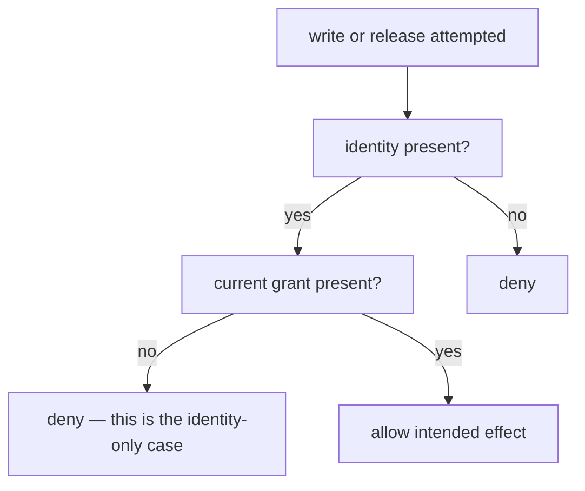

# Turn the table into checks

**Kind:** verification-lab
**Loop step:** 5 Verify

## The rule

A who-is-allowed check needs a property oracle. “The `authorize` function was called” is a tool observation. “Bob receives no company A note body and no partial state is committed through any in-scope path” is a property observation.

## Picture: identity-only must fail the oracle

The honest path is a person with a current grant. The negative path is a person without one. The abuse path is a person who presents identity and expects the write or release to succeed. The oracle does not ask whether `authorize()` was called. It asks whether the effect that must not happen happened.



Start from the table row, not from a test framework:

```text
person × action × object × state/time -> expected decision and effect
```

For an allow row, observe the intended effect and evidence. For a deny row, observe both the denial and the absence of partial release or mutation. A status code alone may hide a leaked body, a committed write, an enqueued job, or an over-detailed event.

## Build checks from equivalence classes, not usernames

Alice and Bob are examples of who-is-allowed classes.

- current same-company member;
- current cross-company member;
- inactive or removed former member;
- scoped same-company administrator;
- administrator of another company;
- unsigned-in or unknown person;
- person with a valid bounded grant;
- person with expired, revoked, wrong-audience, or overbroad hand-off;
- service or worker with and without originating permission.

Objects and actions also have classes:

- same-company and cross-company object;
- existing, missing, deleted, or restricted object;
- summary field versus body field;
- read, list, update, delete, grant, revoke, export, and unknown action;
- direct, aggregate, administrative, background, retry, cache, and restore path.

A Cartesian product of every class may be too large. Select cases using the rule, impact, implementation shape, and when you will look again. Document what you did not cover.

## Four evidence modes

### Normal

Show that a positively authorized action succeeds with the intended projection and state. In the practice files, Alice reads company A’s note; Admin A deletes an A note; the modeled export decision succeeds with the documented distinct current approvals.

Normal evidence prevents “deny everyone” from masquerading as secure who-is-allowed.

### Negative

Use a clearly deny row: Bob reads an A note, Admin A deletes a B note, a removed member reads, one approval attempts a two-person action, or an unknown action is requested. Assert no protected output and no partial mutation.

### Abuse

Vary inputs and paths within the authorized local model:

- choose every object ID, not one convenient sample;
- use client-supplied company labels that conflict with stored state;
- repeat one approver ID;
- attempt list/aggregate release instead of only direct read;
- reorder grant, revoke, and use;
- try an action string not known to policy.

Abuse evidence tests whether the rule follows who is allowed rather than expected UI behavior.

### Failure

Challenge dependencies and time:

- membership or policy lookup is unavailable;
- object lookup returns unknown state;
- permission changes after sign-in;
- approval expires before execution;
- evidence emission fails;
- a cached decision is older than the accepted revocation window;
- a restore reintroduces old membership or grant records.

For this page’s scoped policy, unknown policy state denies. The product may need a usable failure message and operational path so people do not create an unsafe workaround.

## Trace the practice suite to the table

The local suite should include at least these shapes:

| Row or transition | Property oracle | Broken run | Repaired run |
|---|---|---|---|
| current A member × read × A note | intended body returned | pass | pass |
| current B member × read × A note | no A body returned | fail | pass |
| current A member × list × note collection | no B object returned | fail | pass |
| Admin A × delete × B note | B note unchanged / operation denied | fail | pass |
| removed A member × read × A note | no body returned | fail | pass |
| one current approver × export A | decision denies | fail | pass |
| two distinct current A approvers × export A | decision allows | pass only if other policy facts hold | pass |
| any person × unknown action | decision denies | fail | pass |

The expected broken run is non-zero because selected effects that must not happen occur. Do not mark a practice successful merely because “some check failed.” Record the check names and why the failures match the who-is-allowed model.

## Assert effects, not just decisions

A policy-unit check can show that `decide(...)` returns deny. An integration check must show that the operation cannot skip the result.

For a read:

- no protected fields are returned;
- no unauthorized cache entry, export, event, or derived output is created;
- the denial event contains only approved metadata;
- object state remains unchanged.

For a mutation:

- before/after protected state is identical on denial;
- no job or side effect was scheduled;
- transaction failure does not leave a partial change;
- retry does not convert a denial into a duplicate or allowed action.

The local practice files model selected service effects only. Later topics add HTTP, database, transaction, cache, and worker evidence.

## Use a counterfactual

For every critical rule, ask:

> If the stop were removed or weakened, would this check fail for the intended reason?

Temporarily replacing company comparison with `True`, treating inactive memberships as current, or changing unknown-action default to allow should make a relevant check fail. If the suite stays green, it may not exercise the policy path. If every check mocks the policy to return expected decisions, it has mocked away the property.

Mutation is diagnostic, not proof of completeness. A suite can kill selected policy mutations while an unmodeled route skips the policy entirely.

## Measure enforcement coverage separately from policy coverage

Two forms of completeness are needed:

1. **Policy coverage:** table rows, states, grants, and failure modes have oracles.
2. **Enforcement coverage:** every path capable of the protected effect consumes the relevant current decision.

Create an enforcement table:

| Effect | Path | Policy check | Operation check | Failure check | Owner / gap |
|---|---|---|---|---|---|

Do not infer enforcement coverage from a central library’s unit-check percentage. Route registration, query review, architecture constraints, database policies, and negative integration checks may all contribute evidence. None alone is universal proof.

## Hand-off and revocation check sequence

When grants enter scope, check a sequence rather than isolated snapshots:

```text
issuer authorized
-> grant issued with narrow action/object/expiry
-> correct grantee uses it
-> wrong grantee/action/object is denied
-> grant revoked or issuer permission changes
-> later use is denied within the stated window
-> evidence identifies grant and policy versions without exposing secrets
```

Also check duplicate delivery, replay, clock disagreement, and unavailable revocation state according to the mechanism’s model. If the grant is a bearer capability, adjust the person oracle: possession may intentionally be the grant, but scope, authenticity, time, and revocation still need evidence.

## Practice

Extend the notes-app table with a restricted-note body that requires an explicit reviewer grant while ordinary members may list its title.

Produce:

1. one normal body-read case;
2. two negative cases differing in person or grant;
3. one abuse case using list or projection rather than direct read;
4. one failure case for unavailable or stale grant state;
5. the property oracle for each;
6. one policy-removal counterfactual;
7. one leftover gap.

Your work is satisfactory when the title/body distinction, trusted attribute sources, denial side effects, grant lifecycle, and alternate path are observable. “Returns 403” is not enough.

Run the pair you already used on the leftover-permission page if you have not this session:

```text
python -m pytest labs/1.2/1.2-authority-matrix/tests --impl vulnerable
python -m pytest labs/1.2/1.2-authority-matrix/tests --impl fixed
```

The first command must fail selected deny rows. The second must pass.

## Use it somewhere new

Without using the names Alice, Bob, note, or tenant, write four-mode evidence for a handed-off action in another fake product. State which assumption changed and why a notes-app check cannot simply be renamed.

A release is approved at 10:00, the artifact changes at 10:03, the CI worker executes at 10:05, and an approver is revoked at 10:04. Which object was approved — the mutable branch, commit, artifact digest, or deployment request? Which time controls permission? The next transfer page asks you to build checks that answer rather than assume.

## What can still go wrong

Green checks on this laptop are not a pentest of a website. They are evidence for **this** table, **this** week. A suite can pass while an unlisted path skips the stop.

## What this page is not doing

Live targets. Ready-made attack recipes. Treating a status code as the oracle. Answer keys are not on this site.
