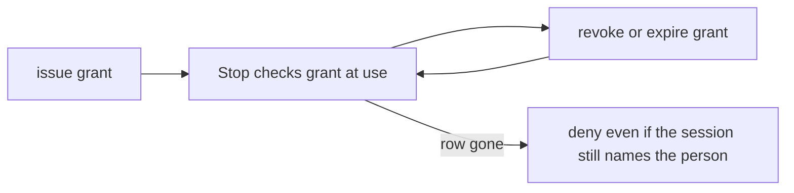

# Grant, notice, expire, revoke

**Kind:** operations-exercise
**Loop step:** 6 Operate

## The rule

Who is allowed is not a request-time yes/no. Permission has a lifecycle:

```text
requested -> reviewed -> granted -> active -> used
                                   |       |
                                   v       v
                               expired / revoked
                                   |
                                   v
                           recovered and reviewed
```

The secure property must survive mistakes, revocation, evidence loss, emergency action, and human stress. Prevention matters, but an invisible or irreversible who-is-allowed failure leaves the product unable to contain or learn from a break.

## Picture: grants have a lifecycle sessions do not own

A grant is issued, used, expired, and taken back. Session cookies and JWTs have their own clocks. Those clocks are not the grant clock. Operating who is allowed means operating the grant table: who may still mutate this company object, when that row was last checked, and what happens when the row is gone.



## Make grants reviewable before activation

An administrative grant screen should show the effect a reviewer is authorizing:

- grantee’s stable identity and relevant company or organization;
- exact actions;
- object or object-set scope;
- start and expiry;
- hand-off and onward-hand-off rules;
- high-impact consequences;
- who requested and who approved;
- whether approval is independent;
- how you take it back and expected effect time;
- evidence and notification behavior.

“Make Cara admin” hides too much. Does it allow reading every note body, changing membership, exporting data, deleting the company, viewing audit evidence, creating new admins, or using emergency paths? A role can simplify common decisions, but the UI must make high-impact expansion understandable.

New objects, roles, companies, and integrations should begin with the narrow documented permission. That is fail closed at birth, not a brochure claim.

## Record decisions without copying protected content

A useful who-is-allowed event can include:

- event schema and policy version;
- originating and effective person IDs;
- company or permission domain;
- action and object identifier or safe class;
- grant, role, or hand-off version;
- decision and stable reason code;
- which stop enforced it;
- trustworthy timestamp and correlation ID;
- whether the decision was fresh, cached, emergency, or handed off.

It should normally exclude:

- note bodies and restricted fields;
- passwords, session cookies, bearer capabilities, tokens, or authorization headers;
- raw request bodies and arbitrary exception context;
- unnecessary email, phone, or display-name data;
- secret approval material.

The evidence itself becomes a protected object. Who may read, export, modify, or delete it? How long is it kept? Which operator can change both product state and the only record of that change? Those are who-is-allowed questions, not merely logging configuration.

## Turn events into signals

“Log denied access” is not a detection design. The alert should name a pattern and the uncertainty it represents.

| Signal | Why it matters | Possible legitimate cause | Response boundary |
|---|---|---|---|
| one person requests many cross-company objects | enumeration or confused company context | stale client links or support investigation | validate identity/context, contain session if warranted |
| admin action targets a different company | unscoped leftover role or client attribute confusion | practice files or a migration tool | block effect, inspect the stop |
| revoked permission continues to produce allows | stale cache/token/grant or failed invalidation | documented bounded delay | compare against objective; disable affected high-impact path if exceeded |
| two-person action uses duplicate/correlated approval | separation is cosmetic | small team or emergency | require alternate approved path or record leftover-risk decision |
| unknown-policy decisions occur | deployment mismatch or new path | staged rollout | deny effect and alert owner; do not silently default allow |
| who-is-allowed events disappear while mutations continue | evidence path failure or suppression | telemetry outage | invoke documented fail-closed or durable-evidence behavior |

Thresholds and windows are product hypotheses. A single confirmed cross-company success is different from repeated denied probes. Avoid universal alert numbers. Record false positives, false negatives, and which effects warrant immediate containment.

## Define revocation as an outcome with a clock

“Role removed” is an administrative action. The security outcome is that the removed permission stops producing protected effects within a stated interval across every relevant representation.

Inventory copies of permission:

- server-side membership and role state;
- sessions and security context;
- self-contained tokens or claims;
- policy caches;
- capability links or hand-off records;
- queued jobs and approvals;
- offline device state;
- database roles or temporary credentials;
- restored backups.

For each, define invalidation or expiry, maximum stale window, high-impact exceptions, evidence, and failure behavior. If disclosure occurs during the stale window, later revocation cannot retrieve the information. State that mechanism limit honestly.

Some industry lists treat immediate application of authorization changes as the goal and describe mitigation where immediate change is impossible. Use the exact requirement only where it applies. Do not turn it into a claim that every token system has solved revocation.

## Design break-glass permission as a separate path

Emergency access is not `if emergency: allow`. A defensible break-glass design may require:

- declared incident or recovery purpose;
- narrowly scoped action and object set;
- short lifetime;
- independent approval or a justified exception when unavailable;
- strong, usable identity evidence appropriate to the risk;
- clear warning and completion state;
- separate, durable evidence and owner notification;
- automatic expiry and explicit post-use review;
- checks for unavailable approver, evidence failure, and accidental repeat.

The path may deliberately trade secrecy or least privilege for safety or availability. Record the owner, conditions, leftover harm, and recovery. “Emergency” does not erase the rule. It defines a different bounded policy state.

## Preserve the person who asked through intermediaries

A worker, support agent, or service may be the effective person that executes the operation. Operations evidence should preserve both:

- **originating person:** who requested, approved, or handed off the effect;
- **effective person:** which service or human actually performed it.

If a worker’s leftover service credential becomes the only permission, every job may inherit broad storage access. The product must decide whether execution uses the originator’s current permission, a frozen scoped grant, or independent service permission. Each has different revocation, replay, availability, and audit consequences.

## People can still use it

A who-is-allowed system fails when legitimate administrators cannot understand or complete the secure path.

Avoid:

- color-only allowed/denied indicators;
- permission names without effect descriptions;
- mouse-only scope selection or revocation;
- approval dialogs that hide company, object set, duration, or environment;
- silent success that encourages repeated high-impact actions;
- inaccessible recovery that drives credential sharing;
- alarms with no safe next action.

Provide keyboard and assistive-technology operation, text labels, a reviewable summary before commitment, explicit completion and failure states, safe cancellation, and a recovery alternative. That does not mean reducing every control. It means making the correct secure action fit the user’s mental model and operational reality.

## Why it happens, what it costs, how you stop it, how you notice, how you recover

For suspected over-permission:

1. **Validate the signal:** confirm decision, policy, grant, and enforcement versions without opening protected content unnecessarily.
2. **Contain narrowly:** revoke the implicated session, membership, grant, worker, approval, or path; do not disable every company by reflex.
3. **Preserve evidence:** protect decision and state-transition records with independent access control and retention.
4. **Scope effects:** enumerate direct, aggregate, admin, cache, worker, retry, export, and restore paths that share the rule.
5. **Repair the cause:** correct policy meaning, attribute source, enforcement coverage, or permission lifecycle — not only the observed user.
6. **Recover state:** remove unauthorized grants or outputs, restore intended data, rebuild caches, and reconcile queued work.
7. **Validate:** rerun normal, negative, abuse, failure, and counterfactual evidence.
8. **Communicate:** tell affected owners what is known, uncertain, contained, and required next.
9. **Revise:** update table, review triggers, checks, runbook, and later standards mapping.

Recovery is not complete because an account was disabled. The bounded who-is-allowed rule must be re-established across affected paths and state.

## Practice

Write a two-page runbook fragment for either membership revocation or the illustrative bulk-export permission. Include:

- grant/use/revocation event fields and prohibited fields;
- one signal, threshold/window rationale, and likely false positive;
- maximum effect time across every permission representation in scope;
- containment owner and how far a break can spread;
- evidence-pipeline failure behavior;
- root-cause repair and recovery validation;
- break-glass behavior and post-use review;
- one accessible administrative path and safe failure alternative;
- one operator-compromise or common-mechanism leftover risk.

Peer-check it under a scenario where the only approver is unavailable and the policy store is degraded. If the runbook’s answer is “temporarily give everyone admin,” revise it.

## Use it somewhere new

On a release desk, an approver may be revoked after approving but before the CI worker executes. Decide whether the approval is a historical fact that remains valid for a bound artifact and short window, or whether current approver permission is re-evaluated at execution. State the safety, availability, and incident-recovery trade-off. Do not hide it in token expiry.

## Can people still use it

Keyboard, named controls, and a reviewable summary before commitment apply to grant and revoke screens. A mouse-only “make admin” is not informed consent.

## What this page is not doing

Do not use live mailboxes, real incident paging, production credentials. Answer keys are not on this site.
