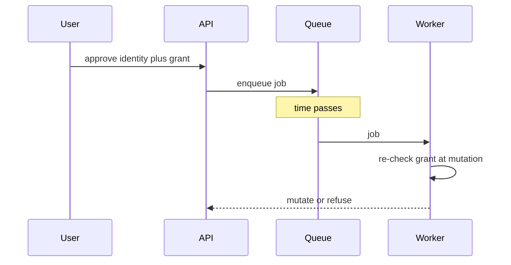

# Same idea on a release desk

**Kind:** transfer-challenge
**Loop step:** 7 Generalize

## Use it somewhere new

This work feeds check-in 1: who may cause a high-impact effect, without using a product name, a role name, or a checklist as the definition of permission.

Changing “note” to “release” is not transfer. ReleaseDesk changes the object, permission source, state transition, trusted components, time horizon, and impact. You must rebuild the model and explain which earlier reasoning still applies.

## Picture: delay is not a grant

ReleaseDesk’s worker runs later, as a machine identity, not as the human who clicked approve. If the worker treats “the enqueueing user was signed in” as permission to deploy, identity has been smuggled across time. The grant must be re-checked at the mutation, bound to artifact digest, environment, and current approver state.



Use only the fake product card below. Do not inspect or operate a real CI/CD system, cloud account, repository, or deployment.

## Product card: ReleaseDesk

ReleaseDesk coordinates production deployments for a small software company.

- A developer proposes deployment of one immutable artifact digest to one named environment.
- The proposer cannot be the sole approver.
- Two current approvers from the owning service team must approve a production deployment.
- Approval expires after 15 minutes and is bound to artifact digest, environment, service, and requested change ID.
- A CI worker performs the deployment later using a machine identity.
- The worker receives jobs through an at-least-once queue, so duplicate delivery is possible.
- An approval may be revoked, an approver may leave the team, or the artifact may be replaced before execution.
- A break-glass on-call path exists for a declared incident, has a five-minute scope, notifies the service owner, and requires post-use review.
- Production credentials are not exposed to developers or approvers.
- Some approvers use keyboard-only or assistive-technology workflows.
- All data and identities in this exercise are fake.

## What materially changed?

Compared with the notes app at this stage, consider at least:

- the effective person is a CI worker, while permission may originate from proposer and approvers;
- the protected object is a state transition involving an immutable artifact and environment, not a stored note;
- who is allowed is assembled from multiple independent conditions;
- the effect occurs after approval and may be delivered more than once;
- identity, team membership, artifact, approval, queue, and environment state can change independently;
- denial or delay can affect incident recovery and availability, not only secrecy;
- machine credentials provide technical ability that must not become leftover product permission;
- an accessible approval and emergency journey is part of whether the policy works.

Do not treat this list as a completed table. It identifies dimensions you must resolve.

## Practice

Produce one coherent who-is-allowed pack.

### 1. Bounded rule

State who may cause a production deployment of which artifact to which environment, under which approvals, state, and time. Name at least four effects that must not happen, including wrong artifact/environment, insufficient or correlated approval, expired/revoked permission, and duplicate execution.

### 2. Person and permission map

Include proposer, two approvers, service-team membership source, queue, CI worker, deployment environment, break-glass on-call, and evidence owner. Distinguish the person who asked from the person or program that acts. Identify the smallest trusted behavior of each component.

### 3. Objects, actions, and state machine

Split proposal, approval, artifact digest, job, environment, deployment, emergency grant, and decision evidence where their permission differs. Model at least:

```text
proposed -> approved -> queued -> executing -> completed
       \-> rejected   \-> expired / revoked / cancelled
```

Define which transitions are irreversible, retryable, or idempotent.

### 4. Access matrix and separation argument

Write at least twelve allow/deny rows. Explain why the two approvals are meaningfully independent — or record the shared failure that remains. Show that proposer, approvers, worker, and break-glass person hold different permission rather than a shared “deploy role.”

### 5. Hand-off or capability interpretation

Decide what the queued job represents. Is it a scoped capability, a request that requires current re-authorization, or a reference to server-side approval state? Define authenticity, scope, audience, expiry, replay behavior, revocation, and whether the worker can act beyond it.

### 6. Enforcement inventory

Identify where policy is enforced at proposal, approval, enqueue, execution, retry, cancellation, and emergency use. Explain why checking only when the job is created is or is not enough.

### 7. Four-mode evidence and operations

Specify normal, negative, abuse, and failure checks, including artifact substitution, duplicate delivery, expiry, approver revocation, unavailable policy/evidence, and emergency use. Add privacy-safe decision events, containment, recovery, accessible approval/revocation, and one operator or infrastructure leftover risk.

### 8. Comparison memo

Use three headings:

- **Reasoning that transfers:** identify structural ideas such as hostile clients, positive permission, fail-closed unknowns, or enforcement coverage and explain why they remain valid.
- **Notes-app claims that fail:** name at least four original people, objects, states, time assumptions, or effects that cannot be copied and why.
- **New conflicts and limits:** explain at least one security-versus-availability or safety conflict, one common-mechanism risk, and one mechanism that supports a rule while creating another risk.

## What is not good enough

- Do not answer “use RBAC,” “use signed tokens,” “require MFA,” or “use a policy engine” as the who-is-allowed model.
- Do not assume a valid signature proves that the current action remains authorized.
- Do not count one person, account, device, or identity event twice as independent approval without justification.
- Do not let the CI worker’s production credential define product permission.
- Do not probe a real repository, CI provider, cloud service, or deployment.
- Do not copy Alice, Bob, or company A into the solution.
- Do not open the answer key before evaluation.

## Check yourself

A usable pack is internally consistent, checkable, safe, and explicit about defaults, permission sources, state, time, and stops. A pack that is ready for check-in 1 also:

- explains at least four notes-app assumptions that fail rather than only renaming them;
- discovers a non-obvious stale-permission, replay, or common-mechanism failure;
- distinguishes machine ability from originating permission;
- defends or rejects the independence of the approval conditions;
- narrows a universal revocation or “exactly once” claim after modeling failure;
- provides usable emergency and recovery paths without turning break-glass into leftover global permission;
- states leftover risk and which industry lists you used as a later check, not as the model.

Finishing the page is not the same as finishing check-in 1. A reviewer will look at whether the pack is consistent and testable.

## Where you may practice

Synthetic product card only. No live CI, cloud account, or real repository.

## What this page is not doing

Live-target steps. Vendor prescriptions. Copying the notes-app table with the nouns swapped. Answer keys are not in this file.
