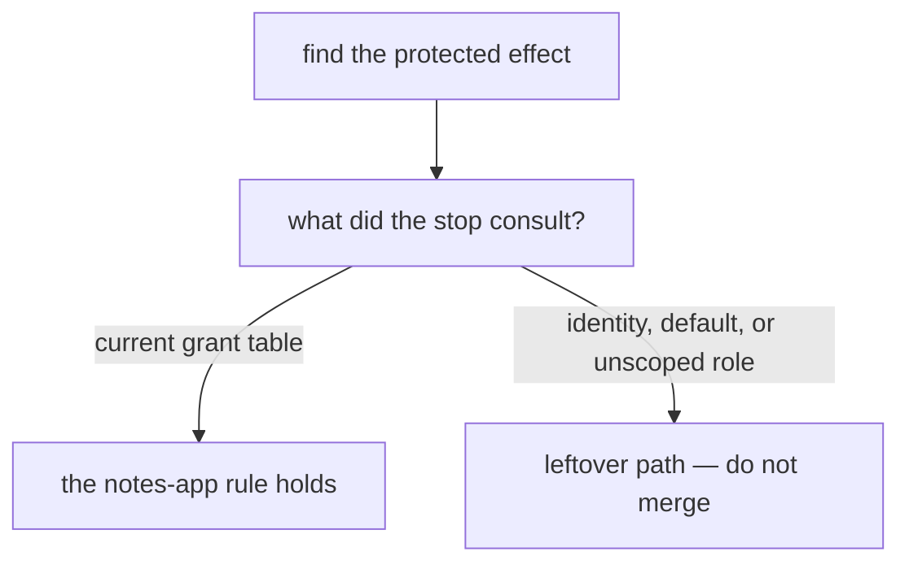

# Would you merge this permission change?

**Kind:** code-review
**Loop step:** 5 Verify and communicate

The answers are not on this page. Do not open the keys file until someone has looked at your review.

## Review

Treat the broken files as a pull request proposing reusable who-is-allowed logic. Reconstruct the who-is-allowed relation the code actually implements, compare it with the notes-app rule, and write changes a developer can check.

The folders `labs/1.2/1.2-authority-matrix/vulnerable/authority.py` and `vulnerable/SECURITY.md` are the change.

## Picture: hunt leftover permission at the mutation

Leftover identity hides in defaults: the function that “already signed in,” the role that lost company scope, the helper that serializes before `decide()`. Keep the rule. If that effect never checks a current grant, that leftover path is still open.



## Where you may practice

Review only the local fake practice files. Do not translate the code into requests against a live application. No exploit payload or public target is needed. Each counterexample is an in-process person–action–object decision.

## 1. Reconstruct the implemented rows

For each public operation in the file, record:

| Operation/effect | Person source | Object source | Action | Permission source | State/time | Default | Protected effect |
|---|---|---|---|---|---|---|---|

Do not accept function names as proof. A function called `authorize` may still trust an unscoped role, ignore current membership, or allow unknown actions.

## 2. Trace every attribute to its trust source

Ask:

- Is the person signed in, and is current membership separately resolved?
- Is company scope obtained from stored relationships or from caller-controlled input?
- Is object ownership resolved before the effect?
- Does role expansion preserve company, action, object, and state?
- Are approvers distinct, current, correctly scoped, and bound to this action?
- Is time evaluated at use rather than assumed from issue time?
- Does an absent rule, missing object, or policy error deny?

Write the actual answer from code. Do not repair missing information in your head.

## 3. Separate policy coverage from enforcement coverage

Compare direct read, aggregate list, delete, revocation, export approval, and unknown-action behavior. A correct branch in one operation does not check another.

For each path, identify:

- the decision step;
- the stop;
- whether release or mutation occurs before the decision;
- whether the operation can use leftover process or role permission;
- which check observes the protected effect;
- which future path would invalidate the conclusion.

## 4. Review state and time

Sign-in may outlive membership. Approval may outlive role, object, policy, or time window. Ask what happens when:

- a member is revoked after login;
- an admin changes company or role;
- an approval is duplicated;
- an object changes between decision and effect;
- a decision is cached;
- the policy cannot classify a new action.

If the code has no time or version model, record the limitation rather than claiming revocation behavior.

## 5. Write comments a maintainer can act on

Each comment must include:

1. the unsupported allow or false assurance;
2. the exact missing or untrusted model element;
3. the effect that must not happen, and what it costs;
4. the minimum structural change;
5. the normal/negative/abuse/failure evidence that would evaluate it;
6. the remaining limit or when you will look again.

Avoid “add an auth check.” Prefer a comment shaped like: “This operation expands a role without preserving the object’s permission domain. Resolve the current scoped membership and stored object domain at the trusted decision step, deny mismatch/unknown state, enforce before mutation, and add same-domain allow plus cross-domain, revoked, and policy-failure checks.”

## Practice

Submit:

- the implemented-row table for every public operation;
- at least six actionable comments across at least four distinct failure classes;
- one who-is-allowed-map correction;
- one proposed bounded policy rule;
- one enforcement-inventory gap;
- one privacy-safe decision event;
- one revocation or stale-permission finding;
- one leftover risk the repaired local files cannot remove;
- a short note on which industry lists apply later, without claiming the whole product is compliant.

Run the pair if you have not this session:

```text
python -m pytest labs/1.2/1.2-authority-matrix/tests --impl vulnerable
python -m pytest labs/1.2/1.2-authority-matrix/tests --impl fixed
```

Tie at least one review comment to a failing check name from the broken run. Do not open the keys file.

## Common mix-ups

Your review is still developing if it only says “IDOR,” “broken access control,” “use RBAC,” “add middleware,” or “follow the industry list.” Those labels may communicate categories, but they do not state person, object, action, permission source, trusted attributes, state/time, enforcement, or evidence.

## Use it somewhere new

Review this sentence from a different design:

> The CI worker has a valid production credential and the job is signed, so the deployment is authorized.

Write one review comment that distinguishes machine ability, message authenticity, originating permission, approved artifact/environment, approval state, expiry/revocation, replay, enforcement time, evidence, and leftover risk. Do not prescribe a vendor.

## Check yourself

Take the broken files from the practice. Write the review that **blocks** them. Then take the repaired files and write the review that **merges** them with leftover risk named. Keep both in your notes for check-in 1.

## What this page is not doing

Live-target steps. Ready-made attack recipes. Merging because a function is named `authorize`. Answer keys are not on this site.
