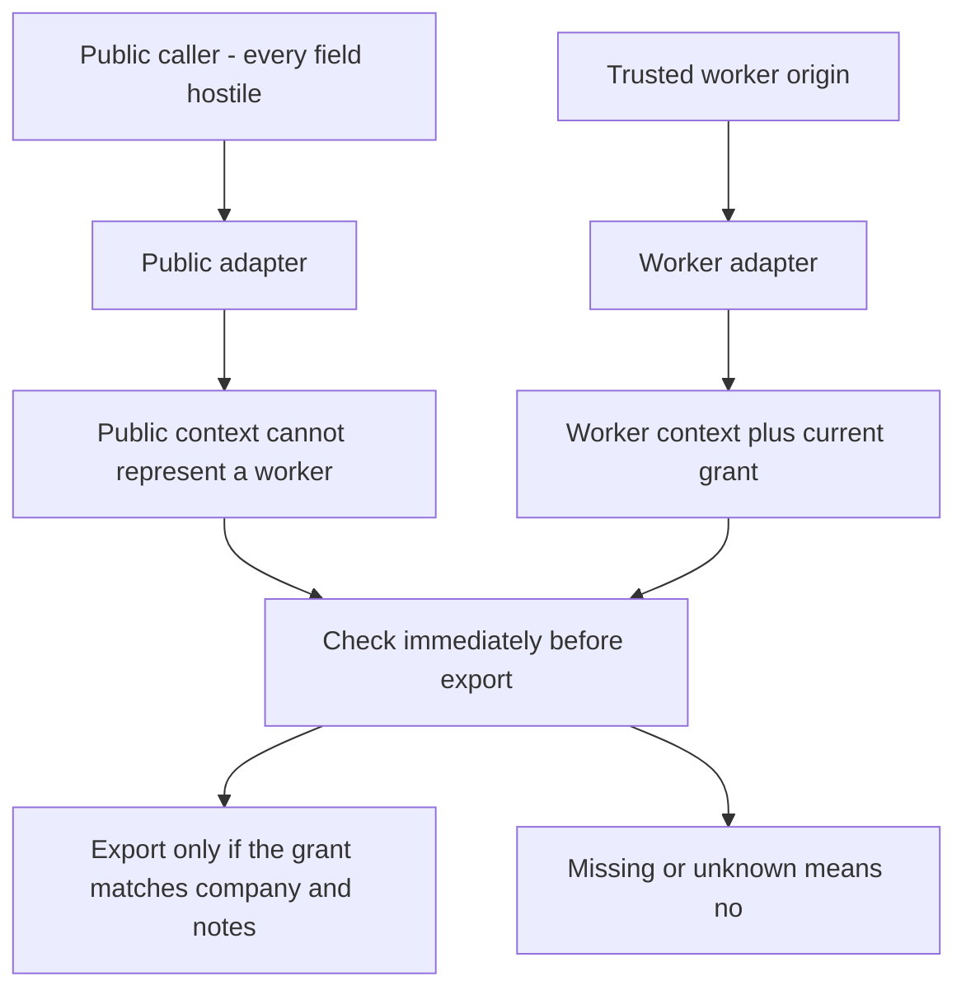

# A boundary is a change in what you assume

**Kind:** concept-model
**Loop step:** 1 Property
**Standards:** OWASP Threat Modeling Project (maintained guidance). Saltzer and Schroeder (1975) on fail-safe defaults, checking every path, and sharing as few tools as you can.

## The rule

A box on a notes-app diagram is not the rule. Start with one sentence you can prove false:

> For a notes-app export this week, a public caller cannot become a worker just by filling in request fields. The export happens only after a trusted server-side adapter shows that this call is a worker, and a current grant narrows that worker to the intended company, action, and notes. If the context is missing or unknown, the answer is no.

That sentence names the effect, what an attacker can try, who decides, how far the allow goes, and what happens on failure. Where worker identity comes from is sometimes called **provenance**. After you meet the word, keep asking: which trusted source established that this call is a worker?

The sentence can be false even when every hop uses TLS and every box sits on a private network. Two functions in the same process can sit on opposite sides of a real boundary: one still treats every field as hostile, the other only accepts context a trusted adapter built.

A **trust boundary** is where a security-relevant assumption or ability changes. Ask what the receiving side may rely on after the crossing. A line on a picture is useful only when the note on that line answers that question.

## Picture: the line is the change in what you assume



A TLS hop between browser and adapter can exist without a new boundary if both sides still treat every field as attacker-controlled. Two functions in one process *can* be a boundary if the public context cannot carry worker authority.

## Keep these words from collapsing

| Word | Precise question | In the notes app this week |
|---|---|---|
| Actor | Who or what takes part? | Member, company admin, batch operator, attacker |
| Principal | Which identity is used for a decision? | Current member id, or export-worker id |
| Component | Where does the code or data run? | Public adapter, policy function, note store |
| Channel | How is the data carried? | Function arguments now; HTTP or a queue later |
| Entry point | Where can an actor or a failure first change in-scope behavior? | Public request adapter; worker adapter |
| Trust boundary | Where does a relevant assumption or ability change? | Untrusted request fields become a checked public context; worker identity becomes a server-built context |

These can sit in the same place. They are not the same word. One component can expose several entry points with different assumptions. One channel can carry both trusted and untrusted data. One actor can act through several principals. A boundary can be crossed without a network.

### A network hop is not automatically a boundary

Suppose a public request passes through a transparent relay. Both sides still treat every field as attacker-controlled. The relay adds no authenticated origin and enforces nothing. There is a network hop. For the export rule, the relevant assumption did not change. Drawing a line there and labeling it “trusted edge” invents trust.

### A boundary can sit inside one process

Suppose the public entry parses hostile fields and calls a policy function with a public context that cannot represent a worker. The two functions run in one Python process. The assumption changes from “the caller chose these strings” to “this context was built through the public adapter and cannot carry worker authority.” That is a real boundary for this rule.

## What you trust depends on the rule

People sometimes call this the trusted computing base. In this course we will keep asking a plainer question: **what you must trust for this named rule**. It is not a permanent inventory of everything called “backend.”

For the export-authority rule this week, a candidate list of what you trust includes:

- the adapter that keeps public and worker call paths apart;
- the source of worker identity and the scoped grant;
- the check that consumes that context immediately before export;
- the store (or practice-file state) used to resolve company and note scope;
- the language and runtime assumptions needed to keep the context type and state honest.

The public browser should not be on that list. If a browser must honestly label itself as an internal worker, the design has already given up the rule.

Change the rule and the list changes. For **note secrecy**, output selection and any log or export sink that handles note bodies matter. For **availability**, resource limits, work scheduling, and maybe a dependency’s failure behavior matter; the content projection might not. For **a usable record**, the evidence producer, transport, store, clock assumptions, and who can read the record become central. Saying “the API is trusted” hides those differences.

Use this test:

> If this component behaved badly or incorrectly, could the stated rule fail even if every other listed control worked as assumed?

If yes, it belongs in what you trust for this rule, or you must narrow the rule. If no, it may still be deployed and security-relevant without belonging on this rule’s list. If you cannot decide, mark the dependency **unknown**. Do not mark it trusted because you hope.

## Attack surface is how someone can reach the protected effect

An **attack surface** is the set of ways an attacker or a modeled failure can influence a protected effect. Ports and routes can be members of the set. They do not define it.

For a note export, relevant surface can include:

- the public request entry and every field it accepts;
- the worker entry and the mechanism that establishes service origin;
- stored company and note identifiers read later;
- a queued or retried message when workers show up later;
- the policy and enforcement path;
- the shared database role or cache key that can widen reach;
- the evidence path, if hiding evidence changes whether the effect proceeds;
- admin and configuration paths that can redefine worker identity or scope.

A CVE list answers a different question. An endpoint list misses stored inputs, alternate paths, shared credentials, configuration, hidden evidence, and state changes. Start from flows to protected effects, then ask what can influence each flow.

## Shared tools can make two checks into one

Trust is often chained:

```text
export decision
  relies on worker context
    relies on adapter origin
      may later rely on queue identity and deployment configuration
        may rely on build and control-plane operators
```

Stop the chain only at an explicit assumption, leftover risk, or a later topic. “Managed service” is not the end of the reasoning.

Saltzer and Schroeder warn that tools shared by users or companies create extra communication and failure channels. A process-wide database credential, a cache key with no company on it, one parser used by edge and API, or a logging pipeline shared with sensitive content can widen both the attack surface and **how far a break can spread**.

Shared does not always mean unacceptable. It means the claim must account for a common failure. If two layers both rely on the same `X-Internal` value, the second check is not independent evidence of worker origin. If a configuration mistake causes both to accept the value, both fail together.

## Isolation and how far a break can spread

People sometimes call the second idea **blast radius**. After you meet the phrase, keep asking the plain question: **how far a break can spread**.

An **isolation boundary** is a mechanism meant to stop one scope from influencing another. A container, schema, process, credential, sandbox, or network policy may help. Its name does not prove the rule.

Bound how far a break can spread across dimensions:

- which companies and objects;
- which actions: read, change, delete, execute, administer, or hide evidence;
- which data fields and how sensitive they are;
- which places the data can leave to;
- which time, expiry, replay, and retry window;
- which control-plane or policy changes;
- which evidence can be hidden or forged.

“Worker access is limited” is not something a reviewer can check. “The ability can export note summaries for company A’s object set once before 12:05, cannot read bodies, cannot choose where the data goes, cannot alter policy, and writes an independent decision record” is a bounded claim. Later topics supply production mechanisms. This page requires the reasoning shape.

## Two checks need two different assumptions

Several controls can be useful for different reasons:

- **prevention** blocks the effect;
- **detection** makes misuse or drift visible;
- **recovery** limits how long it lasts or restores state.

Calling them “layers” is not enough. Compare what each one assumes when it fails.

| Pair | Independence question | Honest conclusion |
|---|---|---|
| Edge strips `X-Internal`; API trusts `X-Internal` | Do both rely on the same field and the same routing or config? | Correlated for header-forgery failure |
| Adapter builds typed worker context; policy enforces a scoped grant | Can a requester skip the adapter or mint the grant? | Can be complementary; prove every export path uses the check |
| Policy denies; evidence sink records the decision | Can failure of the policy also hide the record? Does a missing record block the export? | Detection may be partly independent, not preventive |
| Two products use the same identity assertion and administrator | Can one false assertion or operator mistake defeat both? | Correlated for that failure |

Independence is always “independent with respect to which failure?” A control may be independent of a parser bug but correlated through the same cloud control plane. Unknown dependencies should be labeled unknown.

## Four questions threat modeling uses

Threat modeling often starts with four questions. They are a starting point, not a claim that one named method is required:

1. **What are we working on?** The rule, this week’s scope, flows, assumptions, boundaries, what you trust, and dependencies.
2. **What can go wrong?** Forged origin, scope widening, an alternate entry, replay, a dependency failure, a shared-tool collision, hidden evidence.
3. **What are we going to do?** Separate adapters, narrow authority, deny when unknown, keep a record, recover, name leftover risk.
4. **Did we do a good enough job?** Trace every effect, use several kinds of evidence, challenge independence, and look again after a change or an incident.

Named methods with their own checklists come later. These four questions stop the diagram from being decoration.

## Practice

For each statement, label it **rule**, **component**, **entry point**, **channel**, **trust boundary**, **what-you-trust claim**, **attack-surface item**, **isolation claim**, **how-far-a-break-can-spread claim**, or **unsupported**. More than one label may apply only if you explain why.

1. “The browser connects using TLS.”
2. “The public adapter treats every request field as attacker-controlled.”
3. “Only the worker adapter can construct worker context.”
4. “The API and edge both reject requests whose `X-Internal` value is not `worker`.”
5. “One process-wide store credential can read all companies.”
6. “A single-use grant names company A, action `export_summary`, and notes A1/A2.”
7. “The audit sink is down, but exports continue and no other record exists.”
8. “The service is in a private subnet, so public callers cannot influence it.”

For every **unsupported** statement, rewrite it as a claim you could prove false. Include the protected rule, attacker or failure ability, changed assumption, trusted source, what must not happen, and how you would see it.

## Check yourself

- No box, protocol, product, address range, or internal name is trusted by the label alone.
- What you trust is tied to one rule and changes when the rule changes.
- Entry point and channel are not used as the same word.
- Attack-surface rows point to reachable protected effects.
- Isolation and how far a break can spread name dimensions and evidence.
- “Layers” include a common-failure analysis.
- Unknowns and later work stay explicit.

## Use it somewhere new

A later page will use a fictional document-preview service. Before you get there, predict why “the upload API is the boundary” is not enough. Think about stored-input entry, parser workers, object-store callbacks, queue replay, converter egress, shared libraries, preview caching, moderator tools, and hidden evidence. Do not solve that transfer yet. List which definitions from this page will need a new instance.

## What can still go wrong

A private network, TLS, and an internal-looking field can all be true while a public caller still becomes a worker. Opening this page does not finish the drawing.

## What this page is not doing

Live targets. Ready-made attack recipes. Treating a “top ten bugs” list as the course. Answer keys are not in this file.
