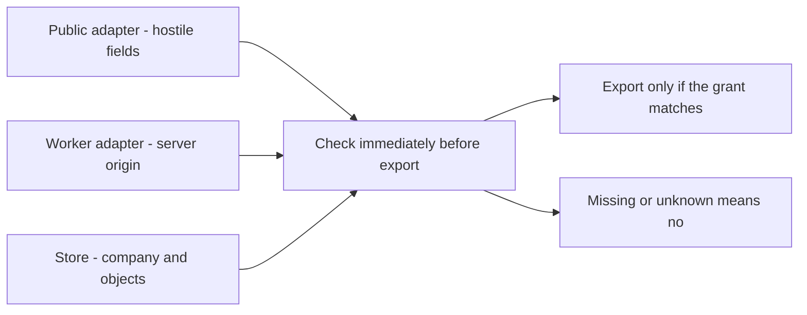

# Draw where trust stops, and how far a break can spread

**Kind:** design-exercise
**Loop step:** 2 Model

## The rule

This page builds the drawing the practice files will use. It is a **design model**, not a claim that the notes app has production networking, cryptographic worker identity, a real queue, or deployed isolation.

Carry forward two artifacts:

- An earlier page said which note secrecy, authority, availability, and record-keeping rules matter.
- Another said which subjects may perform which actions on which objects in current state.

This page asks where those decisions and effects cross assumptions. If the who-may-do-what table says a worker may export company A summaries, the model must show how a caller becomes that worker, how company A and the object set are bound, where the decision is enforced, and which other paths reach the same output.

## Picture: adapters produce context; policy consumes it



## What exists this week vs later

Start with a ledger so a diagram cannot quietly grow fictional assurances.

| Item | This week | Security meaning |
|---|---|---|
| Browser / public caller | In scope and hostile | Chooses request fields, ordering, identifiers, and repetition |
| Public ingress | Conceptual pass-through | Does not establish worker origin; request-path configuration is later work |
| Public adapter | In scope | Produces a public context; cannot grant worker authority |
| Worker adapter | Local illustrative boundary | Produces worker context only from server-held practice state; not production identity proof |
| Policy / enforcement | In scope | Resolves current authority and guards the export effect |
| Note and membership store | Synthetic in-memory state | Source of company and object relations; no database isolation claim |
| Evidence sink | Synthetic in-memory records | Makes decisions visible; no durable or tamper-resistant logging claim |
| Queue, scheduler, retries | Deferred but modeled as a trigger | A later topic must replace the direct worker call with real delayed-state reasoning |
| Login provider, email, object store, CDN, analytics | Deferred dependencies | Must not be drawn as already protected or implemented |
| Cloud control plane, backups, CI/build | Leftover / later work | Chained trust stays explicit |

If a reviewer cannot tell what exists, what is illustrative, and what is deferred, the model is misleading before any threat is considered.

## Draw the flows with names

Use stable flow names so diagram, inventory, checks, and incident notes can refer to the same thing.

```text
HOSTILE / CALLER-CONTROLLED

  [Public caller]
       |
       | F1: requested operation, company/object labels,
       |     internal-looking metadata, correlation value
       v
  [Conceptual ingress] -- F2: unchanged untrusted representation --> [Public adapter]
                                                                  |
                                              B1: context-construction boundary
                                                                  |
                                                                  v
TRUSTED FOR CONTEXT CONSTRUCTION                            [Public context]
                                                                  |
                                                                  | F3: public operation request
                                                                  v
                                                        [Policy + enforcement] ---- F6 ----> [Evidence sink]
                                                                  |
                                                                  | F4: current company/object lookup
                                                                  v
                                                           [This week's store]

  [Synthetic server-held worker registry]
       |
       | F7: worker identity + scoped grant identifier
       v
  [Worker adapter] ---- B2: worker-origin boundary ----> [Worker context]
                                                                  |
                                                                  | F8: export request + narrow grant
                                                                  v
                                                        [Policy + enforcement]
                                                                  |
                                                                  | F9: summary-only export effect
                                                                  v
                                                           [Export result]
```

Boundary B1 does not make request data “trusted.” It makes one narrower statement: the constructed context records that the call arrived through the public adapter and cannot represent worker origin. Company and object identifiers remain untrusted claims until resolved and authorized.

Boundary B2 is also narrow. In the local practice files, it proves that the context came from a separate server-side adapter using registry state, not from public request fields. It does **not** prove how a production workload authenticates, how a queue protects messages, or how deployment configuration resists an operator compromise.

## Annotate every arrow

An arrow without content, control, and assumption is decoration. Expand F8:

| Field | F8 annotation |
|---|---|
| Source | Worker adapter acting for registered worker `export-worker-1` |
| Destination | Policy/enforcement immediately before export |
| Direction | Adapter to enforcement |
| Representation | In-process worker context plus opaque grant identifier |
| Attacker control | A public caller cannot construct the context through the public adapter; a compromised registered worker can choose when to present its own grant |
| Changed assumption | Caller kind and worker id come from server-held adapter state, not request strings |
| Still untrusted / to verify | Grant existence, company, action, object set, expiry/use state, stored note relations |
| Entry point | Worker adapter |
| Enforcement point | Export function before selecting summaries |
| Shared dependencies | Runtime, practice registry, grant store, policy code, evidence path |
| Failure behavior | Unknown caller, context, grant, or scope means no; what happens if evidence fails must be explicit |
| Protected effect | Release only approved company A note summaries |
| How you would see it | Decision plus exact output ids; no note bodies; grant becomes consumed |
| Leftover | Local type and adapter separation is not cryptographic production service identity |

Do the same for every in-scope flow. If the annotation says “validated,” name validation against what. Syntax validation is not origin. If it says “authorized,” name subject, action, object, current state, and enforcement point.

## What you trust, by rule

Do not fill every box with the same trusted color. Use a table or symbols that remain readable without color.

| Component / assumption | Export authority | Note-summary secrecy | A usable record | Availability |
|---|---|---|---|---|
| Public caller honest | Not trusted | Not trusted | Not trusted | Not trusted |
| Public adapter cannot create worker context | Must be correct | Must be correct | Relevant | Relevant to denial only |
| Worker registry / adapter origin | Must be correct | Must be correct | Must be attributable | Relevant to worker availability |
| Grant scope and use state | Must be correct | Must be correct | Must be recorded | Expiry/replay state can deny work |
| Policy + effect enforcement | Must be correct | Must be correct | Decision reason producer | Resource use can affect availability |
| Store’s company/object relations | Must be correct | Must be correct | Object ids needed | Store availability needed |
| Evidence sink | Not preventive in this design | Must not receive bodies | Must be correct/available for the record | Backpressure policy matters |
| Conceptual ingress header stripping | Not relied upon | Not relied upon | May provide a signal only | May shape load later |

The row for ingress is important. If both edge and application trust the same internal-looking header, ingress becomes part of what you trust for authority, and one configuration or parsing error defeats both. A safer rule does not rely on the public edge to turn an attacker-controlled string into worker origin.

## Inventory of how someone can reach the export

Begin with flows and shared mechanisms, not with a scanner. A partial inventory follows.

| Surface / flow | Reachable actor or failure | Controlled input/state | Boundary / effect | Enforcement / trusted source | Shared mechanism and how far a break can spread | Oracle / leftover |
|---|---|---|---|---|---|---|
| F1/F2 public metadata | Any public caller | Internal label, company, action, object ids, repetition | B1 / attempted worker export | Public adapter must force public caller kind | Shared parser/routing can expose all worker-only effects if trusted | Public presentation denies and emits metadata-only evidence; no HTTP proof |
| F3 public operation dispatch | Authenticated or unknown public subject | Operation and identifiers | Policy / note or membership effect | Current who-may-do-what policy | Dispatcher shared across companies; an alternate route can skip the check | Deny unknown action and trace every effect path |
| F4 stored relation lookup | Stale or corrupt practice state | Company, membership, object relation | Policy / scope decision | Server-held store relation | One global store role can reach all companies | Cross-company and missing-object checks; database isolation deferred |
| F6 evidence write | Sink outage or overbroad logger | Availability and recorded fields | Evidence boundary / record-keeping and perhaps export | Explicit evidence-failure rule | Shared sink can leak all companies or hide all decisions | Sanitized schema; simulated failure; durable integrity deferred |
| F7 worker registration | Misconfiguration or compromised operator | Registered id and grant issuance | B2 / worker origin | Server-held registry in the practice files | Registry administrator may reach every registered worker | Unknown worker denies; production operator/control-plane leftover |
| F8 grant presentation | Registered worker or replay | Timing and its grant id | Policy / export authority | Stored narrow grant and current use state | Reusable/global grant widens companies, actions, objects, and time | Scope/expiry/replay checks; cryptographic transport deferred |
| F9 result construction | Enforcement or projection defect | Selection code and store state | Output / secrecy | Exact approved ids and summary projection | Shared export credential/output sink may expose all notes | Exact ids/fields oracle; no real storage/egress assurance |

Completeness is relative to stated scope. The inventory is competent only if it covers every in-scope protected effect and labels deferred paths. “No queue this week” is a legitimate scope statement. Drawing a queue and silently assuming signed messages solve origin is not.

## Trace a who-may-do-what row to the path

Take a row from the earlier authority page:

```text
registered export worker × export_summary × {company A: A1, A2}
  with current single-use grant -> allow
```

Trace it end to end:

1. Worker identity originates in the worker adapter, not request metadata.
2. The grant identifier refers to server-held authority; its existence is not enough.
3. Policy checks caller kind, worker id, action, company, exact object set, expiry, and unused state.
4. The effect path selects only allowed objects and projects only summary fields.
5. Use state changes before another successful effect can occur in this sequential model.
6. Evidence records a bounded decision and grant hash/id, not note content.

Now trace the denied row:

```text
public caller × export_summary × any company/object set -> deny
```

No value in F1—including `worker`, an internal route name, or company A—may move the call into the worker row. That is the boundary rule the practice will challenge.

## When two defenses share a failure

Use a dependency table before claiming depth.

| Control | Function | Inputs/dependencies | Bypass/failure | Relation |
|---|---|---|---|---|
| Conceptual ingress strips internal header | Prevention attempt | Same header parser, routing/config, operator | Alternate encoding/path or configuration drift | Correlated with API header trust; not counted as independent |
| Public adapter constructs only public context | Prevention | Code path, type/runtime, dispatcher coverage | Direct call to worker effect skipping the adapter | Complementary to effect enforcement; coverage must be checked |
| Grant scope consumed at export | Prevention | Grant store, clock/use state, policy | Global grant, check/use gap, unguarded alternate export | Distinct decision from origin but shares enforcement/runtime |
| Sanitized decision evidence | Detection/recovery input | Logger schema, sink, correlation/model version | Sink outage or same process compromise | Not preventive; partly independent only if the failure path is explicit |

Do not turn “partly independent” into a numerical risk reduction. The table supports an engineering claim: which failures one control can catch when another fails, and which common failures defeat both.

## Worked change: add a queue without granting extra trust

Suppose the direct F8 call later becomes:

```text
worker adapter -> queue publisher -> queue -> consumer -> export enforcement
```

New components are not the only change. Ask:

- Is the message a grant, a re-authorization request, or a reference to current server-side state?
- Who is the originating subject and who is the effective consumer?
- Can company, action, object set, or destination change between issue and use?
- What do retries, duplication, reordering, delay, cancellation, and revocation mean?
- Which publisher/consumer identities and queue administrators join what you trust?
- Can one queue or consumer credential reach every company?
- Where is enforcement repeated immediately before the effect?
- What evidence links issue, consume, denial, retry, and effect without leaking content?

This page records those as review triggers. A later topic on delayed work must supply production-ready asynchronous reasoning. The honest model changes before the implementation claim does.

## Practice

Create four linked artifacts:

1. **Annotated diagram:** include F1–F9 or justified equivalents; mark hostile, trusted-for-a-specific-assumption, deferred, and leftover using text/symbols as well as color.
2. **Flow ledger:** complete every annotation field shown for F8.
3. **Attack-surface inventory:** cover public, stored-state, worker, export, evidence, and configuration influence paths.
4. **What-you-trust analysis:** choose export authority and record-keeping, show how their trust lists differ, and classify at least three control pairs for a named failure.

Then ask a peer to challenge it. The reviewer chooses one protected effect and walks backward from effect to every reachable entry point. Any untraced path, untrusted attribute labeled trusted, unnamed shared dependency, or unsupported isolation claim becomes a revision.

## Check yourself

- Every diagram arrow has a stable flow id and ledger row.
- Every in-scope who-may-do-what effect maps to at least one enforcement point and a way to see it.
- Public data remains attacker-controlled after syntax validation and TLS transport.
- Worker origin and worker authority are separate: origin says who/caller kind; the grant says what effect is allowed.
- At least one shared mechanism and one chained dependency are explicit.
- How far a break can spread is dimensional, not “low/medium/high.”
- Deferred components are named with review triggers and no deployed-control claim.
- The model can be read in grayscale and as linear text.

## Use it somewhere new

Archive this notes-app pack before the document-preview page. That service will invalidate it: stored document bytes become a delayed entry point, parser workers may need egress and sandboxing, object storage and a queue become active dependencies, and availability becomes a primary rule. The transfer task will score the quality of the reconstruction, not visual similarity.

## What this page is not doing

Production networking. Cryptographic workload identity. A real queue. Deployed isolation. Live targets. Answer keys are not on this site.
