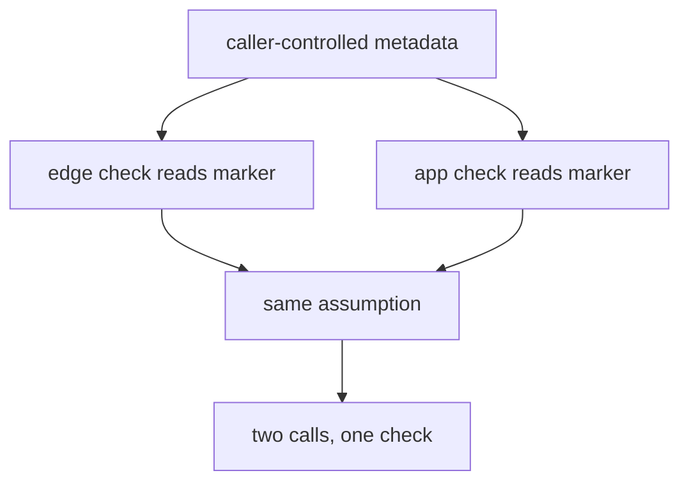

# Try a forged “I am the worker” locally

**Kind:** break-fix-lab
**Loop step:** 3 Break

## Where you may practice

Only the local files under `labs/1.3/1.3-trust-boundaries`. Do not adapt these calls or observations to any public, employer, classroom, or third-party system. Companies (the files say tenant), workers, grants, notes, and events in those files are synthetic.

## The rule

The question is causal, not “can I make a check go red?”

The broken files claim two layers protect a worker-only export:

1. an illustrative edge check recognizes an internal-looking field;
2. the application repeats the same recognition before exporting.

Both layers consume caller-controlled metadata. They are two checks but one trust assumption. The broken files also give the resulting worker path a broad, reusable ability instead of binding the protected effect to current company, action, object, expiry, and use state.

> A public caller cannot become a worker by choosing metadata. Only a trusted worker adapter may establish worker origin, and the export effect requires a current, single-use grant bound to worker, company, action, and exact object set. Missing, unknown, malformed, expired, replayed, or evidence-failed context means no — before any output.

The local practice is designed to make that rule observable without a network target, real credential, real personal data, or harmful payload.

## Picture: two checks that share an assumption are one check

Independence is a property of the *inputs*, not of the call count. When both layers read the same caller-controlled marker, a forged marker fools both. The second check is a duplicate, not a defense.



## Prepare an evidence worksheet

Before running anything, create one row per observed case:

| Check / flow | Required rule | Preconditions | Trigger | Root cause | Impact / what must not happen | Structural prevention | Detection | Recovery | Leftover |
|---|---|---|---|---|---|---|---|---|---|

Keep these columns distinct:

- A **precondition** is a state that makes the failure reachable: a public entry exists, a grant exists, a shared export function accepts the call.
- A **trigger** is the specific local input or transition that exercises the failure.
- The **root cause** is the violated trust or enforcement assumption — not the input string and not the failed assertion.
- **Impact** is what must not happen to a rule: unauthorized summary release, cross-company reach, use outside action/object/time scope, replay, or an unobserved effect.
- **Prevention** changes how the system derives origin, represents authority, or mediates the effect.
- **Detection** makes a boundary crossing visible but does not retroactively prevent release.
- **Recovery** contains authority, repairs every path sharing the assumption, reconciles outputs/state, and rechecks.

“Header spoofing” is a trigger label, not a complete diagnosis. “Validate the header” is not a structural repair when the public caller still controls the asserted fact.

## What to read in the practice files

From the repository root, inspect:

- `labs/1.3/1.3-trust-boundaries/README.md`
- `labs/1.3/1.3-trust-boundaries/tests/test_boundary.py`
- `labs/1.3/1.3-trust-boundaries/vulnerable/SECURITY.md`

Do not open the repaired files or examiner key yet. For each check, mark:

- diagram flow and entry point;
- attacker/failure ability;
- exact protected effect and how you would see it;
- evidence mode: normal, wrong input, abuse, when things break, or “what if we remove this protection”;
- whether the case tests origin, authority scope, enforcement coverage, lifecycle, or evidence behavior.

An environment or import error is not security evidence. A check that passes on both broken and repaired files may be a valuable valid-input regression, an ordinary denial, or a safety constraint rather than an intended vulnerability.

## Run the broken files

Use the command in the lab README from the repository root:

```text
python -m pytest labs/1.3/1.3-trust-boundaries/tests --impl vulnerable
```

Expected shape: selected “what must not happen” assertions fail while valid worker behavior, ordinary public denial, malformed requests, output projection, and practice-safety checks continue to pass. Record the exact totals produced by your checkout; do not invent totals from this paragraph.

For every intended failure, answer three layers of “why”:

1. **Why did the assertion fail?** Describe the returned decision, output, and state.
2. **Why could the implementation produce that result?** Identify the missing or untrusted model element.
3. **Why did the design allow that implementation?** Identify the false boundary, a broad leftover ability, missing lifecycle, a path that skips the check, or a shared-failure claim.

## Why it happens, what it costs, how you stop it, how you notice, how you recover

### Family 1 — forged origin

The public caller may choose an internal-looking marker and service label. If those values create a worker-equivalent context, the client has become part of what you trust for authority.

Trace it:

```text
public field chosen
  -> edge interprets field as internal
     -> application interprets same field as internal
        -> shared export effect accepts effective worker
           -> protected summaries released
```

The two layers do not give independent depth because one attacker-controlled fact drives both. Even perfect TLS only protects the attacker’s chosen field in transit.

Your causal row should say that **origin was derived from an assertion made by the party whose origin was in question**. The smallest structural direction is separate trusted and untrusted adapters, or an equivalent production mechanism that establishes service identity outside public fields. This local course does not claim to implement production workload identity.

### Family 2 — authority widening

A genuine worker identity is still not authority for every export. Challenge company, action, and object-set dimensions separately.

Examples of distinct things that must not happen:

- a company A grant exports a company B object;
- a grant for `{A1, A2}` exports `{A1, A2, A3}`;
- a grant for `export_summary` is used for another action;
- a broad process credential substitutes for the product’s grant.

Do not merge these into “authorization missing.” Each points to a different absent binding. The identity boundary can be correct while the authorization boundary remains wrong.

The impact is the scope actually released or changed, not “the worker is compromised.” A worker with an all-company store credential may have a larger mechanism ability than product authority. The enforcement point must consume the product authority before the effect.

### Family 3 — lifecycle and replay

A scoped grant can become unsafe if its time and use state are ignored. Test expired and already-used grants independently.

Reason in transitions:

```text
issued -> usable -> consumed
              \-> expired
```

Only `usable` may authorize the modeled effect. Unknown transitions mean no. In this sequential in-memory practice, a successful effect consumes the grant. That demonstrates lifecycle reasoning; it does not prove transactionality or race safety. A production queue with duplicate delivery would require atomic consumption, idempotency, cancellation, and retry analysis in later topics.

### Family 4 — evidence failure

The practice models the export as high impact and chooses a conservative exercise rule: if the required evidence record cannot be produced, the effect denies. That is not a universal rule for every event. Some low-risk operations may buffer or degrade; some availability-critical operations may proceed with alternate evidence.

The design must be explicit. “We log exports” is false assurance if the operation proceeds silently whenever the shared sink fails. Test both:

- unavailable evidence produces no export effect under this exercise policy;
- an allowed export record omits note bodies, raw grant material, and other unnecessary sensitive fields.

The evidence sink is therefore part of what you trust for a usable record and, under this exercise rule, part of export availability. That consequence belongs on the model.

### Family 5 — alternate enforcement and correlated claims

Check whether every exported output must pass through the same scoped decision. A policy function can be correct while a wrapper, helper, retry, or administrative path skips it.

Also inspect the broken `SECURITY.md`. A document may claim “edge plus application” as two layers even when source inspection shows a shared caller-controlled input. Evidence includes code and data dependencies, not the number of boxes in prose.

Your analysis must distinguish:

- **policy correctness:** when called with trustworthy context, does the decision enforce scope?
- **enforcement coverage:** can any in-scope effect occur without consuming that decision?
- **control independence:** can one false input or shared failure defeat the claimed layers together?

## What is not good enough

For at least three of these, explain which failure remains:

- strip one exact header spelling at an edge;
- check a private source address;
- rename the route `/internal/export`;
- add a second check that reads the same field;
- sign a message that still grants all companies, actions, and objects indefinitely;
- hide the worker operation in the UI;
- give the worker a broad store credential and promise it will choose the correct company;
- log after release but silently skip the log when the sink fails.

The exercise is not asking which mechanism is always wrong. It asks why the proposed change does not establish the stated origin, authority, lifecycle, mediation, independence, or evidence rule.

## Safe mutation practice

After recording the baseline, make only a disposable copy outside the course practice files. Choose one simple mutation, such as removing an action comparison or changing a used-state transition. Predict exactly which property check should fail and which valid regressions should remain green. Run only the local test command.

If more checks change than predicted, record the coupling as a model finding. Restore by deleting the disposable copy — not by resetting the repository or editing a live target.

## Practice

Submit:

1. exact broken-files command, environment, exit code, and totals;
2. a check-to-flow and evidence-mode trace;
3. one complete causal row for every intended failure;
4. grouping by forged origin, scope widening, lifecycle/replay, evidence failure, alternate enforcement, or correlated control;
5. at least three rejected repairs with the remaining thing that must not happen;
6. one safe mutation prediction/result;
7. a bounded statement of what the practice files cannot prove.

## Check yourself

- Root causes name violated assumptions and enforcement structure, not only inputs or weakness labels.
- Valid behavior is preserved in the analysis; “deny every export” is not accepted as a functional repair.
- Detection and recovery are not presented as prevention.
- Worker identity and worker authority remain separate.
- The local type/adapter model is not called production authentication.
- No step reaches a network, real company, credential, or public system.

## Use it somewhere new

On the document-preview page, hostile influence may arrive as stored document bytes long after the upload request. “The upload endpoint validated it” can become the same kind of false boundary as “the edge stripped the header.” You will trace origin, parser ability, queue lifecycle, egress, and evidence through an asynchronous system rather than repeating this practice’s field names.

## What this page is not doing

Live targets. Real credentials. Harmful payloads. Answer keys. Do not paste this exercise onto a public API, employer system, or classroom deployment.
