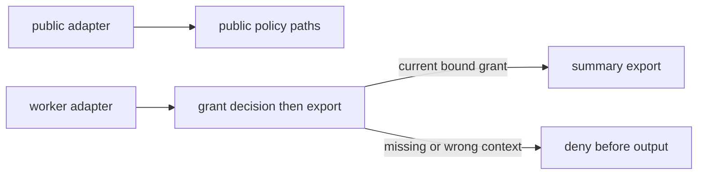

# Restore trusted origin and limit the export

**Kind:** design-exercise
**Loop step:** 4 Build

## The rule

The broken design asks an untrusted caller to state whether it is trusted. The first repair is not a longer list of accepted values. It is a change in where origin comes from.

The repaired local design uses two adapters:

```text
public input -> public adapter -> public context -> public policy paths

server-held worker registry -> worker adapter -> worker context
    -> scoped grant decision -> export effect
```

The public adapter can carry requester data, but it cannot construct worker caller kind or worker identity. The worker adapter receives a synthetic registered identity from server-held practice state. This creates a meaningful in-process trust boundary for the exercise.

## Picture: adapters produce the second context

The smallest composition is not a second `if`. It is an adapter that builds a *different* context — from a server-held worker registry, not from the request’s internal-looking field — and a second decision against that context. If the adapter can fail closed, the second check is real.



Be precise about the claim: a caller using the public function cannot become a worker by setting fields. This does **not** establish mutual TLS, workload certificates, deployment identity, queue authenticity, or resistance to a compromised process or operator. Those are named production design obligations and later work.

## Separate origin, authority, and effect

Three questions must have three answers:

1. **Origin (provenance):** what trusted mechanism establishes the effective caller kind and identity?
2. **Authority:** what current grant permits this caller to perform this action on this company and exact object set now?
3. **Effect:** which enforcement point ensures no output is constructed before both answers are positive?

A worker registry answers only the first. A grant or policy record answers the second. A wrapper that calls policy but then invokes an unguarded helper may fail the third.

Use an authority tuple:

```text
(worker_id, action, tenant_id, object_ids, issued_at, expires_at, use_state)
```

The tuple is a reasoning contract, not a mandate for token format. The practice files call a company `tenant_id`. A server-held opaque grant identifier refers to this state. Production alternatives could include current server-side re-authorization, a cryptographically protected grant, or another bounded mechanism, but each must preserve the same product authority and lifecycle.

## Fail safely at every unknown

The repaired decision should deny when any of these is missing or inconsistent:

- caller context is absent or of the wrong kind;
- worker is unknown or no longer registered;
- grant is absent or belongs to another worker;
- action differs from the grant;
- requested company differs from the grant;
- requested object set differs from the grant;
- a requested object is missing or belongs to another company;
- grant is expired or already consumed;
- required evidence cannot be produced under this exercise’s high-impact policy.

This is “when in doubt, no” applied to the decision surface. It is not enough to default one policy branch to deny if a different function performs the export directly. Every in-scope effect path has to go through the check.

## Bind exact object scope

Company scope alone can still be too broad. Suppose a job was approved to export summaries for `{A1, A2}`. A check that permits every company A note converts an object-scoped grant into a leftover company-wide ability.

The local exercise compares the exact normalized set of requested object ids with the grant. It then resolves each stored note and verifies its company before constructing output. Both checks matter:

- exact scope prevents the caller from adding another same-company object;
- stored relation prevents a mislabeled or corrupt request from treating a company B object as company A.

The output also projects only identifiers and summaries. A correct authority decision does not justify returning fields outside the approved effect. The earlier authority page introduced field-aware authorization; this boundary model traces it to the release point.

## Consume lifecycle state before replay

In the local sequential model, a successful export changes `usable` to `consumed`. A second use denies. An expired grant denies even if its signature or identifier would otherwise look valid.

The production proof obligation is harder:

- check and consumption may need to be atomic;
- a queue may redeliver after timeout;
- two workers may race;
- cancellation and revocation may occur after issuance;
- clocks may disagree;
- retry may need idempotent result reuse rather than a second effect.

Do not hide those under the local result. Record “sequential in-memory lifecycle only” as leftover risk and attach review triggers for persistence, concurrency, and queues.

## Make evidence part of the decision contract

For this exercise, the export is high impact and must not proceed if its bounded decision record cannot be emitted. The record may include:

- caller kind and worker id;
- action;
- company id and count of object ids, not their content;
- grant identifier or one-way reference suitable for correlation, not raw secret material;
- allow/deny and bounded reason code;
- enforcement point and model/policy version;
- time and correlation identifier.

It must not include note bodies, raw grants/tokens, passwords, authorization headers, or unnecessary person attributes.

This choice couples export availability to evidence availability. State that trade-off. A different effect could buffer evidence locally or proceed in a declared degraded mode. The security failure is not choosing one universal behavior; it is leaving behavior undefined and claiming observability anyway.

## Bound how far a break can spread

Write a claim for a compromised registered worker that holds one grant:

| Dimension | Bounded local claim | Leftover / later work |
|---|---|---|
| Company | Only the grant’s company | Practice store is globally readable by implementation code; no database role isolation |
| Objects | Exact grant set | Atomic persistence and concurrent consumption not modeled |
| Action | `export_summary` only | No real action router or production serialization |
| Fields | Id and summary only | No downstream file/object storage or cache |
| Time/use | Before expiry, one successful use | Synthetic clock argument; no distributed clock/retry proof |
| Egress | Returned in-process to the caller | No production destination binding or network egress policy |
| Policy/control plane | Cannot edit registry/grants through modeled functions | Practice administrator and process compromise are leftover |
| Evidence | Bounded decision event required | In-memory sink is neither durable nor tamper-resistant |

The claim is more useful than “the worker is isolated.” It shows exactly which mechanism and evidence support each dimension and where the argument stops.

## Reduce shared tools

Sharing as few mechanisms as you can suggests reducing unnecessary sharing across callers and companies. Candidate improvements include:

- separate public and worker adapters instead of one dispatcher that infers caller kind;
- separate context types so public data cannot represent worker origin;
- company/action/object-scoped grants instead of one global worker boolean;
- exact output projection instead of a shared “dump all notes” helper;
- evidence schemas that omit protected content;
- later, separate credentials, queues, storage prefixes, egress rules, and operational roles where justified.

Separation has costs: more configuration, lifecycle management, observability, incident paths, and failure modes. The goal is not maximum boxes. It is a smaller, more reviewable list of what you trust, and a narrower common failure domain for the rule.

## Evaluate five candidate repairs

### 1. Strip the marker at the public edge

Useful hardening and detection, but not enough as the authority root. A misroute, alternate adapter, parser disagreement, or edge configuration change can reintroduce the field. If the API treats its presence as worker origin, the rule still depends on the edge’s negative filtering.

### 2. Accept the marker only from a private address

An address may be a routing signal, not a product authority fact. Proxies, shared networks, a request that makes the server fetch an internal address, misconfiguration, NAT, or a compromised internal workload can defeat the assumption. The mechanism may contribute to network isolation later; it does not replace service origin and scoped authority.

### 3. Sign the entire request with a global worker key

This can improve integrity and origin relative to a public string, but a global key may authorize every company, action, and object indefinitely. It creates a large spread when something breaks, and difficult rotation. Signature validity must not be confused with product permission.

### 4. Use separate adapters and a scoped, single-use grant

This is the local structural repair. It removes public metadata from worker origin and binds the effect to current narrow authority. It still shares a process/runtime, practice registry, policy code, and store, so the independence and production claims remain bounded.

### 5. Deny all export

This preserves secrecy but destroys authorized functionality and does not demonstrate a usable security design. A successful repair must preserve valid normal behavior while blocking what must not happen.

## Practice

Before viewing the repaired files, submit:

| Decision field | Required content |
|---|---|
| Rule | Public cannot obtain worker-only export; narrow worker grant required |
| Trusted origin source | Which adapter/state constructs caller kind and identity |
| Untrusted inputs | All public fields; worker-chosen presentation time; requested identifiers until checked |
| Positive rule | Exact worker/action/company/object/lifecycle/evidence conditions |
| Enforcement point | Function immediately before summary selection and release |
| Unknown/failure behavior | Deny reason and unchanged output/state |
| Lifecycle | Issue, usable, consumed, expired, revoked/deferred |
| Evidence | Bounded fields, sink behavior, correlation, prohibited fields |
| Rejected alternatives | At least three and their remaining failure |
| How far a break can spread | Company/action/object/field/time/egress/control/evidence dimensions |
| Leftover | No production identity, transport, queue, transaction, sandbox, or durable evidence claim |
| Review triggers | Every change that invalidates the local proof |

## What to read in the repaired files

Only after writing the record, inspect:

- `labs/1.3/1.3-trust-boundaries/fixed/surface.py`
- `labs/1.3/1.3-trust-boundaries/fixed/SECURITY.md`

For each field, cite the code path or check that supports it. If the implementation differs from your design, decide whether it is a defect, a legitimate alternative, or a documented practice limit. “The checks pass” does not settle an unsupported claim.

## Check yourself

- Public and worker origin have structurally separate construction paths.
- No requester-controlled field can choose caller kind or worker identity.
- Origin is not treated as sufficient authority.
- Grant scope includes worker, action, company, exact objects, expiry, and use state.
- The decision is consumed before the protected output and every in-scope output path is traced.
- Evidence failure is deliberate and sensitive content is excluded.
- At least three plausible non-fixes are rejected causally.
- How far a break can spread, and leftover risk, are dimensional and testable.

## Use it somewhere new

A document-preview converter cannot use one in-process context type as its production isolation story. A converter processes hostile stored bytes, may require narrowly constrained egress, and may run asynchronously. The same reasoning still applies: origin of the queued job, current authority to process one object, parser/sandbox of what you trust, exact output destination, lifecycle/retry state, evidence, and bounded spread must be separated.

## What can still go wrong

This local repair still shares a process, a practice registry, policy code, and a store. It is not production worker identity.

## What this page is not doing

Mutual TLS as the week’s proof. Workload certificates. Queue authenticity. Live targets. Answer keys are not on this site.
