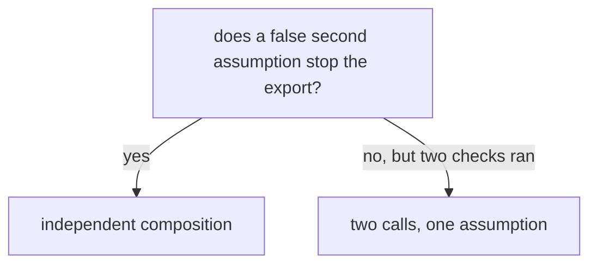

# Prove the boundary across the checks

**Kind:** verification-lab
**Loop step:** 5 Verify

## The rule

An architecture diagram can be internally consistent and still be false. Verification connects each boundary claim to an observation that would contradict it.

For the lab rule:

> Public input cannot establish worker origin, and only a current single-use grant bound to worker, company, action, and exact object set permits the summary export effect.

## Picture: five ways to ask whether the second check is real

Normal, wrong input, abuse, when things break, and “what if we remove this protection” are not five different rules. They are five ways of asking whether the second check still has its own assumption. The independence case sets the second assumption false while leaving the first true.



Useful observations look at more than an HTTP-like status:

- `allowed` decision and reason;
- exact returned note ids and exact allowed fields;
- absence of company B or note-body data;
- grant use state before and after;
- evidence presence and sanitized schema;
- unchanged state/output after denial;
- whether every effect path invokes enforcement.

A `403` alone is weak if output was already constructed, a side effect occurred, a retry remains queued, or sensitive data entered logs.

## Use five evidence modes

### 1. Normal

Show that the intended function remains usable. A registered worker presents its own unexpired, unused grant for the exact company A action and object set. The expected result is one allowed summary-only output, a consumed grant, and a bounded evidence record.

Normal evidence prevents “deny everything” from masquerading as security. It also checks that the repair does not silently broaden output fields for convenience.

### 2. Wrong input

Use a valid or plausible caller that lacks one required condition:

- ordinary public call with no internal-looking metadata;
- unknown worker;
- missing/unknown grant;
- wrong action, company, or object set;
- missing object or company relation.

Vary one condition at a time where possible. Assert denied decision, empty output, unconsumed unrelated grants, and bounded evidence. A case with five invalid fields may pass while hiding which rule works.

### 3. Abuse

Exercise the attacker ability or misuse pattern that motivated the rule:

- public input supplies internal-looking caller/service metadata;
- a valid worker tries to widen from company A to company B;
- a valid worker adds an ungranted same-company object;
- an already-consumed grant is replayed;
- an alternate export helper is called without the adapter/policy path, if such a path exists.

The practice uses benign synthetic strings and function calls. No network evasion, production identifier, or harmful payload is needed.

### 4. When things break

Exercise non-malicious or operational failure:

- grant is expired;
- evidence sink is unavailable under this exercise’s high-impact policy;
- registry or stored relation is missing/unknown;
- representation is malformed;
- later, queue duplication, reordering, clock skew, transaction failure, and partial output would be required.

Unknown/failure behavior is part of the boundary contract. A control that works only while every dependency is healthy is incomplete.

### 5. What if we remove this protection

Remove or bypass one claimed protection in a disposable copy and predict the precise observation that must change. Examples:

- let the public adapter construct worker context;
- remove exact object-set comparison;
- skip used-state transition;
- call output construction before policy;
- make evidence failure silently continue.

If no check changes, the control may be decorative, the check may not reach it, or another correlated control may mask its absence. This evidence is stronger than accumulating green checks because it asks whether the claimed mechanism is causally connected to the rule.

## Build the traceability matrix

Use a matrix that joins design and execution:

| Claim / flow | Rule dimension | Initial state | Ability / failure | Entry and enforcement path | How you would see it | Normal | Wrong input | Abuse | When things break | If we remove it | Leftover |
|---|---|---|---|---|---|---|---|---|---|---|---|
| Public context cannot be worker | Origin | Public adapter reachable | Caller chooses all metadata | F1–F3; worker-only export denies | No output; public caller kind in evidence | — | Plain public deny | Internal metadata still denies | Malformed metadata denies | Permit worker context in public adapter; abuse check must fail | No production routing/identity proof |
| Grant binds exact objects | Authority scope | Grant `{A1,A2}` usable | Worker adds A3 | F8–F9 | Deny; no summaries; grant remains usable | Exact set allows | Wrong set denies | Same-company widening denies | Missing object denies | Remove set equality; widening check must fail | No database row-policy proof |
| Grant is single use | Lifecycle | Grant usable | Repeat after success | F8–F9 | First allow, second deny; one effect | First use allows | Consumed denies | Replay denies | Atomic failure deferred | Remove consumption; replay check must fail | Sequential memory only |
| Evidence required | Record / availability | Sink unavailable | Operational outage | F6 before F9 | Deny and no output under exercise rule | Available sink allows | — | — | Unavailable sink denies | Continue on sink failure; failure check must fail | No durable/tamper-resistant sink |

Every critical claim needs at least one executable case and leftover risk. Not every mode applies to every row, but the evidence pack as a whole must cover all five modes.

## Distinguish decision checks from effect checks

A pure function check may prove:

```text
policy(worker, grant, request) == deny
```

It does not prove:

- every export route calls the policy;
- output is constructed only after allow;
- a retry or admin helper cannot skip it;
- the grant is consumed atomically;
- the database credential cannot read broader data;
- evidence is emitted and sanitized;
- production caller identity is trustworthy.

The lab therefore observes wrapper behavior and output/state as well as decision logic. Its structural checks inspect the repaired public adapter and safety boundary. Even then, it proves only the small in-process practice.

## Test the attack-surface inventory for closure

For each inventory row, define one of four closure states:

- **Executable evidence now:** a local check reaches the entry/effect and asserts an observation.
- **Reviewed structural evidence:** source/model inspection supports the claim but a runtime path is absent.
- **Deferred with trigger:** component is not implemented; later topic and activating change are named.
- **Leftover / unknown:** the assumption remains trusted or unverified and has an owner.

Never mark “closed” because a control name appears in the diagram. A surface can be reduced, mediated, detected, transferred, accepted, or removed; every verb needs evidence and scope.

Example:

| Surface | State | Evidence | Honest conclusion |
|---|---|---|---|
| Public metadata promotes worker | Executable | Forged-metadata abuse checks plus public-adapter inspection | Closed in local API practice; production routing/workload identity unproved |
| Worker grant crosses company | Executable | Company mismatch and exact-output observation | Closed for practice state and sequential call |
| Queue replay | Deferred | Trigger: first persistent/asynchronous worker | No queue assurance claim |
| Cloud operator changes registry | Leftover / later | Owner and later operations trigger | Operator remains chained-trusted |
| Evidence sink tampering | Leftover / later | Only in-memory schema/outage check | Durability/integrity unproved |

## Verify control independence with fault hypotheses

Do not write “independent” without a named fault. Use hypotheses:

- If the public parser accepts an ambiguous field, do both edge and application accept it?
- If the worker registry is wrong, can grant scope still prevent cross-company export?
- If policy code is bypassed, can output projection or evidence prevent release? Usually evidence only detects after the fact.
- If the shared process is compromised, do context types and policy remain trustworthy? No; they share a failure domain.
- If the evidence sink fails, does prevention still work and is the failure visible elsewhere?

Classify each pair for that fault as **independent**, **partly independent**, **correlated**, or **unknown**. A local check can establish some logical separation. It cannot establish production operational independence.

## Run both variants

From the repository root, use the README commands:

```text
python -m pytest labs/1.3/1.3-trust-boundaries/tests --impl vulnerable

python -m pytest labs/1.3/1.3-trust-boundaries/tests --impl fixed
```

Record environment, exact command, exit code, totals, and intended failure names. The broken run should preserve valid/regression cases while failing selected “what must not happen” cases. The repaired suite should pass completely. Treat syntax/import/setup errors as environment defects, not lesson evidence.

For each intended broken-files failure, compare:

- expected rule observation;
- actual broken effect and state;
- repaired effect and state;
- implementation decision that changed;
- inventory row and diagram flow;
- remaining assurance gap.

## Design a counterfactual safely

Copy `fixed/surface.py` to a temporary learner directory. Do not edit course variants in place. Choose one protection and write the prediction before modifying:

```text
If exact object-set binding is removed,
then the same-company scope-widening check will change from denied to allowed,
while the exact authorized export and public-origin denial remain unchanged,
because the mutation affects authority scope but not caller origin.
```

Run the smallest relevant local test selection and then the full repaired suite against your disposable copy if your harness supports it. If the observed effects differ, revise the dependency model. Delete the temporary copy afterward.

## Practice

Submit:

1. five-mode traceability matrix covering every rule this topic named;
2. exact broken/repaired results and environment;
3. diagram-flow and attack-surface row for each check;
4. explicit output, state, and evidence observations — not only statuses;
5. one “if we remove it” prediction, mutation, result, and interpretation;
6. independence classifications for at least three control pairs and faults;
7. closure state and leftover for each surface row;
8. a boundary on the conclusion.

A suitable conclusion is:

> The local evidence shows that the repaired in-process public adapter cannot construct worker origin, and that the modeled export wrapper enforces this practice’s worker/company/action/object/expiry/use/evidence rules for the covered cases. It does not prove production workload identity, HTTP/proxy behavior, persistent atomicity, queue semantics, database isolation, sandboxing, egress control, or durable audit integrity.

## Check yourself

- All five modes are present and trace to claims.
- At least one observation checks exact allowed fields and one checks unchanged state after denial.
- Removing a protection demonstrates a causal link to a claimed control.
- Policy correctness and enforcement coverage are separately addressed.
- Control independence is relative to named failures and shared dependencies.
- Deferred and leftover surfaces are not counted as closed.
- The conclusion is narrower than “secure” or “compliant with a numbered list.”

## Use it somewhere new

A document-preview pipeline needs different observations: no parser escape, no unexpected network/file-system effect, bounded CPU/time/output, exact object-to-job binding, safe preview publication, idempotent retry, and evidence that excludes hostile content. The five modes stay; their observations change with the system.

## What this page is not doing

Live traffic. Harmful payloads. Treating green checks as production identity proof. Answer keys are not in this file.
