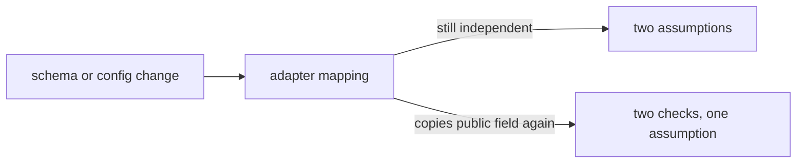

# Notice when the assumption moved

**Kind:** operations-exercise
**Loop step:** 6 Operate

## The rule

At design time, a boundary is an assumption change on a diagram. At runtime, it becomes a set of decisions, configuration, identities, paths, evidence, owners, and failure responses. If those drift while the diagram remains unchanged, the model becomes a source of false confidence.

## Picture: mappings drift while the diagram stays pretty

The adapter is a living object. Resource schemas change. A header name gets reused. A mapping that once produced an independent worker context can start copying the public field again. Operating composition means watching the adapter: when the two decisions diverge, when the mapping was last reviewed, and whether a schema change silently reunited the inputs.

Operations must answer:

- How will we know which boundary and model version handled an effect?
- Which signals suggest public-to-worker confusion, scope widening, replay, bypass, a shared failure, or unexpected egress?
- What happens if evidence itself is unavailable or compromised?
- How do we contain the break without leaving another open path?
- How do we recover properties, state, outputs, authority, and the model — not merely restart a service?
- Which change or incident forces the rule list, the who-may-do-what rows, and this boundary drawing to be revised together?

## Design a privacy-safe evidence contract

For each export decision, a real design might record:

| Field | Purpose | Constraint |
|---|---|---|
| event kind and schema version | Stable interpretation | Do not overload one field across meanings |
| model/policy version | Identify the assumptions enforced | Must map to reviewed artifacts |
| caller kind and effective worker id | Distinguish public/worker origin | Prefer stable internal identifier; avoid unnecessary person attributes |
| trusted adapter / enforcement point | Detect alternate paths | Must be server-derived, not copied from public claims |
| action, company id, object count | Explain scope | Avoid note content; justify object ids if logged |
| grant reference or digest | Correlate lifecycle | Never log a bearer secret or raw grant |
| decision and bounded reason | Diagnose allow/deny | Avoid reflecting hostile content in reason text |
| lifecycle state / replay indicator | Detect expired or reused authority | Keep issue/use/revocation semantics explicit |
| correlation id and time source | Join issue, decision, effect, and response | Treat public correlation values as untrusted; add trusted id |
| evidence outcome | Show stored, buffered, or failed | A local “logged” call is not durable proof |

Prohibited by default: note bodies, passwords, raw tokens/grants, authorization headers, arbitrary uploaded/request content, full exports, unnecessary email addresses, or debug dumps of context. Evidence is itself a data flow and attack surface. Its readers, retention, tenancy, integrity, availability, and deletion rules require protection.

## Define signals as hypotheses

“Alert on suspicious activity” is not operational. Write a hypothesis, window, threshold, evidence fields, owner, false-positive risk, and response.

### Signal A — internal metadata at the public adapter

**Hypothesis:** a client, proxy, or integration is presenting fields that obsolete designs treated as worker origin.

**Possible signal:** count public-adapter calls containing reserved internal labels, grouped by public principal/client class and route, over a short window. Alert on a material change from the documented baseline or any use on a worker-only operation.

**Limits:** SDK bugs, migration traffic, or generic header names can create false positives. Absence does not prove no alternate representation exists. Do not store the raw field if a normalized presence/category suffices.

### Signal B — origin/path mismatch

**Hypothesis:** a worker-only action arrived through a public adapter, or a public action arrived through an unexpected worker path.

This should normally be structurally impossible in the local design. Any observation is high-value drift evidence. Contain the route/adapter and inspect deployments/configuration rather than merely blocking one caller string.

### Signal C — grant scope or lifecycle denial

**Hypothesis:** a stale worker, software defect, replay, or attempted widening is presenting a grant outside company/action/object/time/use scope.

Group reason codes without collapsing them. A spike in `object_scope_mismatch` has different causes than `expired` or `already_consumed`. Establish expected retry/clock behavior before choosing thresholds.

### Signal D — boundary decision without effect or effect without decision

**Hypothesis:** a partial failure, bypass, duplicate, or evidence gap has separated authorization from the protected effect.

Correlate issue → decision → use transition → output completion. Exact-one relationships may be wrong when retries/idempotency are introduced, so document permitted state transitions rather than counting log lines blindly.

### Signal E — unexpected spread

**Hypothesis:** a worker, credential, cache key, store role, or egress path can reach more companies, fields, destinations, or time than the model states.

Use synthetic canaries, access-denial evidence, configuration drift checks, and periodic path review where appropriate. Do not use real sensitive data as a canary in this course.

## Decide evidence-failure behavior

Three broad choices exist:

- **Block:** high-impact effect does not occur without required evidence. Strong accountability, weaker availability, possible denial-of-service pressure.
- **Buffer:** effect proceeds only if bounded local evidence can be durably queued for later delivery. Adds storage, overflow, integrity, replay, and privacy responsibilities.
- **Degrade explicitly:** selected effects proceed with a declared reduced-assurance mode, independent fallback signal, owner notification, and bounded duration. Risky for high-impact releases.

The local export practice chooses **block**. Your operations artifact must explain why, how users/operators see the failure, and how work resumes without bypassing the boundary. “Retry until it works” needs rate, expiry, duplication, and idempotency rules.

## Incident scenario — public caller reached an export

Assume evidence shows a public call received company A summaries through an alternate helper that bypassed the repaired adapter. Work causally.

### 1. Bound the observation

Record known model version, path, caller kind, company/object scope, time, output fields, evidence gaps, and confidence. Do not infer “all company data leaked” or “only these two notes” before enumerating reachability.

### 2. Contain narrowly, then expand by shared assumption

Possible first actions:

- disable the affected export entry/helper;
- revoke the relevant grant class or worker registration;
- block a specific egress destination;
- pause one company’s export if evidence supports that scope;
- preserve bounded evidence and state.

Then locate every path sharing the root assumption: public/worker dispatcher, admin export, retry job, restore tool, cached decision, broad store credential, evidence writer. Blocking only the observed string leaves the structural bypass.

### 3. Revoke and rotate abilities

Revoke affected grants, registrations, sessions, or credentials according to actual reach. A global rotation may be necessary if one shared credential crossed all companies, but unnecessary broad disruption should not substitute for analysis. Record maximum time to effective revocation across caches, queues, retries, and running jobs.

### 4. Repair the root cause

Restore separate origin construction, a mandatory scoped decision, a check on every effect path, deny when unknown, and bounded evidence. Search for every implementation path compiled from the same false boundary pattern.

### 5. Reconcile state and outputs

Identify summaries or other fields released, downstream copies, cached results, queued/retried effects, and evidence missing. Secrecy cannot always be restored. Recovery may require notification and containment of further dissemination, not a misleading claim that rotation “undoes” disclosure.

### 6. Retest and refresh

Run normal, wrong-input, abuse, when-things-break, and “if we remove it” evidence. Update:

- the earlier property and capability assumptions;
- the who-may-do-what rows and enforcement inventory;
- this topic’s flows, what you trust, surfaces, shared dependencies, how far a break can spread, and signals;
- owners, leftover risk, change triggers, and later backlog.

### 7. Communicate accessibly

Provide a plain-language impact statement, technical causal record, affected scope/confidence, current containment, usable workaround, and next update. Do not rely on red/green diagram colors alone. Operator actions and approval/revocation controls must support keyboard use, assistive technology, explicit focus, clear errors, and confirmation states.

## Distinguish containment, eradication, and recovery

| Stage | Boundary example | Common mistake |
|---|---|---|
| Containment | Disable bypass path and revoke affected grants | Block one header value while alternate path remains |
| Eradication/root-cause repair | Remove public-to-worker origin inference; guard every effect | Patch only the observed check |
| Recovery | Reconcile outputs/state, restore evidence, reissue narrow grants, validate five modes | Restart service and declare incident closed |
| Learning | Refresh model, checks, owners, triggers, and shared-failure analysis | Archive report without changing assumptions |

Detection cannot compensate for weak prevention where irreversible secrecy loss is unacceptable. Recovery cannot un-disclose data. The three functions still belong in one design because prevention will never justify an assumption of perfection.

## Refresh the model on meaningful change

Threat-modeling guidance emphasizes continuous refinement. Trigger review when:

- a new architecture component or data flow appears;
- request or message representation changes;
- a worker gains a tool, action, company, destination, or longer lifetime;
- a queue/retry/scheduler makes execution asynchronous;
- a provider, identity source, object store, parser, or evidence sink changes;
- a shared credential/cache/runtime/operator is introduced;
- an isolation or defense-depth claim changes;
- an incident/check shows unmodeled reach even without a visible diagram change.

Use a change record:

| Change | Invalidated assumption | Affected rule | Who-may-do-what rows / flows | New surface/dependency | Evidence to retire/add | Owner / deadline |
|---|---|---|---|---|---|---|

An unchanged box diagram is not evidence of unchanged security. A library choice can add dangerous parsing and resource use. A configuration change can alter origin. An AI component can gain new tools/authority without a new network arrow.

## Practice

Produce a boundary-operations pack for the modeled export:

1. privacy-safe event schema and prohibited-field list;
2. at least four signals, each with hypothesis, window/threshold rationale, evidence, owner, false-positive/negative risk, and first action;
3. decision for evidence sink outage: block, buffer, or explicit degrade, with availability and privacy trade-offs;
4. incident runbook covering scope, containment, revocation/rotation, shared-path enumeration, root-cause repair, output/state reconciliation, evidence restoration, five-mode retest, and communication;
5. maximum revocation-effect interval for every authority copy in the modeled scope;
6. an accessible operator path and safe failure alternative;
7. a completed refresh record for the hypothetical addition of a persistent queue;
8. leftover risk for provider/operator/process compromise and evidence tampering.

### Peer drill

One learner acts as incident lead, one as skeptical reviewer. The reviewer introduces two facts:

- a second export helper bypasses the main wrapper;
- the evidence sink and application share one administrator and runtime.

The incident lead must revise scope, independence claims, containment, and evidence confidence. Credit comes from changing the model when evidence changes, not defending the original diagram.

## Check yourself

- Evidence enables decisions without storing protected content or bearer secrets.
- Every signal has a causal hypothesis and response, not a vague “anomaly” label.
- Evidence outage behavior and availability cost are explicit.
- Containment covers all paths sharing the root assumption.
- Recovery includes state/output reconciliation and cannot claim to reverse disclosure.
- Earlier rule, who-may-do-what, and boundary artifacts are updated together.
- Operations and communication are accessible and scope-honest.

## Can people still use it

Operator actions, approval, and revocation must work from the keyboard, with a name a screen reader can speak, and a cue that is not only color. Those rules apply to the incident path too.

## Use it somewhere new

A document-preview pipeline changes operational priorities: parser crashes and resource exhaustion can dominate availability; unexpected converter egress may be the highest-value signal; stored hostile content may contaminate evidence; object-store callbacks and queue retries create origin/lifecycle ambiguity; and preview caches can preserve unsafe output after the worker is fixed. The transfer page requires a new evidence and recovery plan rather than this export runbook with renamed actors.

## What this page is not doing

Do not use live production incidents as practice. Do not use real sensitive data as a canary. Answer keys are not on this site.
