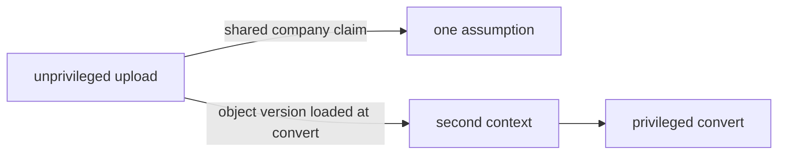

# Same idea on a document preview pipeline

**Kind:** transfer-challenge
**Loop step:** 7 Generalize

## Where you may practice

Synthetic design exercise only. Use inert placeholder documents and local reasoning artifacts. Do not create malicious files, target a converter, contact a storage service, or test a real upload system.

## Use it somewhere new

PreviewForge is a fictional service used by several companies that turns uploaded office documents into browser previews. The rule does not.

The proposed design is:

1. A company member requests an upload slot.
2. The client sends document bytes to object storage.
3. A storage event is delivered through a queue.
4. A converter worker fetches the object, invokes a document parser/converter, and writes a preview.
5. A malware/scanning verdict and conversion status are recorded.
6. A moderation dashboard can quarantine or release a preview.
7. A preview gateway/CDN serves released previews.
8. Security evidence records issue, ingest, scan, conversion, release, fetch, denial, and recovery transitions.

Assume documents, filenames, embedded links, metadata, archive structure, claimed media types, upload order, repeated requests, and preview fetches may be hostile. Object storage, queue, converter dependency, identity provider, preview CDN, and observability provider are third-party or managed dependencies. The converter may need fonts and approved update artifacts but should not have arbitrary network egress.

Do not assume any control is implemented merely because it appears in this description. Your task is to build a model that exposes what must be true and what remains unproved.

## Picture: pipeline privilege is a second context

PreviewForge’s unprivileged upload and privileged convert look like two stages. If the converter trusts the upload step’s company claim, the stages share an assumption. The privileged step must bind to the exact immutable object version and build its own context. Delay and privilege do not compose on their own.



## Why the notes-app pack cannot simply be renamed

At least these assumptions change:

| Notes app | PreviewForge challenge |
|---|---|
| Primary hostile influence arrives as request metadata | Hostile bytes become a **stored entry point** processed later by different code |
| Protected effect is a direct summary export | Effects include parsing/execution-like behavior, resource consumption, file writes, egress, preview publication, and cached release |
| Local worker call is sequential | Queue delivery can be delayed, duplicated, reordered, retried, or canceled |
| Company/object relation is read from one practice store | Authority and origin span upload intent, object key/version, event, job, parser, output, moderation state, and CDN object |
| Summary secrecy dominates | Integrity, availability, company isolation, converter containment, and safe publication may dominate |
| Exact output can be observed in memory | Unsafe output or side effect can persist in object storage/cache even after a decision denies |
| Parser/runtime is ordinary trusted code | A complex third-party converter may be a risky/dangerous component requiring explicit isolation reasoning |
| No network egress exists | Converter egress can turn hostile embedded references or a compromise into cross-boundary effects |

Your transfer must identify at least four changed assumptions in its own words and show how they alter the model. Reusing notes-app flow ids, header story, or a single “worker grant” without new state and effects is not enough.

## Define bounded properties

Write at least three properties, including one each for integrity/isolation and availability. Candidate shapes — not completed answers — include:

- **Object/job binding:** only the exact immutable object version authorized by a current company upload intent may be converted for that company; an event cannot substitute another object/version or company.
- **Converter containment:** hostile document content cannot cause the converter to read/write outside its assigned workspace, contact an unapproved destination, obtain broader company objects, or persist executable state beyond the job’s boundary.
- **Safe publication:** only a preview produced from the bound object/version under the required scan/conversion policy and current moderation state may become publicly fetchable.
- **Bounded resource use:** one company/document cannot consume more than the documented time, memory, expansion, concurrency, output, and retry budget or prevent other companies from receiving service beyond the chosen window.
- **Accountability:** issue → upload → event → consume → scan → convert → publish/quarantine → fetch transitions remain attributable without copying hostile source content or secrets into evidence.

For each, state attacker/failure ability, scope, time, what must not happen, evidence, and leftover risk. “Files are safely processed” is not a property.

Industry lists have extra bars for documenting resource-hungry jobs and for wrapping risky converters. They do not prove that a container, sandbox, or network rule is enough.

## Build a state model before drawing boxes

Use an object-version-bound lifecycle such as:

```text
intent-issued
  -> bytes-stored(version V)
     -> event-accepted
        -> queued
           -> converting
              -> quarantined | ready-for-review | failed
                 -> released
                    -> withdrawn
```

Define permitted transitions and the authority/evidence required at **use time**. Challenge:

- upload intent expires before bytes arrive;
- object key is reused with a new version;
- storage sends duplicate or out-of-order events;
- queue retries after conversion succeeded but acknowledgment failed;
- moderation release races with a new scan verdict;
- a preview is withdrawn but remains cached;
- a parser times out after writing partial output;
- cancellation arrives while a worker is active.

The event should not be assumed authoritative merely because the storage provider produced it. Decide whether it is a grant, a notification that triggers current server-side resolution, or a reference to immutable state. Bind provider origin, bucket/account, company, object key, version/digest, action, time, and replay state according to the chosen design.

## Draw at least these boundary candidates

Your diagram may differ, but it must reason about:

- hostile client ↔ upload-intent service;
- hostile client ↔ object storage upload path;
- object storage event ↔ event verifier/normalizer;
- normalized event ↔ queue publisher/queue;
- queue ↔ converter job adapter;
- job adapter ↔ isolated conversion environment;
- hostile document bytes ↔ parser/converter;
- converter ↔ workspace/file system;
- converter ↔ network egress resolver/policy;
- converter output ↔ validation/quarantine store;
- moderation UI ↔ release policy;
- released preview ↔ gateway/CDN/public fetch;
- every component ↔ evidence path;
- operators/build/update sources ↔ converter/runtime and policy.

Some are network boundaries, some process/data boundaries, and some state/authority boundaries. Annotate the changed assumption. “Inside the private network” is not sufficient.

## Recompute what you trust, by rule

For object/job binding, likely dependencies include upload-intent state, immutable object identity/version, event verifier, job construction, current company relation, and effect enforcement. For converter containment, isolation mechanisms, kernel/runtime, mount and egress policy, credential scope, parser/update source, and workspace cleanup may join what you trust. For availability, queue fairness, resource budgets, timeout/cancellation, expansion limits, retry policy, and shared storage/converter capacity matter. For a usable record, evidence schema, correlation, clock/order semantics, delivery, storage, and evidence access matter.

Do not trust the hostile parser input. Decide whether the third-party converter belongs in what you trust or is treated as likely-compromisable and surrounded by isolation. If the rule is “hostile content cannot escape the job,” some underlying isolation must remain trusted even when the converter fails.

## Derive the attack surface from delayed flows

Include more than upload routes:

- upload-intent creation and object-key selection;
- direct object upload and overwrite/version semantics;
- storage callback/event normalization;
- queue message fields, attributes, redelivery, dead-letter handling, and administration;
- parser formats, metadata, nested content, external references, fonts, and resource demands at a categorical level — no harmful payload construction;
- worker credential, object read/write scope, workspace, environment, and egress;
- output validator, quarantine, moderation, release, withdrawal, and CDN invalidation;
- status/list APIs that might reveal cross-company metadata;
- logs/traces that may ingest hostile strings or document content;
- dependency/update/build and control-plane paths;
- restore/reprocessing paths that can bypass current policy.

For each row, link attacker/failure, controlled state, boundary, protected effect, enforcement/trusted source, shared mechanism, how far a break can spread, how you would see it, owner, and leftover risk.

## Analyze correlated defenses

Challenge claims such as:

- “scanner plus converter” when both use the same parsing library;
- “container plus application allowlist” when both are configured by the same mutable job metadata;
- “two scans” using the same engine/signature/update path;
- “object ACL plus application company check” when both trust an attacker-chosen object prefix;
- “moderation plus CDN policy” when one shared status flag and operator account controls both;
- “timeout plus queue retry limit” when retries reset the budget and share the same capacity pool;
- “logs plus alerts” when one compromised runtime can suppress both.

For at least four pairs, name the fault and classify independence as independent, partial, correlated, or unknown. Propose a way to reduce one common mechanism or narrow how far a break can spread, while acknowledging cost and leftover trust.

## Bound converter spread

Produce a dimensional table:

| Dimension | Required question |
|---|---|
| Company/object read | Can the job credential fetch only one immutable input version? |
| Write | Can it write only one job-specific quarantine prefix? Can it replace source/released objects? |
| Execute/runtime | Which binaries, libraries, syscalls, interpreters, plugins, and update paths are reachable? |
| File system | Is the workspace per job? What persists or is shared? |
| Network/egress | Which destinations/protocols/DNS paths exist? What happens on denial? |
| Resources | CPU, memory, file count, expansion, disk, output size, concurrency, and cumulative retry budget |
| Time/lifecycle | Job expiry, duplicate delivery, cancellation, cleanup, and replay |
| Companies | Can one compromised worker enumerate, read, write, starve, or infer other companies? |
| Control/evidence | Can it alter policy, job issuance, moderation, logs, or alerts? |
| Output/cache | Can unsafe or stale preview survive quarantine/withdrawal? |

“Runs in a sandbox” earns no credit without answers and evidence plans. You need not select a production sandbox technology in this foundation topic.

## Design five-mode evidence

Use inert practice descriptions, not malicious documents.

- **Normal:** exact object version converts within resource budget; preview remains quarantined until authorized release; bounded evidence joins all transitions.
- **Wrong input:** wrong company/object version, expired intent, missing scan state, unauthorized moderator, or unreleased preview denies with unchanged publication state.
- **Abuse:** duplicate event, replayed job, object substitution, attempt to request unapproved egress, excessive declared expansion/resource request, or cache fetch after withdrawal. Represent these as synthetic state/requests.
- **When things break:** converter timeout/crash, partial output, queue redelivery, object-store/evidence outage, CDN invalidation failure, or scanner unavailable.
- **If we remove it:** remove object-version binding, egress deny, cumulative retry budget, quarantine transition, or cache-withdrawal enforcement in a model/test double and predict the changed observation.

Observations should include exact object version, allowed state transition, workspace/egress/resource effects, output location, cache state, job use/idempotency state, and privacy-safe evidence. A status code is not enough.

## Operations and recovery

Design signals for:

- object/event/job binding mismatch;
- duplicate/reordered transition outside the state machine;
- denied or novel converter egress;
- parser resource use near per-job or cumulative company budgets;
- cross-company object/store access denial;
- preview publication without current scan/moderation evidence;
- withdrawal without timely cache invalidation;
- decision/effect transition missing from evidence;
- converter dependency or policy version drift.

Choose evidence-failure behavior per effect. Blocking upload intent, conversion, or public withdrawal may have different availability/safety consequences. Recovery must quarantine partial outputs, stop/revoke job authority, clean per-job state, bound retries, invalidate released/cache copies, repair the shared assumption, reprocess only with a new/current decision, and communicate remaining exposure. It cannot claim that deleting a preview reverses a prior public release.

## Practice

Submit:

1. at least three bounded properties and five things that must not happen;
2. lifecycle/state machine with authority and evidence at each transition;
3. annotated boundary diagram and flow ledger;
4. what-you-trust overlays for object/job binding, containment, availability, and record-keeping;
5. attack-surface inventory covering public, stored, asynchronous, parser, egress, publication, evidence, and control/update paths;
6. dependency graph and four fault-specific control-independence classifications;
7. dimensional converter spread analysis;
8. five-mode evidence matrix and one “if we remove it” case;
9. operations/evidence/recovery plan;
10. comparison memo identifying at least four notes-app assumptions that fail and every earlier rule / who-may-do-what artifact that must be rebuilt;
11. bounded assurance statement and named later work.

## What is not good enough

| Reject | Why |
|---|---|
| Copying notes-app flow ids and renaming a header | The stored bytes and the delay are new entry points |
| Drawing a queue and saying “scan uploads” | Origin, grant, parser isolation, and publication are still mixed |
| Naming a container as the isolation story | Isolation is a claim with dimensions and leftover trust |
| A live-target plan against a real converter or upload product | Course rules |

## Check yourself

Transfer is ready when the work:

- derives boundaries from changed assumptions rather than copying deployment boxes;
- treats stored bytes and asynchronous state as entry surfaces;
- separates provider origin, object/job authority, parser containment, and publication authority;
- recomputes what you trust for different rules;
- identifies shared parsers, credentials, runtimes, configuration, capacity, operators, and evidence paths;
- bounds how far a break can spread across effect dimensions;
- uses five-mode evidence with state/output/side-effect observations;
- revises operations and recovery for persistent output and caches;
- labels unknowns, extra isolation guidance, and later implementation work honestly;
- remains entirely synthetic and safe.

## What this page is not doing

Malicious documents. Do not use real converters. Do not use real object stores. Do not use live upload systems. Answer keys are not on this site.
