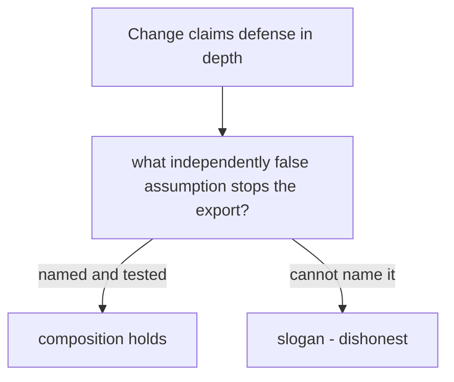

# Review a boundary that looks honest and is not

**Kind:** code-review
**Loop step:** 5 Verify

## Review

Review targets: `labs/1.3/1.3-trust-boundaries/vulnerable/surface.py`, its `SECURITY.md`, and the seeded design record below. Do not open `content/assessment/keys/1.3.md` before submitting your review. The answers live only in that keys folder — not here.

## The rule

The most dangerous statement in an architecture review is often grammatically correct:

> “Defense in depth prevents public callers from reaching the internal export.”

Your job is to trace that claim to assumptions, code paths, effects, and evidence. A good review comment does not merely say “spoofable header” or “use mTLS.” It identifies:

1. the claimed rule and what must not happen;
2. the exact untrusted or missing model element;
3. the root cause and affected path;
4. the minimum structural change required at the trust/enforcement boundary;
5. an observable check or review observation;
6. remaining limits after the change.

Mechanism shopping without a bounded claim is not an actionable review.

## Picture: slogan is not independence

“Defense in depth” on a design paragraph is not evidence. Classification asks whether the second check can fail while the first succeeds. If the reviewer cannot name that independent falsehood, the slogan is dishonest.



## Seeded design record

Review this fictional proposal alongside the broken files:

> The notes-app export endpoint is protected by two independent layers. The edge admits a request only when `X-SecureCollab-Internal: worker` is present, and the API repeats the same check, so forged calls would have to bypass both. The service name in `X-SecureCollab-Service` identifies the worker. Because the service runs on the internal path over TLS and the worker is registered, it may request any company’s export using the company and note ids in the request. A reusable export permission avoids failed batch retries. The store credential already has all-company read access, which is acceptable because only internal code can use it. Successful exports are logged; if logging is unavailable, export continues so operations are not disrupted. The worker and API share one deployment and operator team, which reduces complexity and therefore makes the controls independent. Passing unit tests demonstrate that the boundary is secure. Queues, HTTP routing, cryptographic identity, databases, and production observability are out of scope, but this design is ready for production.

The paragraph mixes potentially useful mechanisms, explicit scope limits, and unsupported conclusions. Review the causal relationships rather than rejecting every sentence wholesale.

## Establish the intended model first

Before commenting, write:

- bounded export rule and what must not happen;
- attacker/failure abilities;
- public and worker entry points;
- source of caller kind, identity, company, action, object set, time/use state, and evidence status;
- exact output effect and enforcement point;
- shared parser/credential/runtime/configuration/operator/evidence dependencies;
- dimensions of how far a break can spread;
- local practice limits.

Without this baseline, comments degrade into style preferences.

## Trace the broken paths

Build a path table from the actual file:

| Path / function | Reachable caller | Caller kind source | Authority source | Effect | Evidence behavior | Shared assumptions | How you would see it |
|---|---|---|---|---|---|---|---|
| Public export path | | | | | | | |
| Worker export path | | | | | | | |
| Decision/helper path | | | | | | | |
| Output projection | | | | | | | |

Do not infer protection from a function name. If a helper accepts a caller-created boolean, mapping, or service string, identify who can set it at each entry. If policy is called after output selection, the location matters. If both public and worker paths share a broad helper, whether every export path goes through the check — and whether too many callers share one helper — are review concerns.

## What to look for

Submit at least eight actionable comments spanning all of these classes:

### 1. Boundary / origin

Look for requester-controlled values promoted to caller identity or trusted context; public/worker path conflation; internal naming or TLS used as trust; and claims that a private route proves origin.

### 2. Authority and lifecycle

Look for registered identity treated as permission for every company/action/object; reusable or expired grant behavior; missing current state; and the store credential substituted for product authority.

### 3. Every path and the output

Look for alternate helpers, policy/effect order, exact object resolution, field projection, unchanged-state denial, and whether every protected output consumes the decision.

### 4. Common mechanisms and false depth

Look for layers sharing an attacker-controlled input, parser, configuration, runtime, credential, operator, or evidence path. State the fault for which they are correlated.

### 5. Evidence, failure, and recovery

Look for silent evidence failure, sensitive fields, weak correlation, no lifecycle event, no alternate signal, and a response that blocks one trigger without repairing all paths sharing the assumption.

### 6. Scope and assurance

Look for a local in-process practice presented as production workload identity, network isolation, persistent atomicity, queue safety, database isolation, or standards compliance. A documented limit followed by “ready for production” is still contradictory.

## Write comments that can be closed

Use this form:

```text
[Severity] [Path/claim]

Rule and what must not happen:
Evidence in candidate:
Root cause / missing trusted fact:
Minimum structural change:
Verification observation:
Leftover after repair:
```

### Weak comment

> Critical: Headers can be spoofed. Use mTLS.

It names a trigger and a product/mechanism category but omits the rule, path, authority scope, enforcement, evidence, and leftover risk.

### Stronger comment shape

> Critical — the public adapter derives effective worker kind from a field selected by the same public caller whose origin is being decided. This permits the worker-only export effect without a trusted worker path, and the edge/application checks are correlated because both consume that field. Separate public and worker context construction; obtain worker identity from a server-controlled adapter; still require current company/action/object authority at the export enforcement point. Add an abuse observation proving all public metadata combinations leave output empty, plus a structural observation that the public path cannot construct worker context. This local repair still does not prove production workload authentication or routing.

Do not copy that shape verbatim for every finding. Each comment must isolate a distinct cause.

## Apply standards precisely

If you cite a standard, stay inside what it actually says:

- Guidance about original IP transfer through trusted, non-user-manipulable fields in proxies is an analogy for origin, not a mandate for a header name or a proof of workload identity.
- Guidance about documenting and defending resource-hungry jobs applies when load and capacity are the rule. Do not attach it to a simple secrecy claim without teaching the availability context.
- Extra protection around documented dangerous or risky components (sandboxing, encapsulation, containers, network isolation) is a higher bar. Label it as extra, and do not assert that “use a container” proves isolation.
- Saltzer principles explain failure shapes; they are not numbered compliance requirements.
- Threat-modeling guidance is methodology-neutral and lifecycle-oriented; do not claim one named method is required here.

A review that says “violates the architecture chapter” without exact applicability and a bounded conclusion is not sufficient.

## Severity and blocking criteria

Use:

- **Critical:** the stated public-to-worker or cross-company thing that must not happen is reachable; a protected effect bypasses mediation; unsafe scope encourages live/production use; or a false production/standards claim would materially mislead.
- **Major:** lifecycle, evidence, spread, or shared-dependency gap materially weakens the claim but does not alone demonstrate the primary failure in the practice files.
- **Minor:** clarity, traceability, or maintainability issue with a bounded effect on review quality.
- **Question:** information needed before deciding; do not hide a finding as a question when evidence is already sufficient.

Block approval if any critical dimension lacks a falsifiable rule, trusted origin, scoped authority, a check on every effect path, five-mode evidence, safe scope, or an honest limit on what you proved.

## Review the proposed fix, not only the defect

For each critical finding, challenge the likely repair:

- Does it change the trusted source or only sanitize the same untrusted assertion?
- Does it preserve normal authorized export?
- Does it bind company, action, exact objects, time, and use state?
- Does every output path consume it before effect?
- Can two controls fail together through one dependency?
- What happens on unknown context or evidence outage?
- Which spread dimensions remain broad?
- Which new dependencies join what you trust?
- Which check would fail if the repair were removed?

This avoids review whack-a-mole, where each trigger is blocked but the false assumption survives.

## Practice

1. intended model and path table;
2. at least eight actionable comments across all six failure classes;
3. severity and approval/block decision;
4. corrected boundary sketch and trust-source table;
5. exact minimum repair set, grouped by root cause rather than file line;
6. verification additions across normal, wrong input, abuse, when things break, and “if we remove it”;
7. at least three shared-failure / independence classifications tied to named faults;
8. dimensional spread statement before and after repair;
9. two exact standards mappings and one standards overclaim you rejected;
10. bounded assurance statement and later-topic triggers.

## Check yourself

- Comments cite candidate evidence and a thing that must not happen.
- Root cause is not reduced to a magic field name.
- Origin, authority, and effect mediation receive distinct findings.
- Duplicate controls are evaluated by dependencies and named faults.
- Repairs are testable and preserve valid behavior.
- Evidence failure and recovery are included.
- Standards are used only within their scope; extra isolation guidance is labeled extra.
- Local practice evidence is not promoted to production assurance.

## Common mix-ups

- Two checks that read the same public field are two layers
- TLS or an internal route name proves worker origin
- A registered worker may export any company
- “Ready for production” can sit next to “queues and identity are out of scope”
- Green unit tests demonstrate the boundary

## Final reflection

Write two short paragraphs:

1. Why can a simpler design with one trusted adapter and one fully mediated scoped decision provide a stronger review argument than several correlated “layers”?
2. Which leftover would most change your production design: workload identity, queue replay/atomicity, database/store isolation, evidence integrity, or operator/control-plane compromise? Explain how it changes what you trust, the surface, and how far a break can spread — rather than naming a tool.

## What this page is not doing

Do not ship “will fix the header later” as the review. Do not open the keys file before your review is evaluated. Do not try the same calls against a public or employer system.
