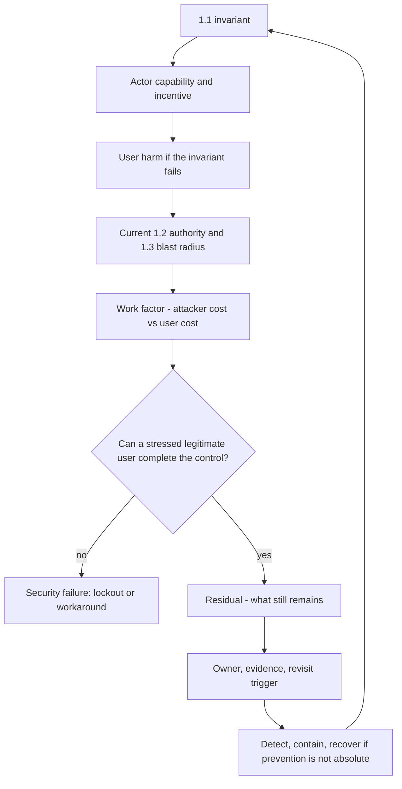
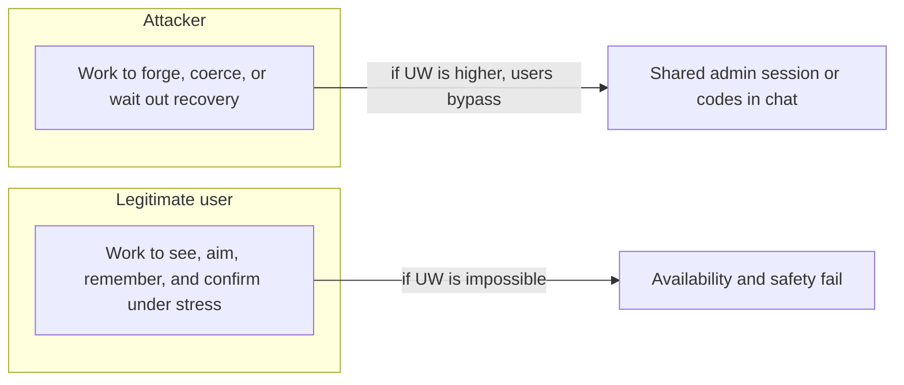

# 1.4-LO-01 — Residual risk is a decision, not a leftover color

**Kind:** concept-model  
**Loop step:** 1 Property  
**Standards:** Saltzer and Schroeder (1975, seminal), especially psychological acceptability, work factor, and compromise recording; WCAG 2.2 (final) for keyboard, use of color, and target size on security-sensitive journeys; NIST SP 800-63-4 (final) for identity *risk* language, not a password recipe; CISA Secure by Design (current public guidance, final) for customer-owned outcomes; NIST CSF 2.0 (final) GV for residual ownership and DE/RS/RC as outcome labels.

## The claim this module owns

SecureCollab Phase 1 still has a human on the path: a member who must confirm account recovery. The property is not “we added MFA” and not “the scanner is green.”

> A high-impact recovery confirmation is a security control. If a legitimate user cannot complete it with keyboard, named controls, and a non-color cue, the control has failed: the user is locked out, or they adopt an unsafe workaround that leaks notes, codes, or a tenant-admin session. Usability is in the trusted computing base for that human-mediated step. Residual risk is whatever still remains after that structural control, with an owner and a revisit date—not a leftover cell on a heat map.

The forbidden outcomes are therefore **lockout**, **unsafe workaround**, and **vanity residual**. Coercion by a physically present attacker is a recorded residual, not something a nicer button deletes.

## Mental model: the risk decision loop

Treat risk as a loop over a named 1.1 invariant, not as a score.



Each arrow is a question you can fail:

| Arrow | Weak answer | Reviewable answer |
|---|---|---|
| Actor | “hackers” | tired legitimate owner; household abuser with the mouse; support channel that prefers emailing secrets |
| Harm | “account compromise” | Tenant A notes unreadable to the owner, or readable to a chat the owner pasted codes into |
| Work factor | “256-bit crypto” | hours of attacker effort versus thirty seconds of user pain on a broken confirm |
| Residual | “users should be careful” | coercion remains; owner is the product lead; revisit when recovery adds a second device |
| Operate | “we have logs” | detect cancel-without-keyboard; recover with a still-mediated alternate path; never email a note body |

NIST CSF 2.0 **Govern / Detect / Respond / Recover** name those outcome families. They do not prove the SecureCollab sentence. SAMM 2.0 governance scores are a maturity conversation, not residual risk. CISA Secure by Design says the manufacturer owns customer outcomes; buying MFA is not the property.

## Mental model: two work factors

Saltzer and Schroeder’s **work factor** is usually taught as attacker cost. For a human-mediated control there are two costs, and they trade.



- Raising attacker work without measuring user work produces **friction theater**: a mouse-only green button that demoed well and fails on a laptop with no pointer, a low-vision user, or a person using only a keyboard.
- Lowering user work without keeping a 1.2 decision (“who may confirm recovery on this account, now”) produces **convenience holes**: email the password, share the tenant-admin session, screenshot the red/green pair.

Psychological acceptability is the principle that the secure path must be the path people can actually complete. WCAG 2.2 Success Criteria **2.1.1 Keyboard**, **1.4.1 Use of Color**, and **2.5.8 Target Size (Minimum)** are the web baseline for that path. They are not a privacy policy and not a claim of full conformance.

## Actors are capability plus incentive, not a villain list

| Actor | Capability in this module | Incentive | Harm if the control fails |
|---|---|---|---|
| Account owner, exhausted | Keyboard, screen reader, or pointer; may lack one of those | Get back into Tenant A notes | Lockout (availability/safety) |
| Household abuser | Physical presence; can use the mouse the owner cannot | Keep the owner locked out, or force a confirmation | Coercion residual; safety |
| Support attacker | Social channel; prefers the user to volunteer secrets | Collect recovery codes or note bodies | Confidentiality of notes and codes |
| Bulk automator | Volume of recovery starts | Account takeover at scale | Many tenants, not one tired user |

“Insider” and “nation-state” are later review triggers. Phase 1 needs the table above, because those four already break the recovery sentence without a new CVE.

## Root cause is not “users are careless”

A demo recovery control that is green and mouse-only fails because **the designers trusted a pointer and a color**. The user who pastes codes into chat is a **consequence**, not the root cause.

| Slice | For this property |
|---|---|
| Root cause | Human-mediated enforcement omitted keyboard, accessible name, and a non-color cue |
| Preconditions | High-impact confirm is required; some users have no reliable pointer or cannot use color alone |
| Trigger | Owner attempts recovery; `is_usable_accessible` is false |
| Impact | Safety and availability (lockout) and/or confidentiality (workaround leaks) |
| Prevention | Named, keyboard-operable control; color is redundant encoding only |
| Detection | Support tickets “can’t click recover”; telemetry on confirm vs cancel by input modality — never log codes |
| Recovery | Alternate accessible path that is still 1.2-mediated; do not email the note body |

## Framework defaults versus the journey

A React component library can ship accessible primitives. FastAPI does not see the button. Next.js “secure defaults” do not name the recovery confirm. WCAG documents success criteria; they do not walk your fixture.

The application guarantee is: **this** confirm control, on **this** recovery journey, is operable without a mouse, has an accessible name, and does not use color as the only encoding. The lab `labs/1.4/1.4-risk-register` is the local oracle for that sentence. It is not a live IdP and not a real mailbox.

## Mechanism limits

CAPTCHA, “confirm in the app,” drag-to-unlock, and hover-only hit targets can recreate the same exclusion. A second device the coerced or locked-out user does not control recreates lockout under a different costume.

Coercion is not fixed by WCAG. Record it as residual with an owner. Do not pretend a larger target size removes a physically present attacker.

## Practice

Describe the confirm control in the words a screen-reader user would hear. If you cannot, the control fails this property. Then run the local pair:

```text
python -m pytest labs/1.4/1.4-risk-register/tests --impl vulnerable
python -m pytest labs/1.4/1.4-risk-register/tests --impl fixed
```

The first command must fail. The second must pass. Map the assertion to lockout-or-workaround, not to a scanner color.

## Transfer

A clinic portal adds step-up authentication. The second factor is a mouse-only dialog. Which 1.1 cells move (availability, safety, confidentiality of the chart), and which residual (coercion, shared workstation) must be rewritten rather than deleted?

## Non-goals

Live identity providers, real recovery inboxes, real patient or banking data, weaponized payloads, and heat maps that replace harm sentences. Gates 0–10 and milestones M0–M5 stay **not-attempted** without learner or product evidence. Answer keys are not in this file.
