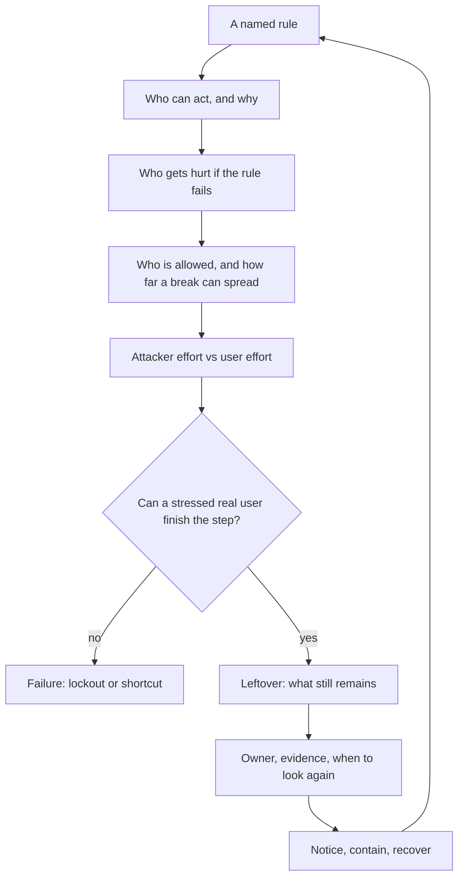
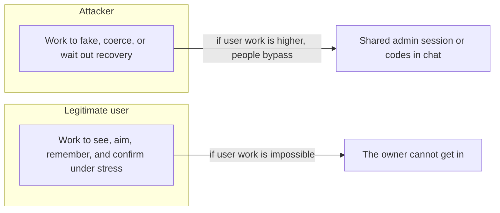

# Leftover risk is a decision, not a leftover color

**Kind:** concept-model
**Loop step:** 1 Property

## The rule

The notes app still has a person on the path: someone who must confirm account recovery. The rule is not “we added a second factor” and not “the scanner is green.”

> Confirming recovery is a security control. If a real user cannot do it with a keyboard, a named button, and a cue that is not only color, the control has failed: they are locked out, or they take a shortcut that leaks notes, codes, or an admin session. Whether people can actually finish the step is part of what you trust. Leftover risk is whatever still remains after that, with an owner and a date to look again — not a leftover square on a heat map.

So what must not happen: **lockout**, **an unsafe shortcut**, and **a fake leftover** (“users should be careful”). A person standing at the laptop can still force a click. That stays on the list. A nicer button does not delete it.

## Picture: the risk loop

Treat risk as a loop over a named rule, not as a score.



Each arrow is a question you can fail:

| Arrow | Weak answer | An answer someone else can check |
|---|---|---|
| Who | “hackers” | tired owner; someone in the house with the mouse; support that wants secrets emailed |
| Harm | “account compromise” | company A notes unreadable to the owner, or readable in a chat where they pasted codes |
| Effort | “256-bit crypto” | hours of attacker work versus thirty seconds of pain on a broken confirm |
| Leftover | “users should be careful” | coercion remains; owner is the product lead; look again when recovery adds a second device |
| Running it | “we have logs” | notice cancel-without-keyboard; recover on a still-checked path; never email a note |

Industry lists name families like govern, detect, respond, recover. They do not prove this sentence about the notes app. A maturity score is not leftover risk. Buying a second factor is not the rule.

## Picture: two kinds of effort

Attacker effort is one cost. User effort is another. They trade.



- Raising attacker work without measuring user work is **friction theater**: a mouse-only green button that demoed well and fails on a laptop with no pointer, a low-vision user, or a keyboard-only user.
- Lowering user work without keeping a who-is-allowed check (“who may confirm recovery on this account, now”) is a **convenience hole**: email the password, share the admin session, screenshot the red/green pair.

The secure path has to be a path people can actually finish. Keyboard, not-color-alone, and a large enough target are the web baseline for that path. They are not a privacy policy and not a claim that the whole site meets every accessibility rule.

## People are capability plus motive, not a villain list

| Person | What they can do here | Motive | Harm if the control fails |
|---|---|---|---|
| Account owner, exhausted | Keyboard, screen reader, or pointer — maybe missing one | Get back into company A notes | Lockout |
| Someone in the house | Physical presence; can use the mouse the owner cannot | Keep the owner locked out, or force a confirmation | Coercion; safety |
| Fake support | A chat or phone; wants the user to volunteer secrets | Collect recovery codes or note bodies | Notes and codes leak |
| Bulk automator | Many recovery starts | Take over accounts at scale | Many companies, not one tired user |

“Insider” and “nation-state” can wait. This week needs the table above. Those four already break recovery without a new bug name.

## Why it happens, what it costs, how you stop it, how you notice, how you recover

A demo recovery control that is green and mouse-only fails because **the designers trusted a pointer and a color**. The user who pastes codes into chat is a **result**, not the cause.

| Slice | For this rule |
|---|---|
| Why it happens | The human step skipped keyboard, a name a screen reader can speak, and a cue that is not only color |
| What has to be true first | Confirm is required; some users have no pointer or cannot use color alone |
| Trigger | The owner tries to recover; the control is not usable |
| What it costs | Lockout, and/or a shortcut that leaks notes |
| How you stop it | Named, keyboard-operable control; color is extra, not the only cue |
| How you notice | Support tickets “I cannot click recover”; counts of confirm vs cancel by keyboard vs mouse — never log codes |
| How you recover | Another usable path that is still checked; do not email the note |

## What the framework does vs what you still have to check

A React library can ship accessible pieces. FastAPI does not see the button. Next.js defaults do not name this confirm. Accessibility documents list success criteria; they do not walk your practice files.

The app’s promise is: **this** confirm, on **this** recovery, works without a mouse, has a name, and does not use color as the only cue. The practice folder is the local check for that sentence. It is not a live login provider and not a real mailbox.

## What the tool cannot do

CAPTCHA, “confirm in the app,” drag-to-unlock, and hover-only targets can shut people out the same way. A second device the locked-out person does not control is lockout in a new costume.

Coercion is not fixed by accessibility rules. Record it as leftover risk with an owner. A larger button does not remove someone standing at the laptop.

## Practice

Describe the confirm control in the words a screen-reader user would hear. If you cannot, it fails this rule. Then run the local pair:

```text
python -m pytest labs/1.4/1.4-risk-register/tests --impl vulnerable
python -m pytest labs/1.4/1.4-risk-register/tests --impl fixed
```

The first command must fail. The second must pass. Tie the check to lockout-or-shortcut, not to a scanner color.

## Use it somewhere new

A clinic portal adds a second factor. The second factor is a mouse-only dialog. Which rules move (getting in, safety, secrecy of the chart), and which leftover (coercion, shared workstation) must be rewritten rather than deleted?

## What this page is not doing

Live login providers, real recovery inboxes, real patient or banking data, ready-made attack recipes, and heat maps that replace harm sentences. Answer keys are not in this file.
