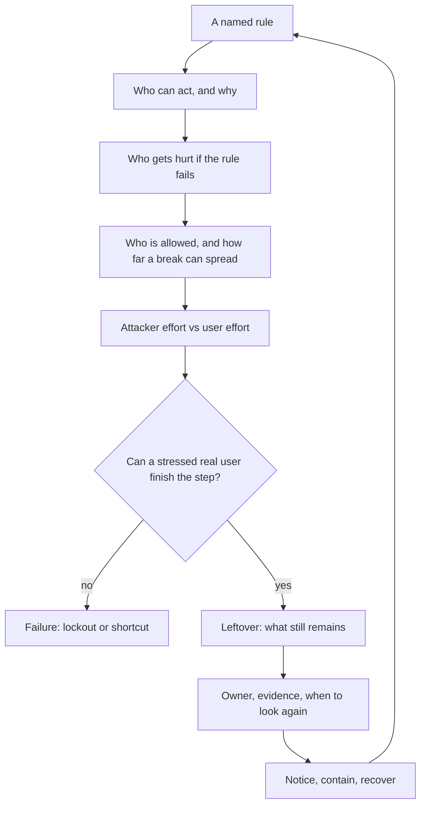
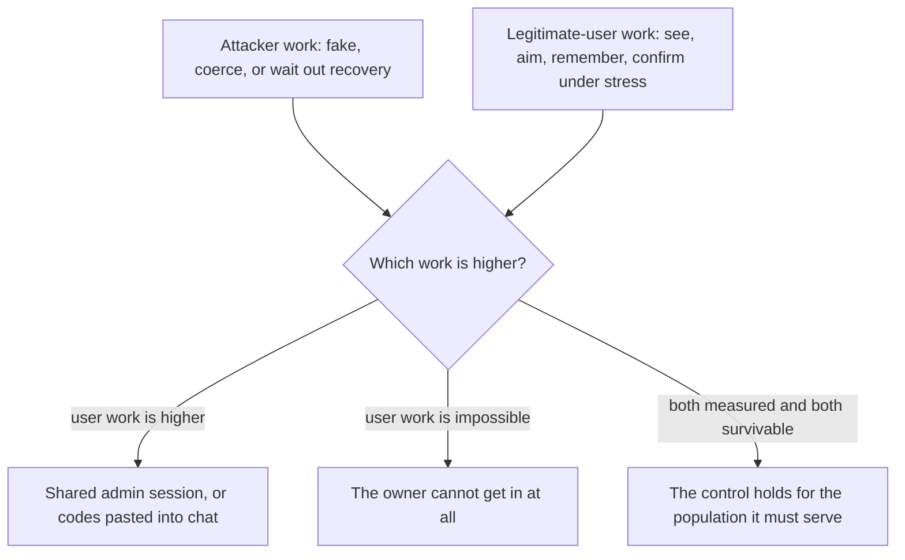

# Leftover risk is a decision, not a leftover color

**Kind:** concept-model
**Loop step:** 1 Property
**Standards:** WCAG 2.2 success criteria 2.1.1 Keyboard (Level A), 4.1.2 Name, Role, Value (Level A), and 1.4.1 Use of Color (Level A), applied to a security-sensitive journey rather than to the whole product. NIST CSF 2.0 GV.RM (risk management) and DE/RS/RC for the degrade-detect-recover half of this rule. Saltzer & Schroeder (1975) on psychological acceptability and work factor.

## The rule

The notes app still has a person on the path: someone who must confirm account recovery. The rule this module teaches is not "we added a second factor" and not "the scanner is green." Those are both claims about a tool. This page is about a claim you can check against one specific journey: can the account owner, under stress and possibly without a mouse, actually finish the step that gets them back in?

> Confirming recovery is a security control. If a real user cannot do it with a keyboard, a named button, and a cue that is not only color, the control has failed: they are locked out, or they take a shortcut that leaks notes, codes, or an admin session. Whether people can actually finish the step is part of what you trust. Leftover risk is whatever still remains after that, with an owner and a date to look again — not a leftover square on a heat map.

Unpack that sentence clause by clause, because each clause is doing work. "A real user" rules out testing only with a mouse and full color vision — the population that can complete a control is not the population the designer happened to test with. "Actually finish the step" rules out a control that is present in the DOM but not reachable — WCAG 2.2's 2.1.1 Keyboard success criterion exists precisely because a control a sighted mouse user can click is not thereby a control everyone can activate. "Locked out, or they take a shortcut" names the two failure branches this module cares about, and they are not interchangeable: lockout denies the legitimate owner access, while a shortcut (screenshotting both buttons to ask a roommate which one is "the good one," or sharing an admin session so someone else can click through) reopens exactly the exposure the recovery control existed to close. "Leftover risk... with an owner and a date" is the clause that turns "residual risk" from a phrase people write in a report into something falsifiable: if you cannot name who owns it and when they will look again, you have not named a residual, you have filled in a cell.

So what must not happen: **lockout**, **an unsafe shortcut**, and **a fake leftover** ("users should be careful," with no owner and no trigger). A person standing at the laptop can still force a click even after the button is perfectly accessible — that risk stays on the list. A nicer button does not delete it; it only removes the *other* two failure modes.

## Picture: the risk loop

Treat risk as a loop over a named rule, not as a score you compute once and file away. The loop matters because each arrow is a place a real risk process quietly turns into theater: a plausible-sounding phrase substitutes for a checkable answer, and nobody notices because the loop still "completes."



Each arrow is a question you can fail, and the second column below is not merely "more detail" — it is the difference between an answer a peer can check and an answer that only sounds complete:

| Arrow | Weak answer | An answer someone else can check |
|---|---|---|
| Who | "hackers" | tired owner; someone in the house with the mouse; support that wants secrets emailed |
| Harm | "account compromise" | company A notes unreadable to the owner, or readable in a chat where they pasted codes |
| Effort | "256-bit crypto" | hours of attacker work versus thirty seconds of pain on a broken confirm |
| Leftover | "users should be careful" | coercion remains; owner is the product lead; look again when recovery adds a second device |
| Running it | "we have logs" | notice cancel-without-keyboard; recover on a still-checked path; never email a note |

Industry lists name families like govern, detect, respond, recover — NIST CSF 2.0's own top-level functions are exactly these words. They are a useful vocabulary for the bottom half of the loop, but naming a function is not the same claim as proving this sentence about the notes app's recovery journey. The same gap shows up in two other places a team might reach for a standard as a shortcut past this sentence. OWASP SAMM 2.0 scores a team's governance and process maturity, and a high SAMM score is a claim about the organization's practices in general, not a claim that any specific control on any specific page actually holds today — a maturity score is not leftover risk, whatever OWASP SAMM's own score says. CISA's Secure by Design guidance asks manufacturers to ship secure defaults and own security outcomes for customers rather than pushing the burden onto them; that framing is exactly the "customer-outcomes, secure-defaults" idea this lesson has been building toward, but pledging to follow it is not the same as this specific confirm control actually being reachable without a mouse — buying a second factor, or publishing a Secure by Design pledge, is not the rule. Both SAMM and Secure by Design are inputs a designer might use on the way to a checkable claim about one control, not substitutes for making that claim.

## Picture: two kinds of effort, and where they meet

Attacker effort is one cost. User effort is another. Treating them as the same number, or measuring only one, is how a "more secure" control ships that is actually just harder for everyone including the attacker's intended victim.



The diagram has one decision point with three branches on purpose, because the two failure branches are genuinely different problems that get confused when people say "the control is too weak" for both. Raising attacker work without measuring user work is **friction theater**: a mouse-only green button that demoed well in a conference room and fails on a laptop with no pointer, for a low-vision user, or for a keyboard-only user — the demo never included the population the branch above names. Lowering user work without keeping a who-is-allowed check ("who may confirm recovery on this account, right now") is a **convenience hole**: email the password, share the admin session, read a code aloud over the phone. Both branches ship under the banner of "we improved recovery," and the diagram is the tool for telling them apart before either one ships.

NIST SP 800-63-4 is worth naming here directly, because it is easy to misread as only a password-complexity checklist and this module needs the opposite reading from it. Its actual emphasis is risk-based and customer-experience-focused: it treats the identity journey's usability as part of the risk decision, not as a separate concern traded off against security after the fact. That is the same claim this diagram is making about recovery specifically — user effort is not a nice-to-have layered on top of the "real" security work, it is one of the two costs the design has to weigh from the start.

The secure path has to be a path people can actually finish, not merely a path that exists. Keyboard operation, a cue that is not color alone, and a target large enough to hit reliably are the web accessibility baseline for that path — WCAG 2.2 states this baseline as success criteria, not as aspiration. They are not a privacy policy, and meeting them for this one journey is not a claim that the whole site meets every accessibility rule; the claim is scoped to the recovery-confirm step, the same way an ASVS control claim in an earlier module was scoped to one enforcement point rather than to "the app is secure."

## People are capability plus motive, not a villain list

A risk register that says "hackers" or "insider threat" has named a genre, not an actor. The four rows below are not exhaustive, but they are the ones that already break this specific recovery step without needing a new vulnerability class:

| Person | What they can do here | Motive | Harm if the control fails |
|---|---|---|---|
| Account owner, exhausted | Keyboard, screen reader, or pointer — maybe missing one of these | Get back into company A notes | Lockout |
| Someone in the house | Physical presence; can use the mouse the owner cannot, or force a click | Keep the owner locked out, or force a confirmation | Coercion; a safety failure, not merely a data one |
| Fake support | A chat window or a phone call; wants the user to volunteer secrets | Collect recovery codes or note bodies | Notes and codes leak |
| Bulk automator | Many recovery attempts, run in parallel | Take over accounts at scale | Many companies affected, not one tired user |

Notice what the table buys you that "insider" and "nation-state" do not: a prediction. The row for "someone in the house" predicts that making the confirm button *more* accessible does nothing about coercion — a keyboard-operable button is still a button a person standing over someone's shoulder can force them to press. That prediction is the whole reason coercion appears again in the next lesson's leftover-risk table rather than disappearing once the accessibility fix ships. "Insider" and "nation-state" can wait for a later module; this week needs the table above, because these four actors already break recovery without a new bug name, and a register that skips straight to CVE-style categories will miss every one of them.

## Why it happens, what it costs, how you stop it, how you notice, how you recover

A demo recovery control that is green and mouse-only fails because **the designers trusted a pointer and a color** — not because an attacker found a clever bypass. The user who ends up pasting codes into a roommate's chat is a **result** of that trust, not the cause of the failure; blaming the user for the workaround is exactly the "users should be careful" fake leftover this module rejects.

| Slice | For this rule |
|---|---|
| Why it happens | The human step skipped keyboard operability, a name a screen reader can speak, and a cue that is not only color |
| What has to be true first | Confirm is required to recover the account; some users have no pointer, or cannot rely on color alone to distinguish two buttons |
| Trigger | The owner attempts recovery and the control is not usable by them specifically |
| What it costs | Lockout, and/or a shortcut that leaks notes or an admin session |
| How you stop it | A named, keyboard-operable control, where color is extra encoding rather than the only cue |
| How you notice | Support tickets that say "I cannot click recover"; counts of confirm-versus-cancel by keyboard-versus-mouse modality — never a log of the codes themselves |
| How you recover | A second usable path that is still checked by the same who-is-allowed decision; never email the note as a fallback |

## What the framework does vs what you still have to check

A component library can ship pieces that are individually accessible. FastAPI does not see the button at all — it serves whatever markup the frontend sends, accessible or not. Next.js defaults do not name this specific confirm control as security-sensitive; that judgment is the module's, not the framework's. Accessibility documents like WCAG list success criteria and how to test for them, but they do not walk your practice files and tell you which control in your codebase is the one this module's rule is about — you still have to make that identification yourself, the same way an earlier module's ASVS mapping required you to say which function was the enforcement point before the standard could tell you anything.

What this practice is supposed to show: the confirm control works without a mouse, has a name, and does not use color as the only cue. The practice folder is the local check for that one sentence. It is not a live login provider, and it is not a real mailbox — the fixture's `recovery.py` is a small Python model, not a UI you click.

## What the tool cannot do

CAPTCHA, "confirm in the app," drag-to-unlock, and hover-only targets can each shut people out the exact same way a mouse-only button does, even though none of them is literally "color-only." A second device that the locked-out person does not control is lockout wearing a different costume — swapping "click this button" for "open the app on your phone" does not change who can complete the step if the person's phone is the thing that got taken away.

Coercion is not fixed by any accessibility rule, and this is worth stating plainly because it is the recurring mistake this module is built to prevent: a larger, better-labeled, keyboard-operable button does not remove someone standing at the laptop physically forcing a confirmation. That risk is recorded as leftover with an owner, not solved by CSS. It reappears in the next lesson's leftover table, in the operate lesson's residual list, and in the transfer lesson's clinic and banking scenarios, because it genuinely does not go away when the UI improves — that persistence across every later lesson is itself the evidence that this is a real residual and not a phrase filled into a template.

## Practice

Describe the confirm control in the words a screen-reader user would hear, out loud or in writing, before you look at the code. If you cannot produce that description, the control fails this rule regardless of what its CSS looks like. Then run the local pair:

```text
python -m pytest labs/1.4/1.4-risk-register/tests --impl vulnerable
python -m pytest labs/1.4/1.4-risk-register/tests --impl fixed
```

The first command must show failures tied to the forbidden outcome and to a missing-keyboard-evidence boundary case — not merely "an exception was raised." The second must show all six tests passing. Tie the check to lockout-or-shortcut, not to a scanner color: if you cannot say which of the two failure branches a given red test represents, you have not yet connected the code to the rule.

## Use it somewhere new

A clinic portal adds a second factor to protect a patient chart. The second factor is a mouse-only dialog. Which rules move (getting in, safety, secrecy of the chart), and which leftover (coercion, a shared workstation) must be rewritten rather than deleted when you carry this claim to a clinic? [Lesson 07 Transfer](07-transfer.md) works through this scenario in full; [Lesson 02 Model](02-model.md) is where the register rows for this journey get written down.

## What this page is not doing

Live login providers, real recovery inboxes, real patient or banking data, ready-made attack recipes, and heat maps that replace harm sentences are all out of scope for this practice. Answer keys are not on this site; they live in `content/assessment/keys/1.4.md`, isolated from every learner-facing page.
