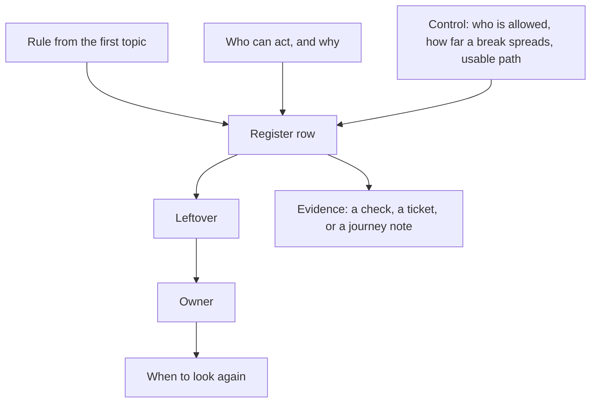

# A risk list someone else can argue with

**Kind:** design-exercise
**Loop step:** 2 Model

## Could someone else challenge a row?

A list that says “MFA,” “WAF,” and “users should be careful” is a tool inventory. A list a peer can attack looks like this:

> For rule *I*, person *A* with ability *C* and motive *N* can cause harm *H* unless control *K* holds. Leftover *R* remains, owned by *O*, looked at again on trigger *T*. Evidence *E* would show *K* is false.

Companies, memberships, notes, and a **local recovery-confirm practice**. No live login provider, no files, no support-impersonation product, no real users.

## Picture: anatomy of a row

If any box is a product name or a color, the row is not ready.

## Step 1: name the pieces

Take the rules you already wrote and ask what leftover they still carry when a human must confirm recovery.

| Rule | Recovery leftover to name | Out of scope here |
|---|---|---|
| Secrecy of note bodies | Shortcut: codes or bodies pasted into chat; shared admin session | Cloud operator with a database snapshot (already deferred) |
| Owner can reach their notes | Mouse-only or color-only confirm blocks the owner | A future login provider going down in a region |
| Safety of the person recovering | Coercion; lockout of someone who cannot use a pointer | A full accessibility audit of the whole product |
| Who may confirm | Support reading codes aloud over the phone | Support impersonation as a shipped feature |
| A record of recovery | Confirm/cancel by keyboard vs mouse, without recording codes | Picking a log product |

## Step 2: write the rules

| Piece | This system |
|---|---|
| Who | Owner; someone in the house with the pointer; support on a voice channel |
| What | Recovery confirm control; backup codes; session after success |
| Actions | confirm, cancel, support-reads-codes |
| Paths | Local UI practice now; email and phone later |
| What you trust for this journey | Accessible name, keyboard path, cue that is not only color, a who-is-allowed check that this person may confirm **this** account |
| What you do not trust | Color alone; hover-only target; “users will figure it out”; the component library brochure |
| Time | Recovery happens under stress, often without the original device |

Minimum who-is-allowed rows:

| Who | What | Action | Decision |
|---|---|---|---|
| Current owner | confirm control | keyboard confirm | allow if the control is usable |
| Current owner | confirm control | color-only distinguish | deny: that is not a control |
| Person present | confirm control | coerce pointer | leftover: record it; do not “fix” with CSS |
| Support | backup codes | read aloud | deny here; later topics add a check and a record |

A missing support row is how leftover permission appears (“just tell us the code”). Write the hole.

## Step 3: harm scenarios, not bug-list names

Write at least three scenarios in complete sentences. Fake names only.

1. **Lockout.** Kai uses a screen reader and no pointer. The confirm control has no name and is mouse-only. Kai never re-enters company A. Getting in, and safety, fail.
2. **Shortcut.** Remy cannot tell green from gray. They screenshot both buttons to a roommate chat and ask which one is “the good one.” The recovery step leaks; a later shared admin session may follow.
3. **Support pressure.** A caller claiming to be support asks for the code because “the button is broken for everyone.” If the product trained users that recovery is hostile, phishing gets easier.

## Step 4: leftover, owner, when to look again

| Leftover | Why it remains | Owner | Look again |
|---|---|---|---|
| Coercion by a present attacker | A usable UI does not remove physical control of the device | Product lead for identity | When recovery adds a second factor or a safe word |
| Alternate path not yet built | Practice only proves the confirm widget | Same | When a checked backup path is designed |
| Honest-lab assumption | The check is not a user study | Course facilitator | Never treat the practice as population evidence |

Maturity scores, scanner yellow, and “256-bit” do not belong in the leftover column.

## Practice

Open `recovery.py` under `labs/1.4/1.4-risk-register`. Write down rule, person, harm, control, leftover, owner, trigger, and evidence. No real people’s data.

## Use it somewhere new

Map a mouse-only second factor. Add rows for a clinician on a shared workstation and a patient using only a keyboard. Which dimensions of “how far a break can spread” change (time, objects, hiding the evidence)?

## What can still go wrong

Coercion remains. Do not delete that row when the button becomes keyboard-operable.

## What this page is not doing

Do not run this list against a public clinic or bank. Answer keys are not on this site.
