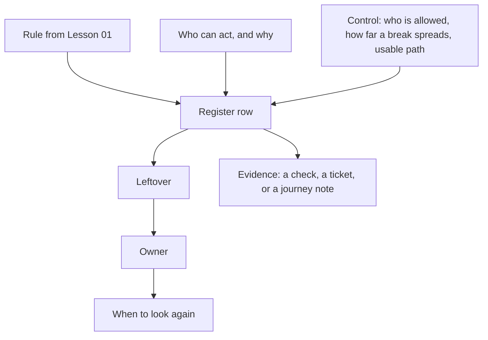

# A risk list someone else can argue with

**Kind:** design-exercise
**Loop step:** 2 Model

## Could someone else challenge a row?

A list that says "MFA," "WAF," and "users should be careful" is a tool inventory wearing the shape of a risk register. It looks complete because every row has words in it, but none of those words can be checked against the system — you cannot point to a place in SecureCollab and say "this is where MFA fails" the way you can point to a place and say "this is where the confirm control has no accessible name." A list a peer can actually attack, in the useful sense of finding a hole in your reasoning, looks like this instead:

> For rule *I*, person *A* with ability *C* and motive *N* can cause harm *H* unless control *K* holds. Leftover *R* remains, owned by *O*, looked at again on trigger *T*. Evidence *E* would show *K* is false.

Every one of those seven variables is a placeholder for something a reader can independently verify or dispute. If a peer disagrees with your row, they now have something specific to disagree with — "control *K* does not actually hold because of X" — rather than a vague sense that the register feels thin. That is the whole value of the template: not that it is more thorough-sounding, but that it is falsifiable in a way "we have MFA" is not.

The system for this exercise is companies, memberships, notes, and a **local recovery-confirm practice** — the same fixture Lesson 01 introduced. There is no live login provider, no real files, no support-impersonation product, and no real users anywhere in this exercise; every actor below is a fake name attached to a fake scenario.

## Picture: anatomy of a row



If any box in this picture would be filled in with a product name or a color, the row is not ready to go in the register. "Control: we use Okta" is a product name in the *K* box; "control: current-owner keyboard confirm, verified by `is_usable_accessible`" is a claim you can check against the lab fixture.

## Step 1: name the pieces

Take the rule you already wrote in Lesson 01 and ask what leftover it still carries once a human is required to confirm recovery — because a human in the loop is exactly the point where a rule that would otherwise be airtight (say, a cryptographically strong recovery token) becomes contingent on whether a specific person, under specific stress, can act on it.

| Rule | Recovery leftover to name | Out of scope here |
|---|---|---|
| Secrecy of note bodies | Shortcut: codes or bodies pasted into chat; a shared admin session | A cloud operator with a database snapshot (already deferred in an earlier module) |
| Owner can reach their notes | A mouse-only or color-only confirm blocks the owner outright | A future login provider going down in a whole region |
| Safety of the person recovering | Coercion; lockout of someone who cannot use a pointer | A full accessibility audit of the entire product |
| Who may confirm | Support reading codes aloud over the phone | Support impersonation shipped as an actual product feature |
| A record of recovery | Confirm-versus-cancel counted by keyboard-versus-mouse, without recording the codes themselves | Choosing a specific logging product |

Reading down this table, notice that every "leftover" column names something that survives *even after* the accessibility fix from Lesson 01 ships. That persistence is the point: a risk register that only lists things the current sprint will fix is not tracking residual risk, it is tracking a backlog.

## Step 2: write the rules

Before writing individual rows, fix the vocabulary the rows will use — otherwise "who" quietly drifts between meaning "the account owner" and "anyone who can reach the confirm button," and the two are not the same set of people.

| Piece | This system |
|---|---|
| Who | Owner; someone in the house with the pointer; support on a voice channel |
| What | The recovery confirm control; backup codes; the session created after a successful confirm |
| Actions | confirm, cancel, support-reads-codes |
| Paths | A local UI practice for now; email and phone channels arrive in later modules |
| What you trust for this journey | An accessible name, a keyboard path, a cue that is not only color, and a who-is-allowed check that this specific person may confirm *this* account, right now |
| What you do not trust | Color alone; a hover-only target; "users will figure it out"; the component library's marketing page |
| Time | Recovery happens under stress, and often without the device the account was originally set up on |

With the vocabulary fixed, the who-is-allowed rows can be written precisely enough that a missing row is visible as a gap rather than invisible as an omission:

| Who | What | Action | Decision |
|---|---|---|---|
| Current owner | confirm control | keyboard confirm | allow, if the control is usable by this person |
| Current owner | confirm control | color-only distinguish | deny: a color-only distinction is not a control at all |
| Person present | confirm control | coerce the pointer | leftover: record it explicitly; do not attempt to "fix" this with CSS |
| Support | backup codes | read aloud | deny here; a later module adds both a check and a durable record before this action can be allowed |

The fourth row is the one worth sitting with. A register that omits it entirely is not neutral on the question of whether support may read codes aloud — it is silently allowing it, because nobody wrote down that it should be denied. That is exactly how leftover permission appears in practice: not as an explicit "yes," but as a missing "no." Writing the hole down, even as a denial, is what makes the register something a later reviewer can trust.

## Step 3: harm scenarios, not bug-list names

Write at least three scenarios in complete sentences, using fake names only, because a scenario written as a sentence forces you to commit to who is harmed and how — "accessibility issue" does not.

1. **Lockout scenario:** Kai uses a screen reader and has no pointer, and the confirm control has no accessible name and is mouse-only, so Kai never re-enters company A's workspace. Both "getting in" and "safety" fail here, not merely "usability" — Kai's notes may contain time-sensitive information Kai now cannot act on.
2. **Shortcut scenario:** Remy cannot reliably tell green from gray under their monitor's color calibration, so they screenshot both buttons and send them to a roommate's chat, asking which one is "the good one." The recovery step has now leaked outside the product entirely, into a chat log neither the product nor the roommate is obligated to protect, and a shared admin session may follow if the roommate ends up clicking through on Remy's behalf.
3. **Support-pressure scenario:** a caller claiming to be support tells a user "the button is broken for everyone, just read me the code." If the product's own broken button has already trained users that recovery is unreliable and hostile, this phishing pretext becomes far more believable than it would be against a product whose recovery flow actually works.

Each scenario names a specific person, a specific mechanism, and a specific harm — which is what makes it possible to check, later, whether the fix in Lesson 04 actually closes it. "There is an accessibility risk" cannot be checked against anything; "Kai, who uses a screen reader, is locked out because the control has no accessible name" can be checked directly against `labs/1.4/1.4-risk-register/vulnerable/recovery.py`.

## Step 4: leftover, owner, when to look again

| Leftover | Why it remains | Owner | Look again |
|---|---|---|---|
| Coercion by a present attacker | A usable UI does not remove physical control of the device from whoever is standing over it | Product lead for identity | When recovery adds a second factor or a safe-word mechanism |
| Alternate path not yet built | The practice fixture only proves the confirm widget itself; there is no checked fallback path yet | Same | When a checked backup path is actually designed, not merely proposed |
| Honest-lab assumption | The lab's check is a small predicate over a dict, not a user study with real participants | Course facilitator | Never treat the practice's pass/fail as evidence about a real population — that generalization is exactly the mistake this note exists to block |

Maturity scores, a scanner turning yellow instead of red, and "it's 256-bit" do not belong in the leftover column under any of these three rows — none of them is a specific harm with an owner and a trigger, which is the bar every other cell in this table meets.

## Worked example: filling in the row from the fixture, not from imagination

The template asks for rule, person, harm, control, leftover, owner, trigger, and evidence. Filled in against the *vulnerable* fixture rather than a hypothetical, it reads:

```text
rule:     Confirm must be keyboard-operable, named, and not color-only (Lesson 01)
person:   Kai (screen-reader user, no pointer) — capability: keyboard/AT only
motive:   Get back into company A notes after a lockout
harm:     Locked out entirely; cannot act on time-sensitive note content
control:  is_usable_accessible(recovery_confirm_control())
evidence: labs/1.4/1.4-risk-register vulnerable/recovery.py -- control has no
          "name" key and mouse_only is True; is_usable_accessible returns False
leftover: none once the fixed control ships, EXCEPT coercion (separate row)
owner:    product lead for identity
trigger:  re-check whenever the confirm control's markup or props change
```

Compare that to the *fixed* fixture: the same template, same person, same rule — but `evidence` now points at `fixed/recovery.py`, where the control carries a `name` and `keyboard: True`, and `is_usable_accessible` returns `True`. The row's `leftover` field does not go to zero; it narrows to exactly the coercion case, because nothing about naming a button touches whether someone can be physically forced to press it. That narrowing, not disappearance, is what a real fix to a real row looks like — a counterexample to the assumption that "fixed" means "leftover is empty."

## Practice

Open `recovery.py` under `labs/1.4/1.4-risk-register`. For the vulnerable fixture, write down rule, person, harm, control, leftover, owner, trigger, and evidence, using the seven-variable template from the top of this lesson. Use no real people's data.

## Use it somewhere new

Map a mouse-only second factor guarding a patient chart. Add rows for a clinician working from a shared workstation and a patient who has only a keyboard available. Which dimensions of "how far a break can spread" change here relative to the notes-app version — does the harm stay contained to one account, or does a shared workstation mean one bad confirm affects the next patient's session too?

## What can still go wrong

Coercion remains a leftover risk even after every row above is addressed. Do not delete that row from the register once the button becomes keyboard-operable; the accessibility fix and the coercion residual are two different rules, and fixing the first does not touch the second at all.

## What this page is not doing

Do not run this list, or any part of this exercise, against a public clinic or bank system. Answer keys are not on this site; they live only in `content/assessment/keys/1.4.md`.
