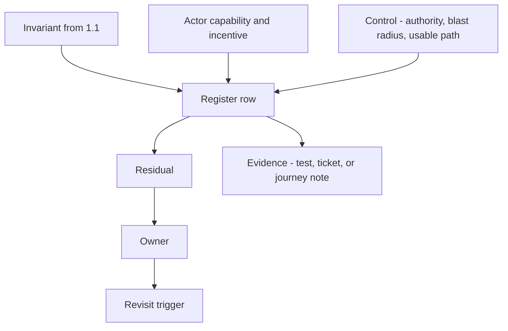

# 1.4-LO-02 — A risk register is a set of reviewable rows

**Kind:** design-exercise  
**Loop step:** 2 Model  
**Standards:** NIST CSF 2.0 (final) GV for ownership of residual risk; WCAG 2.2 (final) as the web baseline for the recovery journey; NIST SP 800-63-4 (final) for risk-based identity decisions; CISA Secure by Design (current public guidance, final); Saltzer and Schroeder (1975, seminal) psychological acceptability.

## Can a second engineer challenge a row?

A register that lists “MFA,” “WAF,” and “users should be careful” is a tool inventory. A register that a peer can attack looks like this:

> For invariant *I*, actor *A* with capability *C* and incentive *N* can cause harm *H* unless control *K* holds. Residual *R* remains, owned by *O*, revisited on trigger *T*. Evidence *E* would show *K* is false.

SecureCollab Phase 1 freeze: tenants, memberships, notes, and a **local recovery-confirm fixture**. No live IdP, no files, no support impersonation product, no production users.

## Mental model: anatomy of a row

If any box is a product name or a color, the row is not ready.

## Step 1: bind every high-impact 1.1 cell

Do not invent a new catalogue. Pull the Phase 1 cells you already wrote and ask what residual they still carry when a human must confirm recovery.

| 1.1 cell | Recovery-related residual to name | Out of scope this week |
|---|---|---|
| Confidentiality of note bodies | Workaround: codes or bodies pasted into chat; shared tenant-admin session | Cloud operator with a database snapshot (1.1 already deferred this) |
| Availability of the owner’s notes | Mouse-only or color-only confirm blocks the owner | Regional outage of a future IdP |
| Safety of the person recovering | Coercion; lockout of a user who cannot use a pointer | Full WCAG conformance audit of the whole product |
| Authorization of who may confirm | Support reading codes aloud over the phone | Support impersonation as a shipped feature |
| Accountability of recovery | Evidence of confirm/cancel by modality, without recording codes | SIEM product selection |

## Step 2: write the recovery journey as subjects and effects

| Piece | This system |
|---|---|
| Subjects | Owner; household abuser with the pointer; support staff on a voice channel |
| Objects | Recovery confirm control; backup codes; session after success |
| Actions | `recovery:confirm`, `recovery:cancel`, `support:read-codes` |
| Channels | Local UI fixture now; email and phone later (4.1 / 4.2) |
| TCB for this journey | Accessible name, keyboard path, non-color cue, 1.2 decision that this principal may confirm **this** account |
| Untrusted | Color alone; hover-only hit target; “users will figure it out”; the component library brochure |
| State / time | Recovery happens under stress, often without the original device |

Minimum authority cells (1.2 shape):

| Subject | Object | Action | Decision |
|---|---|---|---|
| Current owner | confirm control | keyboard confirm | allow if the control is usable |
| Current owner | confirm control | color-only distinguish | deny-as-control: the control is not a control |
| Abuser present | confirm control | coerce pointer | residual: record, do not “fix” with CSS |
| Support | backup codes | read aloud | deny in Phase 1; later 4.2 with mediation and evidence |

A missing support cell is how ambient authority appears (“just tell us the code”). Write the hole.

## Step 3: harm scenarios, not CVE names

Write at least three scenarios in complete sentences. Synthetic names only.

1. **Lockout.** Kai uses a screen reader and no pointer. The confirm control has no name and is mouse-only. Kai never re-enters Tenant A. Availability and safety fail.
2. **Workaround.** Remy cannot tell green from gray. They screenshot both buttons to a roommate group chat and ask which one is “the good one.” Confidentiality of the recovery step fails; a later shared admin session may follow.
3. **Support pressure.** A caller claiming to be support asks for the code because “the button is broken for everyone.” If the product trained users that recovery is hostile, phishing work factor drops.

## Step 4: residual, owner, trigger

| Residual | Why it remains | Owner | Revisit |
|---|---|---|---|
| Coercion by a present attacker | Accessible UI does not remove physical control of the device | Product lead for identity | When recovery adds a second factor or a safe word (4.2) |
| Alternate path not yet built | Lab only proves the confirm widget | Same | When a mediated backup path is designed |
| Honest-lab assumption | Pytest is not a user study | Course facilitator | Never treat the lab as population evidence |

SAMM scores, scanner yellow, and “256-bit” do not belong in the residual column.

## Practice

Draw the row diagram so a second engineer could name pytest cases. The fixture to point at is `labs/1.4/1.4-risk-register` file `recovery.py`. Your artifact is a versioned register (even a table in your notes) with invariant, actor, harm, control, residual, owner, trigger, and evidence. No real PII.

## Transfer

Clinic step-up: mouse-only second factor. Add rows for a clinician on a shared workstation and a patient using only a keyboard. Which 1.3 blast-radius dimensions change (time, objects, evidence suppression)?

## Residual risk

Coercion remains. Do not delete that row when the button becomes keyboard-operable.

## Non-goals

Do not define security as a Top 10 item. Do not run this register against a public clinic or bank. Keys stay out of lessons.
