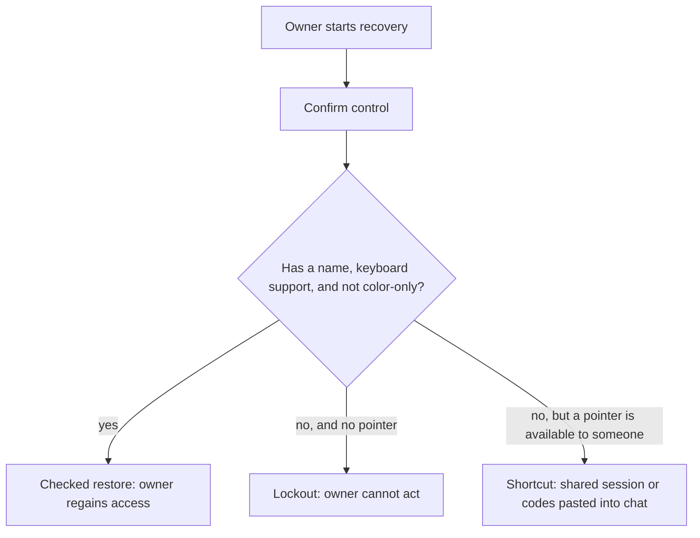

# Try a recovery button that some people cannot use

**Kind:** mechanism-lab
**Loop step:** 3 Break

## Try it

The practice is not a website you attack, and there is nothing here to exploit in the usual sense — no injection, no bypassed check, no stolen token. The failure is already sitting in the object the fixture returns: color without a name, mouse-only with no keyboard path. Watch the checker treat that object as a **failed security rule**, the same category of failure as a missing authorization check, rather than as a cosmetic UI complaint someone might file a ticket about eventually.

The rule under test:

> The confirm control used for account recovery must be usable without a pointer and must not use color as the only cue. If it is not, recovery has failed as a security control, in exactly the sense that a missing authorization check is a failed security control.

Run this only inside `labs/1.4/1.4-risk-register/`. No browser, no live login, no real mailbox, no classmate deployment. Restore the broken and repaired folders from git when you are done; the data throughout is fake.

## Picture: two paths through the same confirm



The diagram has three outcomes from one decision, not two, because "the control fails" is not one failure mode — it is lockout for someone with no pointer and a shortcut for someone who has a pointer but shares it or works around the color. The broken fixture takes the "no" branch on purpose, and which of the two failure paths a given user ends up on depends on what capability that specific user has, which is exactly the point Lesson 01's actor table was making.

## Run the pair

From the repository root, in a throwaway environment:

```text
python -m pytest labs/1.4/1.4-risk-register/tests --impl vulnerable
python -m pytest labs/1.4/1.4-risk-register/tests --impl fixed
```

`--impl vulnerable` **must fail** three of six tests: the module's stated forbidden outcome, a boundary case about a control that never declares keyboard support one way or the other, and a malformed-input case about a whitespace-only name. `--impl fixed` **must pass** all six. If either run does not match that pattern, you are not testing the rule — go back and check whether the fixture files were restored correctly before assuming the test suite itself is wrong.

## What to look at: the cause, not a trophy

Read `vulnerable/recovery.py` as a design note about what its author trusted, not as a checklist to tick off. Group what you see:

| What you see | What kind of failure | Not the lesson |
|---|---|---|
| `mouse_only: True` | People with no pointer cannot finish the secure path at all | "Users should practice clicking more carefully" |
| No `name` key | The control is not in the accessible tree a screen reader can query | A scanner's contrast-ratio score as the definition of security |
| Color present without a name | Color is the only cue distinguishing two different actions | "Make the green a nicer shade of green" |
| Checker never asks about `keyboard` | A control that is silent on keyboard support is treated as fine by default | A missing feature, rather than a missing check |

The fourth row is easy to miss on a first read, and it is the more interesting defect of the two. `mouse_only: True` is an explicit, visible flag — anyone reading the object can see it. But the checker's *logic* never actually asks "is this control keyboard-operable?" It only asks "is this control explicitly flagged mouse-only?" Those are not the same question. A control that is simply silent on the matter — no `mouse_only` flag at all, no `keyboard` flag at all — sails through the vulnerable checker, because the checker was written to catch a bad *signal*, not to require a good *guarantee*. That is a fail-open-by-omission pattern: verifying the absence of evidence for harm, instead of verifying the presence of evidence for safety. `labs/1.4/1.4-risk-register/tests/test_missing_keyboard_flag_is_not_silently_accepted` exists specifically to make this gap visible rather than letting it hide behind the more obvious `mouse_only: True` case.

The helper `is_usable_accessible` is what the tests call. It is not a production accessibility engine, and it is not attempting to be one — it exists so that "this must not happen" is **checkable** inside this course's fixture, the same way a two-line permission predicate in an earlier module was never meant to be a real authorization engine either.

## Why it happens vs what it costs

| Slice | For this practice |
|---|---|
| Why it happens | The designer trusted a pointer and a hue as sufficient, and the checker was written to catch the flag that names the obvious version of that mistake rather than to require positive proof of the opposite |
| What has to be true first | Recovery is a high-impact action; some people have no pointer, or cannot rely on color alone to distinguish two controls |
| Trigger | The confirm control is a mouse-only, unnamed widget, or one that is simply silent about keyboard support |
| What it costs | Lockout, or an unsafe shortcut that can leak company A notes or an admin session |
| How you notice later | Support tickets, and keyboard-versus-mouse confirm counts — never the codes themselves |
| Out of scope for this practice | Live CAPTCHA services, real user studies, ready-made attack recipes against a real product |

## Counterexample: a control that looks fixed but is not

Suppose a well-meaning fix set `mouse_only: False` and gave the control a `name`, but never added `keyboard: True` — the author assumed that turning off `mouse_only` was itself sufficient, since "not mouse-only" sounds like it should mean "keyboard works." Run that exact object through `is_usable_accessible` in `fixed/recovery.py`: it returns `False`, because the fixed checker requires *positive* evidence (`control.get("keyboard")` must be truthy), not merely the absence of the bad flag. This is the counterexample to "turning off the bad flag is the fix" — the fix is requiring the good flag, which is a different and stronger claim.

## Practice

Run both commands this session. Record the three failing test names from `--impl vulnerable` and, for each one, write one sentence connecting it to a rule from Lesson 01 (getting in, or safety) rather than to "an accessibility bug" as a category. Then read the two anti-fake tests (`test_checker_rejects_a_bad_control_regardless_of_variant` and `test_checker_accepts_a_good_control_regardless_of_variant`) and explain, in your own words, why they call `is_usable_accessible` on a dict you constructed by hand instead of on whatever `recovery_confirm_control()` happens to return. If you cannot explain the difference, reread the "What to look at" section above before moving on — that difference is the whole reason the checker's logic and the fixture's object are tested separately rather than only together.

## Use it somewhere new

A clinic's second factor is mouse-only. Name the same two failure branches — lockout versus shortcut — for a clinician working from a shared crash-cart workstation, where the "shortcut" branch might mean the next clinician on shift inherits an already-confirmed session rather than a screenshot in chat. Ask, too, which of the two anti-fake tests would still catch a clinic vendor's claim that their dialog is "accessible" without you ever seeing the dialog's actual markup: the pattern of testing the checker's logic against constructed input, independent of whatever the vendor's own demo produces, transfers directly — you would ask the vendor to run their accessibility check against a deliberately bad control you supply, not only against the control they chose to demo.

## What this page is not doing

No live-target steps, and no real people's data anywhere in this exercise. Do not "fix" the practice by deleting or weakening a test — if a test seems wrong, that is itself a finding to write down, not a reason to make it pass.
