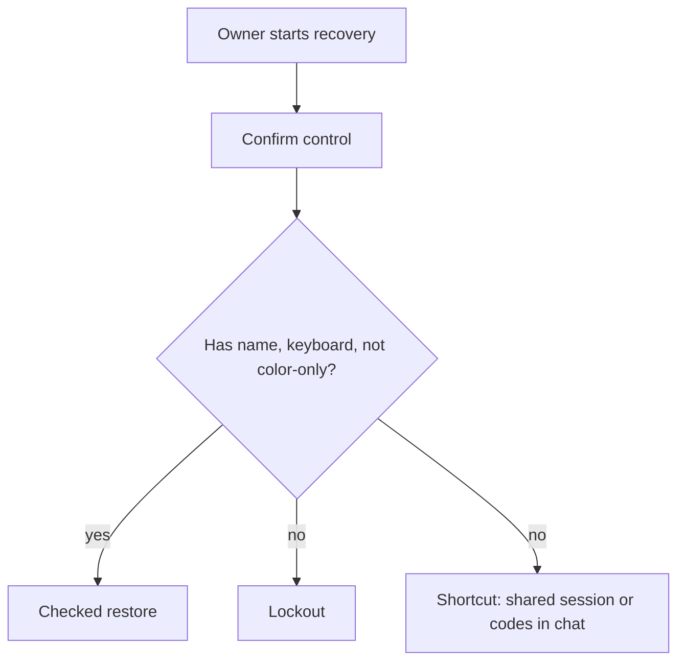

# Try a recovery button that some people cannot use

**Kind:** mechanism-lab
**Loop step:** 3 Break

## Try it

The practice is not a website you attack. It is a tiny Python model of a recovery **confirm** control. The failure is already in the object: color without a name, mouse without a keyboard. You are here to see that the check treats that object as a **failed rule**, not as a UI nit.

The rule under test:

> The confirm control used for account recovery must be usable without a pointer and must not use color as the only cue. If it is not, recovery has failed as a security control.

## Where you may practice

Only `labs/1.4/1.4-risk-register/` is in scope. No browser, no live login, no real mailbox, no classmate deployment. Restore the broken and repaired folders from git when you are done. Fake data only.

Do not paste this exercise onto a public recovery page, employer login, or live clinic portal.

## Picture: two paths through the same confirm



The broken files take the **no** branch on purpose.

## Run the pair

From the repository root, in a throwaway environment:

```text
python -m pytest labs/1.4/1.4-risk-register/tests --impl vulnerable
python -m pytest labs/1.4/1.4-risk-register/tests --impl fixed
```

`--impl vulnerable` **must fail** on `test_recovery_control_is_usable_and_accessible`. `--impl fixed` **must pass**. If both pass, you are not testing the rule.

## What to look at: the cause, not a trophy

Read `vulnerable/recovery.py` as a design note. Group what you see:

| What you see | What kind of failure | Not the lesson |
|---|---|---|
| `mouse_only: True` | People cannot finish the secure path | “Users should practice clicking” |
| No `name` | The control is not in the accessible tree | A scanner title about contrast as the definition of security |
| Color present without a name | Color is the only cue | “Make it a nicer green” |

The helper `is_usable_accessible` is what the tests call. It is not a production accessibility engine. It exists so “this must not happen” is **checkable** in this course.

## Why it happens vs what it costs

| Slice | Practice |
|---|---|
| Why it happens | Designers trusted a pointer and a hue |
| What has to be true first | Recovery is high-impact; some people have no pointer or cannot rely on color |
| Trigger | The confirm control is a mouse-only unnamed widget |
| What it costs | Lockout or an unsafe shortcut, which can leak company A notes or an admin session |
| How you notice later | Tickets and keyboard-vs-mouse counts |
| Out of scope | Live CAPTCHA farms, real user tests, ready-made attack recipes |

## Practice

Run both commands this session. Record the failing test name. In your notes, rewrite the failure as a rule (getting in / safety and/or secrecy), not as “an accessibility bug.”

## Use it somewhere new

Clinic second factor that is mouse-only: name the same two branches (lockout vs shortcut) for a clinician on a crash-cart workstation.

## What this page is not doing

No live-target steps. No real people’s data. Do not “fix” the practice by deleting the test.
