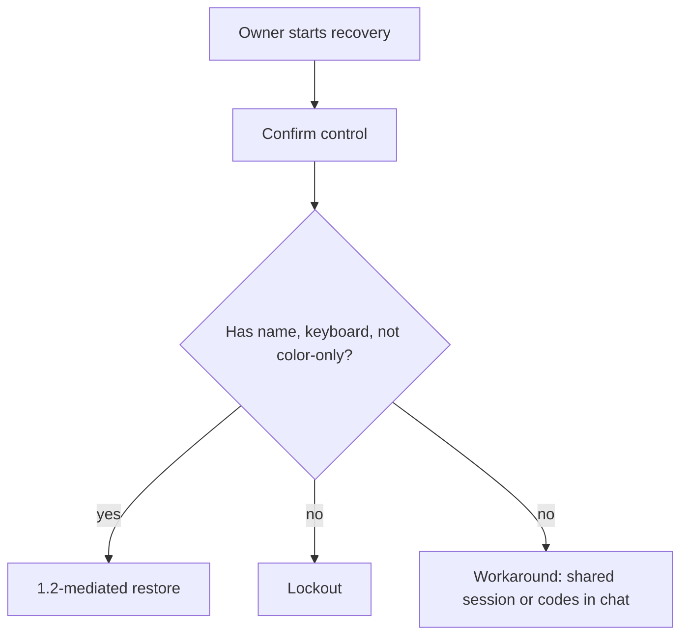

# 1.4-LO-03 — Break an inaccessible recovery control locally

**Kind:** mechanism-lab  
**Loop step:** 3 Break  
**Lab:** `labs/1.4/1.4-risk-register` — local course files and synthetic data only  
**Standards:** WCAG 2.2 (final) 2.1.1, 1.4.1, 2.5.8 as the web baseline; Saltzer and Schroeder psychological acceptability (1975, seminal); NIST CSF 2.0 DE as an outcome label for later operate work.

## Which forbidden effects does a green button still cause?

The lab is not a website you attack. It is a tiny Python model of a recovery **confirm** control. The security failure is already in the object: color without a name, mouse without a keyboard. You are here to see that pytest treats that object as a **failed property**, not as a UI nit.

The invariant under test:

> The confirm control used for account recovery must be usable without a pointer and must not use color as the only encoding. If it is not, recovery has failed as a security control.

## Authorized boundary

Only `labs/1.4/1.4-risk-register/` is in scope. No browser, no IdP, no real mailbox, no classmate deployment. Restore `vulnerable/` and `fixed/` from git when you are done. Synthetic data only.

Do not paste this exercise onto a public recovery page, employer SSO, or live clinic portal.

## Mental model: two paths through the same confirm



The vulnerable fixture takes the **no** branch by construction.

## Run the pair

From the repository root, in a disposable environment:

```text
python -m pytest labs/1.4/1.4-risk-register/tests --impl vulnerable
python -m pytest labs/1.4/1.4-risk-register/tests --impl fixed
```

`--impl vulnerable` **must fail** on `test_recovery_control_is_usable_and_accessible`. `--impl fixed` **must pass**. If both pass, you are not testing the invariant.

## What to observe — cause, not trophy

Read `vulnerable/recovery.py` as a design document. Group what you see:

| Observation | Failure class | Not the lesson |
|---|---|---|
| `mouse_only: True` | Psychological acceptability / complete mediation of the human path | “Users should practice clicking” |
| No `name` | WCAG 2.1.1 / 4.1.2-shaped gap: the control is not in the accessible tree | A scanner finding titled “button contrast” as the definition of security |
| Color present without a name | 1.4.1 Use of Color | “Make it a nicer green” |

The helper `is_usable_accessible` is the oracle the tests call. It is not a production accessibility engine. It exists so the forbidden outcome is **machine-checkable** in this course.

## Root cause versus impact

| Slice | Lab |
|---|---|
| Root cause | Designers trusted a pointer and a hue |
| Preconditions | Recovery is high-impact; some operators have no pointer or cannot rely on color |
| Trigger | `recovery_confirm_control()` returns a mouse-only unnamed widget |
| Impact | Lockout or unsafe workaround, which can leak Tenant A notes or a tenant-admin session |
| Detection later | Tickets and modality telemetry (LO-06) |
| Out of scope | Live CAPTCHA farms, real user tests, weaponized payloads |

## Practice

Run both commands this session. Record the failing test name. In your notes, rewrite the failure as a 1.1 cell (availability/safety and/or confidentiality), not as “a11y bug.”

## Transfer

Clinic step-up that is mouse-only: name the same two branches (lockout vs workaround) for a clinician on a crash cart workstation.

## Non-goals

No live-target instructions. No real PII. Do not “fix” the lab by deleting the test.
