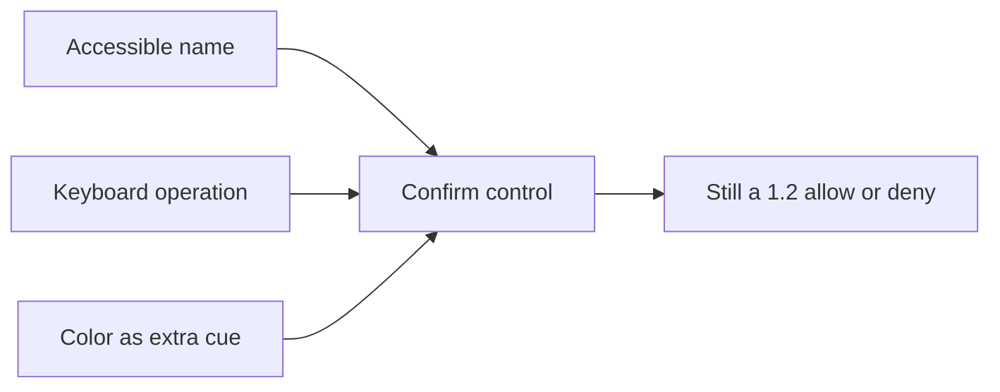

# 1.4-LO-04 — Restore the human path without lowering assurance

**Kind:** design-exercise  
**Loop step:** 4 Build  
**Lab:** `labs/1.4/1.4-risk-register`  
**Standards:** WCAG 2.2 (final) as web baseline; Saltzer and Schroeder fail-safe defaults and psychological acceptability (1975, seminal); CISA Secure by Design (current public guidance, final) for not shifting the burden onto the customer’s eyesight and pointer.

## Structural means the journey actually works

A denylist of yesterday’s CSS class is not the fix. A scanner suppression is not the fix. “The component library is accessible” is not the fix.

The structural change is: the confirm object **is** a named, keyboard-operable control, and color is extra encoding only. The 1.2 decision (this principal may confirm **this** account **now**) is unchanged. You do not restore availability by emailing the password.

## Mental model: redundant encoding, not a swap



If you remove Name or Key, the control is not a control. If you remove Color, a sighted mouse user might be slightly slower; the property can still hold. If you remove the 1.2 decision, anyone who can call `confirm` wins.

## What the fixed fixture must show

Read `fixed/recovery.py` against this checklist. Do not treat the snippet as production React.

| Predicate | Why it is structural |
|---|---|
| `name` is a non-empty accessible name | Screen-reader users can hear “Confirm account recovery” |
| `keyboard` is true | 2.1.1: the effect is reachable without a pointer |
| `mouse_only` is false | Pointer is not a hidden TCB |
| Color may remain | Redundant, not sole, encoding |

Fail-safe: if name or keyboard is missing, `is_usable_accessible` is false. Uncertainty is a **deny** of “this control is an acceptable recovery gate,” not an allow because the demo looked fine.

## What this is not

- A full WCAG conformance claim for SecureCollab.
- A CAPTCHA, drag-to-confirm, or “open the mobile app” detour that recreates exclusion.
- A lower-assurance escape hatch (“email us the note body”).
- A coercion fix. Physical presence remains residual.

## Trade-off you must write down

Reducing friction (keyboard, name, larger target) **is** the security change for this invariant. It is not a gift that weakens hashing or tenant isolation. If someone argues that making confirm easier helps attackers, answer with the two-work-factor model from LO-01: you measured user work that was blocking legitimate recovery. Attacker work to coerce or phish is a **different row**, owned and dated.

## Practice

Name subject, object, action, and the predicate that must be true after the fix. Run:

```text
python -m pytest labs/1.4/1.4-risk-register/tests --impl fixed
```

It must pass. Then write one sentence: which 1.1 cell is restored, and which residual you refused to delete.

## Transfer

Banking re-auth dialog: if the bank “fixes” mouse-only by sending a one-time code in SMS that support will read back, what 1.2 cell did they quietly change?

## Residual risk

Coercion remains. Alternate mediated path is still future work. Honest-lab is not a user study.
