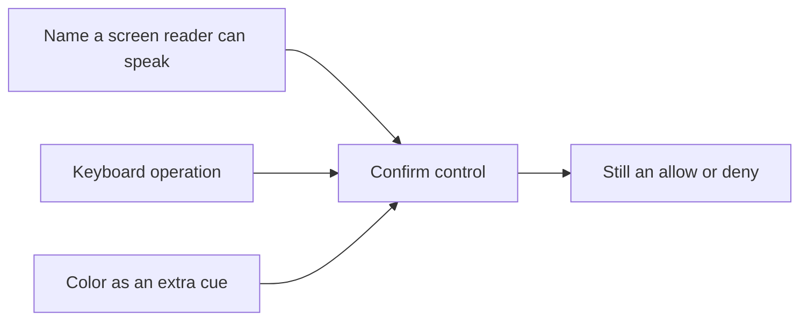

# Fix the button without making recovery weaker

**Kind:** design-exercise
**Loop step:** 4 Build

## The rule

A denylist of yesterday’s CSS class is not the fix. Hiding a scanner warning is not the fix. “The component library is accessible” is not the fix.

The structural change is: the confirm object **is** a named, keyboard-operable control, and color is extra encoding only. The who-is-allowed decision (this person may confirm **this** account **now**) does not change. You do not restore access by emailing the password.

## Picture: extra cues, not a swap



If you remove Name or Key, the control is not a control. If you remove Color, a sighted mouse user might be slightly slower; the rule can still hold. If you remove the who-is-allowed decision, anyone who can call confirm wins.

## What the repaired files must show

Open `fixed/recovery.py`. Do not treat the snippet as production React.

| Check | Why it is structural |
|---|---|
| `name` is a non-empty accessible name | Screen-reader users can hear “Confirm account recovery” |
| `keyboard` is true | The effect is reachable without a pointer |
| `mouse_only` is false | A pointer is not secretly what you trust |
| Color may remain | Extra, not the only, cue |

Fail closed: if name or keyboard is missing, `is_usable_accessible` is false. Uncertainty is a **no** on “this control is an acceptable recovery gate,” not a yes because the demo looked fine.

## What this is not

- A full accessibility badge for the notes app.
- A CAPTCHA, drag-to-confirm, or “open the phone app” detour that shuts people out again.
- A weaker escape hatch (“email us the note”).
- A coercion fix. Physical presence remains leftover risk.

## Trade-off you must write down

Reducing friction (keyboard, name, larger target) **is** the security change for this rule. It is not a gift that weakens hashing or keeping companies apart. If someone argues that making confirm easier helps attackers, answer with the two-effort picture from the first page: you measured user work that was blocking real recovery. Attacker work to coerce or phish is a **different row**, owned and dated.

## Practice

Name who, what, action, and the check that must be true after the fix. Run:

```text
python -m pytest labs/1.4/1.4-risk-register/tests --impl fixed
```

## Use it somewhere new

Banking re-auth dialog: if the bank “fixes” mouse-only by sending a one-time code in SMS that support will read back, what who-is-allowed row did they quietly change?

## What can still go wrong

Coercion remains. An alternate checked path is still future work. This practice is not a user study.
