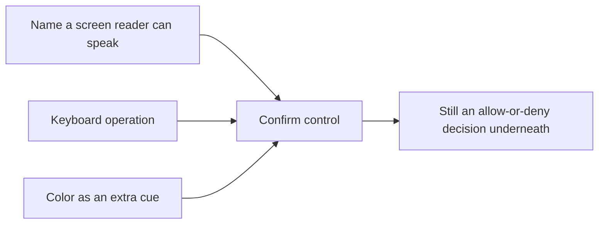

# Fix the button without making recovery weaker

**Kind:** design-exercise
**Loop step:** 4 Build

## The rule

A leftover CSS class name is a denylist entry, not a named keyboard control — it changes what the button looks like, not what a screen reader announces or what a keyboard event handler responds to. Silencing a scanner warning does not give the button a name either; it just stops a tool from telling you the name is missing. A vendor "accessible component" sticker is not the restore, because the sticker is a claim about the library, and this rule is a claim about one specific control in one specific app using that library in a specific way.

The restore has two structural parts, not one, and Lesson 03 already showed why both are needed: the confirm object **is** a named, keyboard-operable control, and the checker requires *positive* evidence of that, not merely the absence of a bad flag. Color remains as extra encoding only, never the sole cue. None of this changes the who-is-allowed decision underneath — the question of whether this specific person may confirm this specific account, right now, is untouched by whether the button has a name. You do not restore access by emailing the password; that would trade a UI problem for an authority problem, which is a worse trade, not a fix.

## Picture: extra cues, not a swap



Each of the three inputs on the left plays a different role, and the diagram is arranged to show that removing any one of them has a different consequence, not a uniformly "worse" one. If you remove Name or Key, the control stops being a control at all for anyone who cannot use a mouse — this is the failure mode the whole module is about. If you remove Color, a sighted mouse user might be slightly slower to distinguish confirm from cancel, but the rule can still hold, because Name and Key are still carrying the load Color was only supplementing. If you remove the who-is-allowed Decision box entirely, the fix becomes actively dangerous: anyone who can call the confirm function wins, regardless of whether they are the account owner, which is a strictly worse state than the one you started in.

## Two candidate mechanisms, compared honestly

A competent engineer, faced with this bug report, would reasonably propose one of two fixes. Only one of them is the structural repair this module teaches, and the reason the other one fails is worth stating precisely rather than dismissing by name.

**Candidate A — turn off `mouse_only`.** This is the fix someone reaches for first, because `mouse_only: True` is the flag that is visibly, obviously wrong in the vulnerable object, and setting it to `False` feels like directly reversing the bug. It fails because the checker in the vulnerable fixture never actually required positive evidence of keyboard support — it only checked that `mouse_only` was not set. Flip that one flag without adding a `keyboard` declaration, and the object now claims to not be mouse-only while still not actually supporting the keyboard, which is worse than the original bug: the original at least declared its limitation honestly.

**Candidate B (the restore) — declare `keyboard: True` and require the checker to see it.** This is the fix `fixed/recovery.py` actually implements. It closes the gap Candidate A leaves open, because the checker now asks "does this control affirmatively support the keyboard?" rather than "does this control avoid explicitly claiming it does not?" Those are different questions, and only the second one is actually falsifiable in the direction that matters — a control that is silent about keyboard support should not pass by default, the same way an authorization check that is silent about a caller's identity should not default to allow.

## What the repaired files must show

`fixed/recovery.py` is not the clinic's confirm widget, and it is not attempting to be — it is the smallest object and checker pair that makes the distinction between Candidate A and Candidate B checkable.

| Check | Why it is structural, not cosmetic |
|---|---|
| `name` is a non-empty, non-whitespace accessible name | Screen-reader users hear "Confirm account recovery," not silence — and `"   "` must fail this check the same way an empty string does, because both announce nothing |
| `keyboard` is explicitly `True` | The effect is reachable without a pointer, and the checker requires this as positive evidence rather than inferring it from `mouse_only` being false |
| `mouse_only` is `False` | A pointer is not secretly the only path to the effect |
| Color may remain | It is extra, redundant encoding, never the only encoding |

If `name` or `keyboard` is missing or falsy, `is_usable_accessible` returns `False`. A polished visual demo does not make this an acceptable recovery gate if the underlying object cannot pass that check — the demo and the object are two different things, and a real screen reader sees the object, the same as the checker does, not the demo.

## What this is not

- A full accessibility badge for the notes app as a whole — the claim is scoped to this one journey.
- A CAPTCHA, a drag-to-confirm gesture, or an "open the phone app" detour, any of which can shut people out again in a new shape even while claiming to fix the old one.
- A weaker escape hatch, such as "email us the note" as a fallback when confirm fails.
- A coercion fix. Physical presence over someone's shoulder remains leftover risk no matter how the button is labeled.

## Trade-off you must write down

Reducing friction — adding keyboard support, a name, and a large enough target — **is** the security change this rule calls for, not a UX nicety layered on top of a separately "real" security fix. It does not weaken hashing, session binding, or keeping companies apart from each other; those are different rules, addressed by different mechanisms, and nothing here touches them. If someone argues that making confirm easier to use "helps attackers," answer with the two-effort picture from Lesson 01: you measured *user* work that was blocking real recovery for real people, and that measurement is independent of *attacker* work to coerce or phish, which is a different row in the register, owned and dated separately rather than traded off against this one.

## Practice

Name who, what, action, and the specific check that must be true after the fix — in the same seven-variable shape Lesson 02 used for register rows. Then run:

```text
python -m pytest labs/1.4/1.4-risk-register/tests --impl fixed
```

All six tests must pass. If any fails, the object or the checker still has a gap Candidate A would have left open.

## Use it somewhere new

A banking re-auth dialog is "fixed" for mouse-only by adding a path where support will read the one-time code back to the customer over the phone. Which who-is-allowed row did the bank quietly change by adding that path, and why is reading a code aloud not the same kind of fix as declaring `keyboard: True`?

## What can still go wrong

Coercion remains untouched by this fix, exactly as Lesson 01 predicted it would. An alternate, independently checked recovery path is still future work this module does not build. This practice was never a user study, and its passing tests are evidence about the fixture, not about a real population of users.
