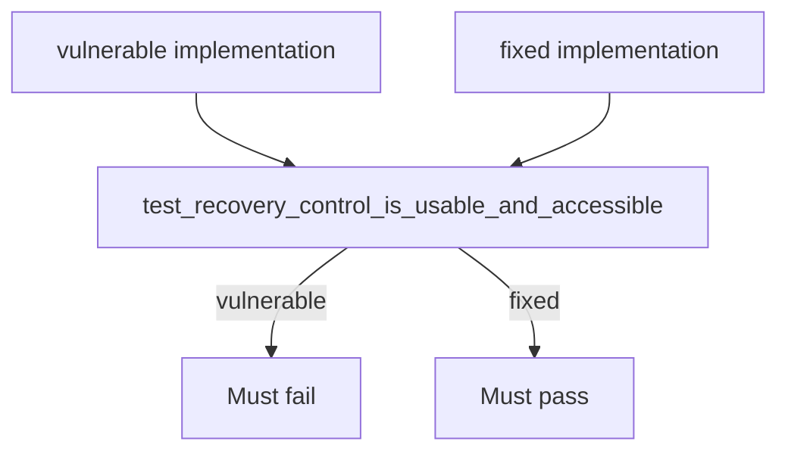

# 1.4-LO-05 — Evidence that inaccessible recovery is forbidden

**Kind:** verification-lab  
**Loop step:** 5 Verify  
**Lab:** `labs/1.4/1.4-risk-register`  
**Standards:** WCAG 2.2 (final) as the web baseline the oracle approximates; NIST CSF 2.0 DE as a label for later signals, not as the test.

## An invariant that cannot fail a test is still a slogan

Happy-path “pytest collected 1 item” is not evidence. The oracle must be **false** on the vulnerable tree and **true** on the fixed tree.



If both pass, the test is not looking at `mouse_only`, name, or keyboard. If both fail, the fix is not structural or the oracle is wrong.

## Four modes, even for a widget

| Mode | Must show for this module |
|---|---|
| Normal | A named, keyboard-operable confirm is accepted by the oracle (fixed tree) |
| Negative | Color-only or mouse-only confirm is rejected (vulnerable tree) |
| Abuse | Sharing an admin session to skip recovery is **out of band** here: record it as a register residual, not as a pytest in this folder |
| Failure | Missing name or keyboard fails closed (`is_usable_accessible` is false) |

The file is `labs/1.4/1.4-risk-register/tests/test_recovery_a11y.py`. It calls `recovery.recovery_confirm_control()` and asserts `is_usable_accessible`. That is a **forbidden-outcome** test: inaccessible recovery is not allowed to count as a passing control.

A test that only asserts HTTP 200 is not this module’s evidence (see 9.3 when you get there). This lab never opens a socket.

## Map tests to LO-02 cells

| Test | Matrix cell | 1.1 cell |
|---|---|---|
| Oracle false on mouse-only unnamed control | Owner × confirm × color-only → deny-as-control | Availability/safety (lockout) |
| Oracle true on named keyboard control | Owner × confirm × keyboard-confirm → allow | Same cells restored |
| Not tested here | Support × codes × read-aloud | Authorization hole in the register |

## Practice

Execute both implementations this session:

```text
python -m pytest labs/1.4/1.4-risk-register/tests --impl vulnerable
python -m pytest labs/1.4/1.4-risk-register/tests --impl fixed
```

Paste nothing from keys. Write the command output’s fail/pass into your notes next to the matrix row.

## Transfer

Clinic mouse-only step-up: write one test name you would want (`test_step_up_control_keyboard_operable`) and what must fail on the broken widget. Do not run it against a real clinic.

## Non-goals

Do not add live traffic. Do not log recovery codes in a “better” test. Keys stay out of this file.
