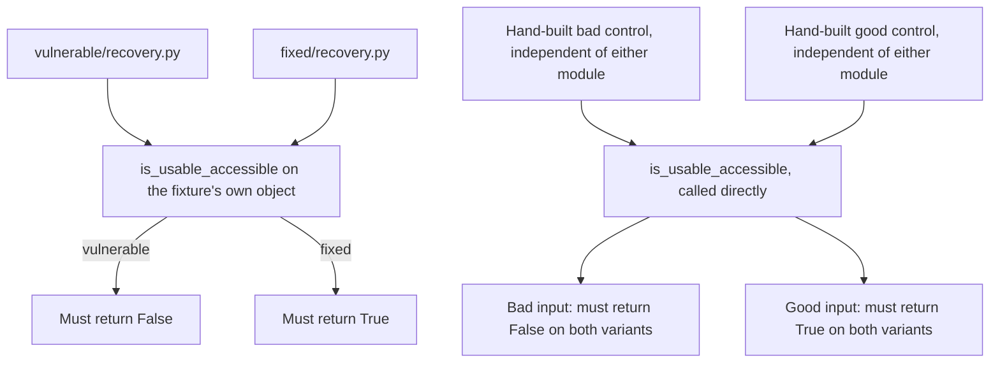

# Proof that a broken recovery button is not "fine"

**Kind:** verification-lab
**Loop step:** 5 Verify
**Standards:** WCAG 2.2 success criteria 2.1.1 Keyboard (Level A), 4.1.2 Name, Role, Value (Level A), and 1.4.1 Use of Color (Level A). NIST CSF 2.0 GV.RM for the risk-ownership half of what these tests are evidence for.

## Check it

A test that merely calls a function and checks it did not raise an exception does not prove the confirm control works from the keyboard — an object with every field present and structurally valid can still be mouse-only, still lack a real name, and still pass a check that only asks "did this run without crashing." Mouse-only, color-only, and keyboard-silent all have to fail on the broken files and pass on the repaired ones, and they have to fail for the *security* reason, not for an incidental one like a missing dictionary key raising a `KeyError` before the real assertion even runs.

## Picture: a broken recovery must fail the check, for the right reason

Asserting that the confirm function returns a dict at all is a weaker claim than asserting it returns a dict this specific rule accepts — and the gap between those two claims is exactly where a fake fix can hide.



The right side of the diagram is the anti-fake pair, and it exists because the left side alone has a hole: if the "fixed" module hardcoded `is_usable_accessible` to always return `True`, the left-side test would pass for the wrong reason — the object and the checker would simply agree with each other by construction, not because the checker actually enforces anything. Calling the checker on hand-built input, independent of what either module's own factory produces, closes that hole.

## What the check has to show

| Mode | Must show for this topic |
|---|---|
| Normal | A named, keyboard-operable confirm is accepted (`fixed`'s own factory output) |
| Wrong input / boundary | A control that is silent about keyboard support — not flagged mouse-only, but no `keyboard` key either — is rejected; a control with color but no name is rejected even when it is not mouse-only |
| Malformed input | A whitespace-only name (`"   "`) is rejected, because a bare truthiness check on a string would let it through while a screen reader announces nothing |
| Abuse | Sharing an admin session to skip recovery entirely is **out of band** for this lab folder: it is recorded as leftover risk in the register, not asserted as a red test here, because there is no code-level oracle for "a human handed someone else their session" |
| When things break | Missing name or missing keyboard evidence fails closed — `is_usable_accessible` returns `False`, never an exception that could be silently caught and ignored |

Six tests live in `labs/1.4/1.4-risk-register/tests/test_recovery_a11y.py`: the forbidden-outcome test, the color-only-without-name boundary, the missing-keyboard-flag boundary, the whitespace-name malformed case, and the two anti-fake tests. HTTP 200, a passing lint run, or an exception-free execution prove none of these; this practice never opens a network socket at all, so there is no HTTP status to check in the first place.

## Map checks to the rows you wrote in Lesson 02

| Check | Who × what × action | Rule |
|---|---|---|
| `test_recovery_control_is_usable_and_accessible` fails on vulnerable | Owner × confirm × color-only-mouse-only → deny | Getting in / safety (lockout branch) |
| `test_missing_keyboard_flag_is_not_silently_accepted` | Owner × confirm × silent-on-keyboard → deny | Same rule, a quieter version of the same failure |
| `test_checker_rejects_a_bad_control_regardless_of_variant` / `test_checker_accepts_a_good_control_regardless_of_variant` | (tests the checker itself, not a specific actor's action) | Editorial integrity of the oracle — the test suite must not be fakeable |
| Not tested here at all | Support × codes × read-aloud | A who-is-allowed hole named explicitly in Lesson 02, denied by policy rather than by a unit test |

## Worked example: reading a failure as evidence, not as noise

Run `python -m pytest labs/1.4/1.4-risk-register/tests --impl vulnerable -v` and the third line of output names `test_missing_keyboard_flag_is_not_silently_accepted` as failed. Read the assertion message rather than skipping past it: it says a control that never declares keyboard support must not be accepted just because `mouse_only` happens to be false. Trace why this specific test fails on `vulnerable` and nowhere else. The vulnerable checker's logic is `if control.get("mouse_only"): return False`, followed by a name check, and nothing else — it never inspects a `keyboard` key at all. Feed it a dict with `mouse_only: False` and a valid name but no `keyboard` key, and every one of its checks passes, so it returns `True` for a control that has never actually promised keyboard support. That is the traced failure: not "the test is red," but "the checker accepts silence as a guarantee," which is the fail-open-by-omission pattern Lesson 03 named.

Now trace the same input through `fixed/recovery.py`. Its third line reads `if not control.get("keyboard"): return False` — a positive requirement, not a negative one. The same input that passed the vulnerable checker now fails this line and returns `False`, correctly. That one-line difference between "check for the bad flag" and "require the good flag" is the entire structural fix, and the test's pass/fail behavior on the two variants is the proof that the difference is real rather than cosmetic.

## Why an oracle over a dict is enough evidence, and what it still does not prove

The oracle here — `is_usable_accessible` called on both the fixture's own object and on hand-built input — is enough evidence that the *declared* shape of a control satisfies the rule. It is not evidence that a real browser, running a real screen reader, actually announces the name correctly, or that the keyboard event handler is wired up in the shipped frontend rather than merely declared as `keyboard: True` in a data model. That gap between "the model says keyboard is supported" and "the shipped page actually supports keyboard" is a real one, and it is the reason this module's evidence checklist in the assessment also asks for WCAG-oriented review notes on an actual journey, not only a passing test suite.

## Practice

```text
python -m pytest labs/1.4/1.4-risk-register/tests --impl vulnerable
python -m pytest labs/1.4/1.4-risk-register/tests --impl fixed
```

Record which three tests fail on `vulnerable` and connect each one, in one sentence, to a row from Lesson 02's register. For the two that are not the module's headline forbidden outcome — the missing-keyboard-flag boundary and the whitespace-name malformed case — write down which actor from Lesson 01's table would actually hit that specific failure in practice, rather than treating both as generic edge cases. Kai, who has no pointer at all, is the person the missing-keyboard-flag test protects; a low-vision user relying on a screen reader that announces nothing for a whitespace name is the person the malformed-input test protects. Naming the person behind each red test is what keeps "verify" from collapsing into "run the suite and check the exit code," which is the same collapse Lesson 01 warned about for risk scores in general.

## Use it somewhere new

Write a test name you would want for a mouse-only second factor (`test_step_up_control_keyboard_operable`) and describe, in words, what must fail on the broken widget for that test to be doing real work rather than merely existing. Then write the anti-fake version of it — a test that calls whatever checker function the clinic's own second-factor library exposes, on a hand-built bad input you control, independent of any object the library's own demo produces. If the library has no such checker exposed at all, that absence is itself a finding: a control you cannot independently verify against hostile input is a control you are trusting on the vendor's word alone, which is the same trust failure Lesson 01 rejected when it named "the framework is accessible" as an insufficient claim. Do not run any such test against a real clinic system; the point of this exercise is the shape of the test, not an actual probe.

## What this page is not doing

Do not add live traffic anywhere in this exercise, and do not log recovery codes in a "better" test as a way of making the evidence look more thorough. Answer keys are not on this site; they live only in `content/assessment/keys/1.4.md`.
