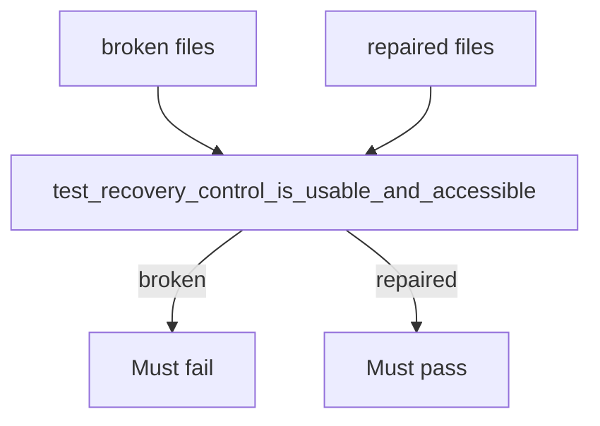

# Proof that a broken recovery button is not “fine”

**Kind:** verification-lab
**Loop step:** 5 Verify

## Check it

A collected-item count of 1 does not prove the confirm control works from the keyboard. Mouse-only color still has to fail on the broken files and pass on the repaired ones.

## Picture: a broken recovery must fail the check

Asserting the confirm function exists can still hide that the control remains mouse-only.



If both pass, you are not looking at `mouse_only`, name, or keyboard.

## What the check has to show

| Mode | Must show for this topic |
|---|---|
| Normal | A named, keyboard-operable confirm is accepted (repaired files) |
| Wrong input | Color-only or mouse-only confirm is rejected (broken files) |
| Abuse | Sharing an admin session to skip recovery is **out of band** here: record it as leftover risk, not as a check in this folder |
| When things break | Missing name or keyboard fails closed (`is_usable_accessible` is false) |

It calls `recovery.recovery_confirm_control()` and asserts `is_usable_accessible`. That check is there so inaccessible recovery still fails.

HTTP 200 does not prove the confirm is named and keyboard-usable. This practice never opens a network socket.

## Map checks to the rows you wrote

| Check | Who × what × action | Rule |
|---|---|---|
| False on mouse-only unnamed control | Owner × confirm × color-only → deny | Getting in / safety (lockout) |
| True on named keyboard control | Owner × confirm × keyboard-confirm → allow | Same rules restored |
| Not tested here | Support × codes × read-aloud | A who-is-allowed hole in the list |

## Practice

```text
python -m pytest labs/1.4/1.4-risk-register/tests --impl vulnerable
python -m pytest labs/1.4/1.4-risk-register/tests --impl fixed
```

## Use it somewhere new

Write a test name you would want for a mouse-only second factor (`test_step_up_control_keyboard_operable`) and what must fail on the broken widget. Do not run it against a real clinic.

## What this page is not doing

Do not add live traffic. Do not log recovery codes in a “better” test. Answer keys are not on this site.
