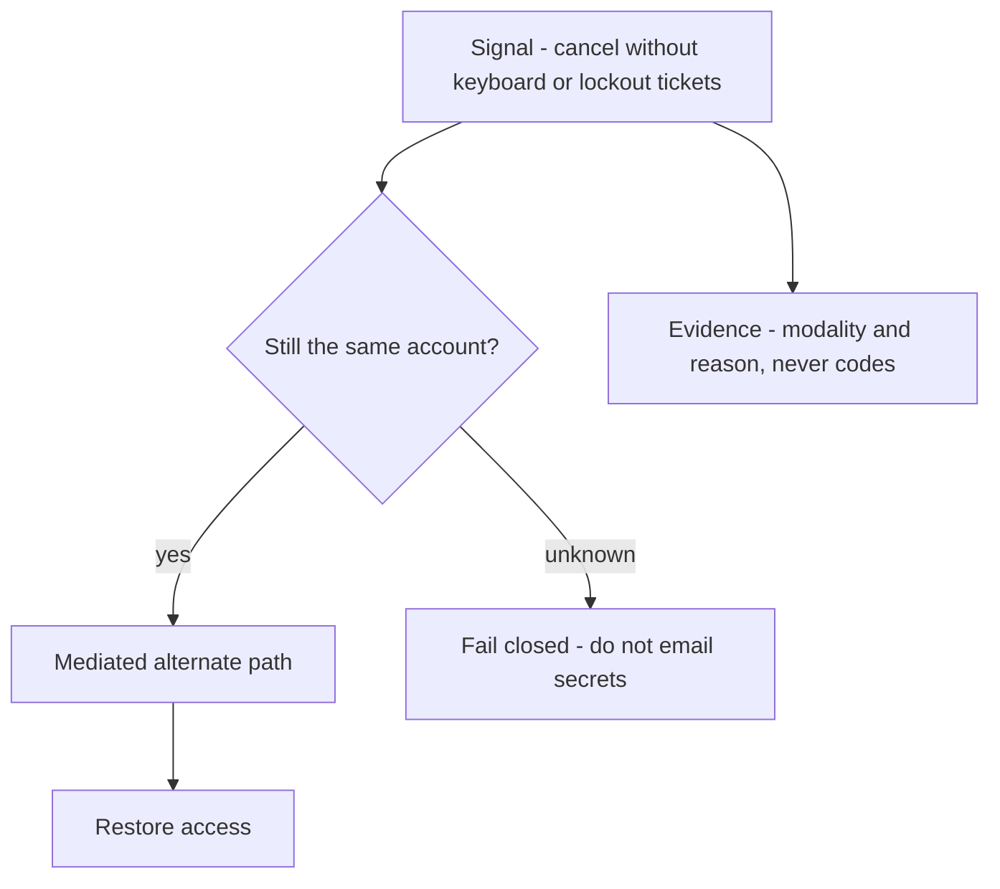

# 1.4-LO-06 — Detect and recover without lowering the 1.2 bar

**Kind:** operations-exercise  
**Loop step:** 6 Operate  
**Standards:** NIST CSF 2.0 (final) Detect, Respond, Recover as *outcome* labels; WCAG 2.2 (final) for the alternate path’s own usability; Saltzer and Schroeder compromise recording (1975, seminal).

## Prevention is not the whole residual story

Even after LO-04, someone will still fail recovery: a new exclusion you did not model, a library regression, a coercion event. Operations is the rest of the 1.4 loop: notice, contain, restore, and refuse to “help” by emailing note bodies.

## Mental model: prevention failed, the loop continues without lowering 1.2

A broken recovery widget is a detection-and-recovery problem, not a licence to grant support ambient read-aloud of codes. The alternate path must still be a 1.2-mediated, usable control. Detect names the modality. Recover restores access. Neither emails note bodies.



CSF **Detect / Respond / Recover** name those boxes. They do not select a SIEM. They do not prove ASVS. GV still asks who owns the residual.

## Signals that do not become a second leak

| Outcome | This module |
|---|---|
| Detect | Support spike: “cannot click recover”; product telemetry: confirm vs cancel with `input_modality=keyboard\|pointer\|unknown` |
| Signal content | Account id, control id, success/fail, modality — **never** recovery codes, note bodies, or real email addresses |
| Respond | Stop pointing people at the broken widget; open the alternate mediated path; do not grant support a read-aloud of codes |
| Recover | Owner completes a usable confirm; revoke a shared tenant-admin session if that workaround appeared |
| Residual | Coercion; honest-lab is not production telemetry |

A log line a reviewer can accept looks like:

```text
recovery_confirm fail account=a1 control=confirm-recovery modality=unknown reason=not_keyboard_operable
```

Not: the code, the note, or a personal mailbox.

## Degrade without ambient authority

If the primary widget is broken, degradation is **another 1.2-mediated, usable path**, not “trust support.” Support reading codes aloud is a new subject-action-object cell you denied in LO-02.

## Practice

Write one log line you would accept in review (ids, reason, no body, no real email). Tie it to `labs/1.4/1.4-risk-register`. Write who owns the coercion residual and what trigger reopens it.

## Transfer

Clinic step-up fails for keyboard-only clinicians. What Detect signal is privacy-safe (no chart text), and what Recover path stays mediated (no “text me the one-time code on a shared phone”)?

## Usability

The alternate path must itself meet keyboard, name, and non-color-only. WCAG 2.2 2.1.1, 1.4.1, and 2.5.8 apply to that path too. They are not a privacy policy.

## Non-goals

SIEM product names are not the property. Keys stay out of lessons.
