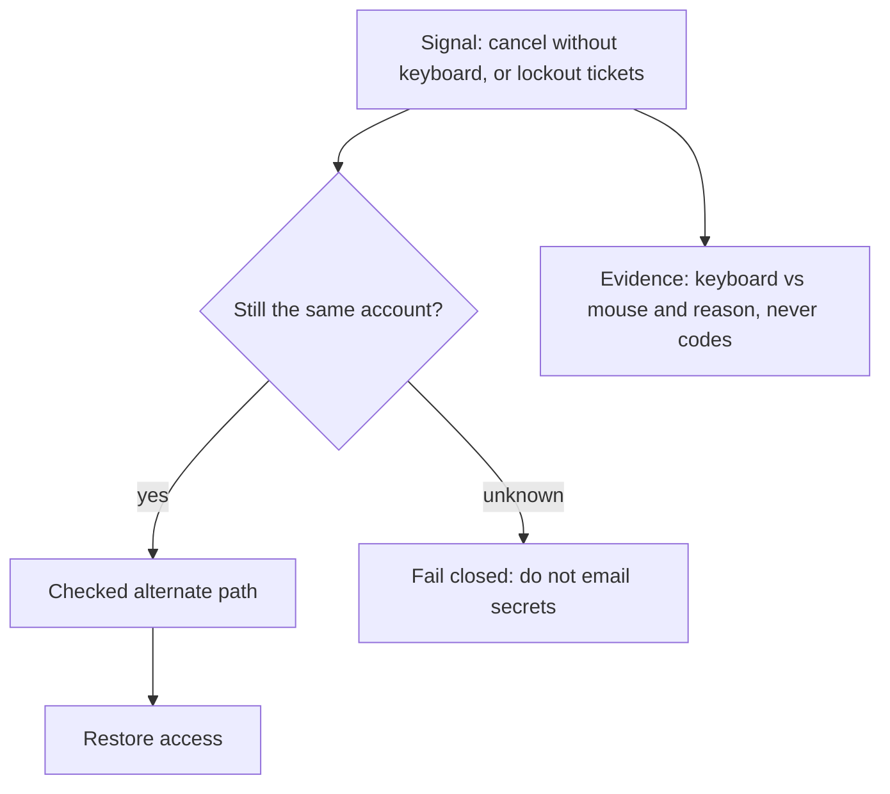

# Notice and recover without handing support the keys

**Kind:** operations-exercise
**Loop step:** 6 Operate

## Fixing it once is not enough

Even after the button is fixed, someone will still fail recovery: a new exclusion you did not model, a library regression, a coercion event. Then notice the failed recovery, contain the leftover path, restore access, and refuse to “help” by emailing note bodies.

## Picture: the loop continues without lowering the bar

A broken recovery widget still has to be usable from the keyboard, not only the mouse. Support must not read codes aloud. The other path still has to be a checked control. Then restore access. Do not email notes.



Buying a log product does not make recovery usable from the keyboard. Ticking a checklist does not restore the control.

## Signals that do not become a second leak

| Outcome | This topic |
|---|---|
| Notice | Support spike: “cannot click recover”; product counts: confirm vs cancel with keyboard, pointer, or unknown |
| What the line holds | Account id, control id, success/fail, keyboard vs mouse — **never** recovery codes, note bodies, or real email addresses |
| Respond | Stop pointing people at the broken widget; open the alternate checked path; do not grant support a read-aloud of codes |
| Recover | Owner completes a usable confirm; revoke a shared admin session if that shortcut appeared |
| Leftover | Coercion; this practice is not production telemetry |

```text
recovery_confirm fail account=a1 control=confirm-recovery modality=unknown reason=not_keyboard_operable
```

Not: the code, the note, or a personal mailbox.

## Degrade without leftover permission

If the primary widget is broken, degradation is **another checked, usable path**, not “trust support.” Support reading codes aloud is a new who-what-action row you denied on the design page.

## Practice

Write a log line (ids, reason, no body, no real email). Write who owns the coercion leftover and what trigger reopens it.

## Use it somewhere new

Clinic second factor fails for keyboard-only clinicians. What notice is privacy-safe (no chart text), and what recover path stays checked (no “text me the one-time code on a shared phone”)?

## Can people still use it

The alternate path must itself meet keyboard, name, and not-color-only. Those rules apply to that path too. They are not a privacy policy.

## What this page is not doing

Answer keys are not on this site.
