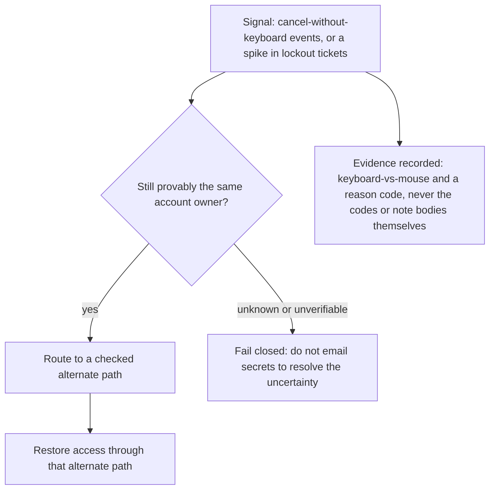

# Notice and recover without handing support the keys

**Kind:** operations-exercise
**Loop step:** 6 Operate

## Fixing it once is not enough

Lesson 04's fix makes the confirm control named, keyboard-operable, and color-safe on the day it ships. It does not make that true forever. A new CSS exclusion rule, a component-library regression that quietly drops the `keyboard` attribute during a refactor, or a coercion event happening to a specific real person can all fail recovery again after the structural fix is in place — and none of those three causes is "we forgot the original lesson." The operate step of the loop exists precisely because a fix that only works at ship time is not actually a fix; it is a snapshot that will drift. This lesson is about what has to be true on an ordinary Tuesday, months after Lesson 04's pull request merged: notice the failure when it happens, contain whatever leftover path someone reaches for instead, restore access through a path that is still checked, and never let the response itself become a new leak by putting note bodies or recovery codes into a log line.

## Picture: the loop continues without lowering the bar

The point of this diagram is that "degrade" is not a separate, lower standard from the primary path — it inherits every rule the primary path had to meet.



A broken recovery widget still has to be usable from the keyboard once you route around it — the alternate path is not exempt from Lesson 01's rule just because it is labeled "backup." Support must not read codes aloud as a substitute for a working alternate path, because that substitution is exactly the who-is-allowed change Lesson 02 denied by name. A log pipeline recording every attempt does not, by itself, make recovery usable from the keyboard; observability and usability are different properties, and a system can have excellent logs describing a control nobody can actually operate.

## Signals that do not become a second leak

| Outcome | This topic, specifically |
|---|---|
| Notice | A support-ticket spike saying "cannot click recover"; product-side counts of confirm-versus-cancel broken down by keyboard, pointer, or unknown modality |
| What the log line holds | Account id, control id, success-or-fail, and keyboard-versus-mouse modality — **never** recovery codes, note bodies, or a real email address |
| Respond | Stop directing people at a widget known to be broken; open the alternate checked path; do not grant support staff a read-aloud of codes as a stopgap |
| Recover | The owner completes a genuinely usable confirm; revoke any shared admin session if that shortcut had already appeared as a workaround |
| Leftover, still | Coercion; and the fact that this practice fixture is not production telemetry, so none of these signal names should be copy-pasted as if they were already wired into a real system |

A concrete log line for this signal looks like this, and every field in it is deliberately chosen to be useless to an attacker who somehow reads the log:

```text
recovery_confirm fail account=a1 control=confirm-recovery modality=unknown reason=not_keyboard_operable
```

Compare that to what it deliberately excludes: the recovery code itself, the note body, or a real email address. If any of those three appeared in the line, the operational fix for one failure (a broken button) would have created a second, independent failure (a secret sitting in a log aggregator that dozens of engineers can query), which is worse than the original problem, not merely unrelated to it.

## Degrade without granting leftover permission

If the primary widget is broken, degradation has to mean **another checked, usable path** — not "trust support to sort it out by voice." Support reading codes aloud is not a neutral stopgap; it is a new who-what-action row that Lesson 02's design table explicitly denied, and reaching for it under operational pressure does not retroactively make it acceptable. The pressure to degrade quickly during an incident is real, and it is exactly the moment a team is most likely to grant an ad hoc exception that becomes permanent because nobody circles back to remove it once the fire is out.

## Worked example: tracing one incident through the loop

A component-library upgrade silently drops the `keyboard` prop from every button that does not explicitly re-declare it, three months after Lesson 04's fix shipped. Trace what happens, step by step, rather than jumping straight to "add a regression test."

First, notice: support tickets saying "cannot click recover" begin arriving at a higher rate than baseline, and the product-side counter for keyboard-modality confirms drops toward zero while mouse-modality confirms stay flat — the signal exists before anyone reads a single ticket, because the counts themselves shifted. Second, decide: for each affected account, is the person requesting help still provably the account owner, using whatever identity signal the product already had before this incident? If yes, route them to the checked alternate path from the diagram above; if that cannot be established, fail closed rather than accepting a phone call as sufficient. Third, recover: once the regression is identified and reverted, the primary path is usable again, and any admin session that got shared as a stopgap during the incident window gets revoked, not left in place because "it's fine now."

Now trace the counterexample: suppose the team's first instinct, under ticket pressure, is to have support read codes aloud "just for this week while we investigate." That decision is not a temporary operational choice with no lasting cost — it is the exact who-is-allowed change Lesson 02's design table denied, and "just for this week" is how temporary exceptions become permanent, because the pressure that justified it (an active incident) is gone by the time anyone would need to justify removing it.

## Practice

Draft a deny line with account and control ids and a reason code — never a body, a code value, or a real email address. Name who owns the coercion leftover from Lesson 01 and 02, and state the specific trigger that would cause someone to revisit it (a new device requirement, a safe-word mechanism, or a reported incident).

## Use it somewhere new

When a clinic's second factor fails for a keyboard-only clinician mid-shift, what notice is privacy-safe — meaning it carries no chart text, no patient identifier beyond an opaque account reference — and what recovery path stays checked, ruling out "text the one-time code to a shared nursing-station phone" as an acceptable degrade?

## Can people still use it

The alternate path itself must meet keyboard operability, carry a real name, and avoid color as the only cue — Lesson 01's rules apply to the fallback exactly as much as to the primary control, and treating a fallback as exempt from the rule it was built to satisfy is a common and costly mistake. These are not a privacy policy layered on afterward; they are the same security claim, applied to a second piece of UI.

## What this page is not doing

Answer keys are not on this site; they live only in `content/assessment/keys/1.4.md`, isolated from every learner-facing page including this one.
