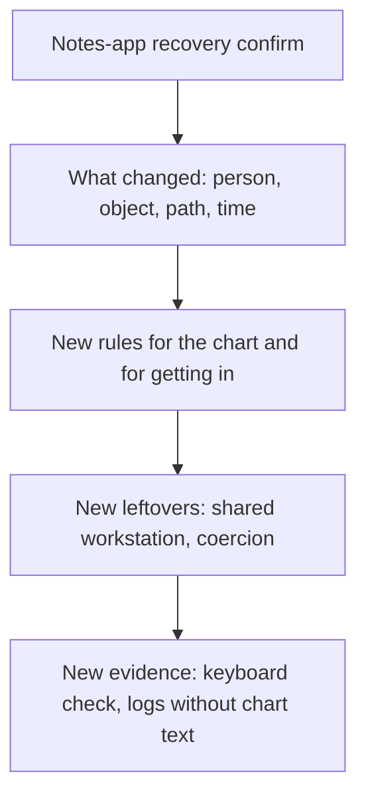

# Same idea at a clinic and a bank

**Kind:** transfer-challenge
**Loop step:** 7 Transfer

## Use it somewhere new

You get a **clinic portal** that adds a second factor, and a **banking re-auth** dialog as a second sketch. One of the second-factor UIs is mouse-only.

## Picture: transfer changes the envelope, not the product name

Renaming “recovery confirm” to “clinic step-up” is not transfer. Keyboard lockout and chart-exposing shortcuts are new rules. Support reading a code aloud is a new who-is-allowed row, not a usability win.

| Notes app this week | Clinic / bank sketch |
|---|---|
| Owner recovering a notes account | Exhausted clinician or customer on a shared workstation |
| Recovery confirm widget | Second-factor or re-auth dialog over a chart or balance |
| Lockout or support read-aloud of codes | Lockout or chart/balance exposed by a shortcut |
| Coercion leftover | Still coercion; SMS to a shared phone is a new path |

## Prompt A — clinic second factor

The second factor is a mouse-only dialog over a patient chart.

Your answer must include:

- who can act (exhausted clinician; shared workstation; someone who wants the chart);
- what you trust (the browser is hostile; the dialog is what you trust for this step);
- what must not happen (keyboard-only clinician locked out **or** a shortcut that exposes the chart);
- a test idea that would fail if the rule were false (check on name/keyboard/not-color-only — run only on a local practice you own, never on the real clinic);
- leftover risk (coercion; SMS to a shared phone);
- whether the human path must meet the web accessibility baseline (yes, as a baseline, not as a full badge).

## Prompt B — banking re-auth

A bank “fixes” mouse-only by offering support that will read the one-time code aloud. State which who-is-allowed row changed (support × code × read-aloud) and why that is not a usability win.

## What is not good enough

| Reject | Why |
|---|---|
| A tool or famous-bugs-list name as the rule | You still have not named the outcome |
| “The framework is accessible” as the promise | You need a claim about this journey |
| A live-target plan against a hospital or bank | Course rules |
| Deleting coercion because the button is larger | Leftover risk needs an owner |

## Practice

One page. No answer keys. The only running system you may break is `labs/1.4/1.4-risk-register`.

## What this page is not doing

Real clinics, real banks, real patient or financial data.
