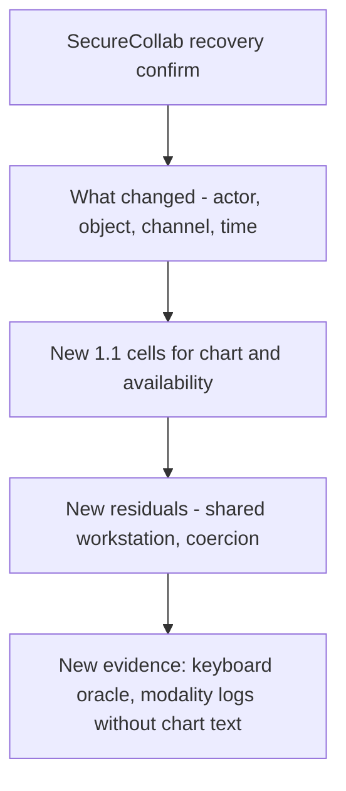

# 1.4-LO-07 — Rewrite the register when the human path changes

**Kind:** transfer-challenge  
**Loop step:** 7 Transfer  
**Standards:** WCAG 2.2 (final); NIST SP 800-63-4 (final) risk language; CISA Secure by Design (current public guidance, final). Do not cite a Top 10 item as the definition of security.

## Change the product, keep the loop

SecureCollab scaffolding goes away. You get a **clinic portal** that adds step-up authentication, and a **banking re-auth** dialog as a second sketch. One of the second-factor UIs is mouse-only. Your job is to rewrite the 1.4 loop, not to name a CWE.

## Mental model: transfer changes the envelope, not the product name

Renaming “recovery confirm” to “clinic step-up” is not transfer. Actor, object, channel, and residual change. Keyboard lockout and chart-exposing workarounds are new 1.1 cells. Support reading a code aloud is a new 1.2 cell, not a usability win.

## Prompt A — clinic step-up

The second factor is a mouse-only dialog over a patient chart.

Your answer must include:

- attacker capabilities (exhausted clinician; shared workstation; someone who wants the chart);
- trust assumptions (browser is hostile; the dialog is in the TCB for this step);
- the forbidden outcome (keyboard-only clinician locked out **or** a workaround that exposes the chart);
- a test idea that would fail if the cell were false (oracle on name/keyboard/not-color-only — run only on a local fixture you own, never on the real clinic);
- residual risk (coercion; SMS to a shared phone);
- whether the human path must meet WCAG 2.2 (yes, as web baseline, not as a full conformance badge).

## Prompt B — banking re-auth

A bank “fixes” mouse-only by offering support that will read the one-time code aloud. State which 1.2 cell changed (support × code × read-aloud) and why that is not a 1.4 usability win.

## What graders reject

| Reject | Why |
|---|---|
| Tool or awareness-list name as the property | 1.1 |
| “The framework is accessible” as the guarantee | Journey-level claim required |
| Live-target plan against a hospital or bank | Lab policy |
| Deleting coercion because the button is larger | Residual ownership required |

## Practice

One page. No keys. The only running system you may break is `labs/1.4/1.4-risk-register`.

## Non-goals

Real clinics, real banks, real patient or financial data. Gates stay unmarked without evidence.
