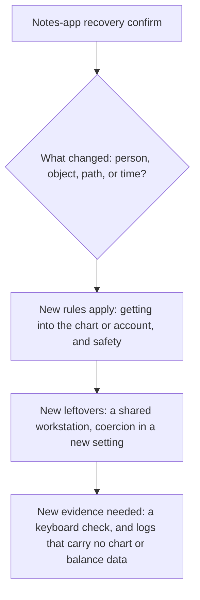

# Same idea at a clinic and a bank

**Kind:** transfer-challenge
**Loop step:** 7 Transfer

## Use it somewhere new

You get two sketches. A **clinic portal** adds a second factor guarding access to a patient chart, and a **banking re-auth** dialog protects a transfer of funds. One of the two second-factor UIs is mouse-only. Neither sketch is a real product, and nothing here is run against a real clinic or bank.

## Picture: transfer changes the envelope, not the product name

The mistake a transfer exercise is designed to catch is treating "clinic" and "bank" as new vocabulary for the same rule, when what actually has to change is the envelope around the rule — who is harmed, what object is exposed, and what a shortcut costs.



A clinic step-up is structurally a recovery confirm — a human must complete an action to proceed past a gate — but the object behind the gate is a patient chart rather than a notes account, and the person on the other end of a lockout might be a clinician mid-shift rather than an individual account owner recovering their own access. Keyboard lockout and chart-exposing shortcuts are the same *shape* of failure as Lesson 01's lockout and shortcut branches, but they are not the same rule, because the harm scenario is different: a locked-out clinician is not merely inconvenienced the way a locked-out notes-app owner is; they may be blocked from time-sensitive patient information mid-shift. Support reading a code aloud is a new who-is-allowed row in this setting too, and it is not a usability win here either, for exactly the reason Lesson 02 named — it substitutes a person's voice for a checked control.

| Notes app | Clinic sketch | Bank sketch |
|---|---|---|
| Owner recovering a notes account | An exhausted clinician on a shared workstation | A customer confirming a funds transfer |
| Recovery confirm widget | Second-factor dialog gating access to a chart | Re-auth dialog gating a transfer of funds |
| Lockout, or support reading codes aloud | Lockout, or a shortcut that exposes the chart to the next person at that workstation | Lockout, or support reading a one-time code back over the phone |
| Coercion leftover | Still coercion, plus a new failure mode: the next clinician on shift inherits an already-confirmed session | Still coercion, plus SMS to a shared household phone as a new, unreviewed path |

## Write this for the clinic second factor

The second factor in this sketch is a mouse-only dialog sitting in front of a patient chart. Your answer must include all of the following, each stated as a specific claim rather than a general one:

- **who might try:** an exhausted clinician working from a shared workstation, and separately, anyone at that workstation who wants to see the chart without being the clinician of record;
- **what you trust:** the browser itself is hostile and untrusted, as always; the dialog's own declared state (name, keyboard, color) is what this specific claim trusts, and nothing beyond that;
- **what must not happen:** a keyboard-only clinician is locked out of the chart, **or** a mouse-driven shortcut exposes the chart to someone other than the clinician of record;
- **a check that would fail if the rule were false:** the same shape as `labs/1.4/1.4-risk-register`'s check on name, keyboard, and not-color-only — run only against a local practice fixture you built yourself, never against a real clinic system;
- **leftover risk:** coercion, unchanged from the notes-app version; and a new one specific to this setting, SMS delivered to a shared workstation phone rather than a personal device;
- **whether the human path must meet the web accessibility baseline:** yes, as a baseline for this one journey — not as a claim that the whole clinic portal has passed a full accessibility audit.

## Write this for the banking re-auth dialog

A bank "fixes" its mouse-only re-auth dialog by adding a path where support will read the customer's one-time code back to them over the phone if they call in stuck. State precisely which who-is-allowed row changed — support × one-time-code × read-aloud — and explain, in your own words rather than by citing this module's earlier wording, why that addition is not a usability improvement: it replaces a check the system itself enforces with a check a human support agent performs by ear, over a channel (a phone call) that is far easier to social-engineer than the original dialog ever was.

## Worked example and counterexample: two clinic "fixes" that are not the same fix

Suppose the clinic team responds to a lockout complaint by adding `keyboard: True` and a real accessible name to their second-factor dialog, following exactly the structural pattern from Lesson 04. Trace it: the object now carries positive evidence of keyboard support, the checker (if the clinic wrote one that mirrors `is_usable_accessible`) requires that evidence rather than inferring it from an absent `mouse_only` flag, and a keyboard-only clinician can now complete the step. This is the worked example — the same fix, transferred, doing the same work.

Now the counterexample. A different clinic team responds to the same complaint by adding a fallback: if the dialog is not confirmed within sixty seconds, the chart opens anyway, on the theory that patient care cannot wait on an accessibility bug.

```text
worked:         dialog.keyboard = True; dialog.name = "Confirm identity"
                -> checker requires positive evidence -> keyboard-only clinician passes
counterexample: dialog.timeout_open_after_seconds = 60
                -> who-is-allowed decision is bypassed entirely after the timer
                -> anyone waiting sixty seconds gets the chart, clinician or not
```

Trace the counterexample the same way: the object may now genuinely be keyboard-operable in the happy path, so a naive check of "is the primary control accessible" could even pass. But the fallback has quietly deleted the who-is-allowed decision Lesson 01's diagram insisted could not be removed — anyone who can wait sixty seconds now gets the chart, accessible clinician or not. This is not a transfer of Lesson 04's fix; it is a transfer of Lesson 01's warning about what happens when the Decision box is removed, dressed up as an accessibility accommodation. The two clinics' changes look superficially similar, each described internally as "we improved the second factor," and they are not the same change at all — one closes a lockout, the other opens a much larger hole while appearing to close the same one.

## What is not good enough

| Reject | Why |
|---|---|
| A tool or a famous-bug-list name offered as the rule | Naming a category is not the same as naming this journey's specific forbidden outcome |
| "The framework is accessible" offered as the whole claim | You need a claim about *this* journey, not a claim about the library it happens to be built from |
| A live-target plan against an actual hospital or bank | Forbidden by this course's laboratory policy, full stop |
| Deleting the coercion row because the button got larger | A bigger button changes nothing about whether someone can be physically forced to press it |

## Practice

Bind the recovery-confirm rule to one concrete page in each sketch — the clinic dialog, and the bank dialog — rather than leaving either answer at the level of "the same principles apply." Keep the answer keys closed while you do this. The only running system you may actually execute code against is `labs/1.4/1.4-risk-register`; the clinic and bank sketches are written exercises, not executable fixtures.

## What this page is not doing

Do not use real clinics, real banks, or real patient or financial data anywhere in either sketch above.
