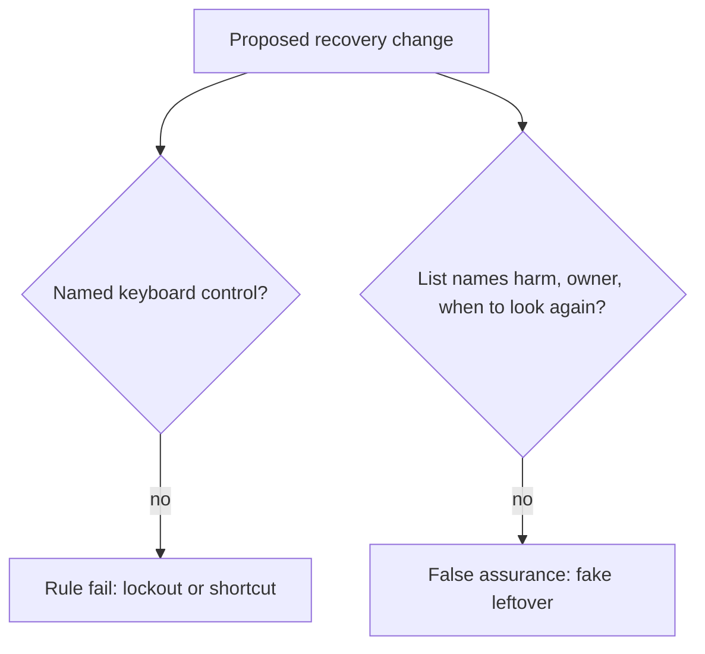

# Review a risk list that names tools instead of harm

**Kind:** code-review
**Loop step:** Review

## What you are reviewing

Review the recovery confirm and the risk register. Mark each claim **rule**, **tool**, or **false assurance**, and say whether lockout, a shortcut that leaks, or a missing record would land if they ship. Open the confirm widget and the register row. An accessibility badge can wait.

The review is whether `test_recovery_control_is_usable_and_accessible` passes, not whether someone wrote “will fix accessibility later.”

## Picture: problems to find (name them yourself)

Start at the control and the list, not at the tool names. A missing name a screen reader can speak, color-only distinction, mouse-only confirm, or “users should be careful” leftover each maps to a rule. Do not open the keys file. For each problem, write the label and the rewrite.

- Confirm button has no accessible name
- Confirming action distinguished only by red vs green
- Mouse-only drag-to-confirm
- Risk list lists leftover as “users should be careful”

Also reject: trusting the browser as the vault; closing a finding without re-running `--impl fixed`; keys in learner notes; “we should try this on the staging clinic.”

## Common mix-ups

- Accessibility is a separate compliance track from security
- Friction always increases security
- Attacker effort is the only effort that counts — not the legitimate user stuck in a flow
- A maturity score or scanner color is leftover risk
- Coercion is solved by CSS

## Use it somewhere new

On a mouse-only second-factor screen, write the same four problem names as they would appear in that UI (unnamed dialog, color-only continue, pointer-only, leftover “clinicians should be careful”).

## Can people still use it

Keyboard, not-color-alone, and a large enough target apply to the control. They are not a privacy policy.

## What this page is not doing

A mouse-only confirm with only “will fix accessibility later” is leftover lockout with no owner.
