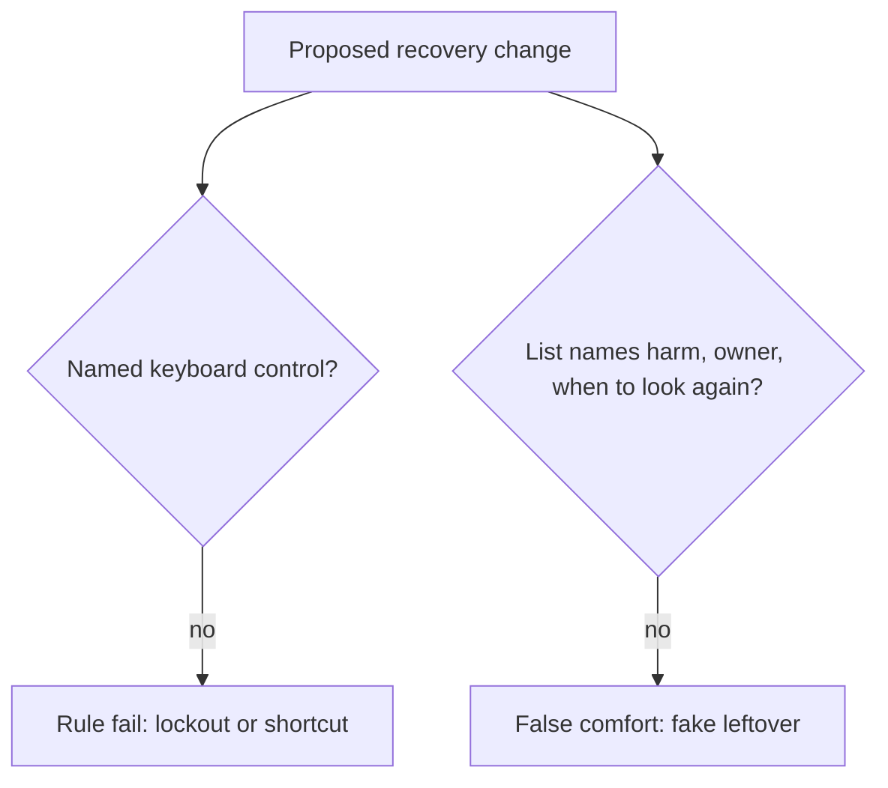

# Review a risk list that names tools instead of harm

**Kind:** code-review
**Loop step:** Review

Intended findings live only in the answer-key folder — not here. Do not open that file until your review has been evaluated.

## What you are reviewing

A colleague ships a notes-app recovery confirm and a “risk register.” Your job is to label each claim **rule**, **tool**, or **false comfort**, and to say which outcome (lockout, shortcut/secrecy, or a missing record) breaks if they ship. Start at the confirm widget and the register row, not at a scanner color or an accessibility badge.

The folder `labs/1.4/1.4-risk-register/vulnerable/` is the change. The check you already ran (`test_recovery_control_is_usable_and_accessible`) is the rule test. A comment “will fix accessibility later” is not.

## Picture: problems to find (name them yourself)

Start at the control and the list, not at the tool names. A missing name a screen reader can speak, color-only distinction, mouse-only confirm, or “users should be careful” leftover each maps to a rule. Do not open the keys file. For each problem, write the label and the rewrite.

- Confirm button has no accessible name
- Confirming action distinguished only by red vs green
- Mouse-only drag-to-confirm
- Risk list lists leftover as “users should be careful”

Also reject: trusting the browser as the vault; closing a finding without re-running `--impl fixed`; keys in learner notes; “we should try this on the staging clinic.”

## Common mix-ups

- Accessibility is a separate compliance track from security
- Friction always increases security
- Attacker effort is the only effort that counts — not the legitimate user stuck in a flow
- A maturity score or scanner color is leftover risk
- Coercion is solved by CSS

## Practice

Write three review notes a maintainer could act on. Each note: what you saw, rule or false comfort, suggested structural change, leftover you will **not** delete. Tie at least one note to `test_recovery_control_is_usable_and_accessible`. Do not open the keys file.

## Use it somewhere new

Clinic mouse-only second factor: write the same four problem names as they would appear in that UI (unnamed dialog, color-only continue, pointer-only, leftover “clinicians should be careful”).

## Can people still use it

Keyboard, not-color-alone, and a large enough target apply to the control. They are not a privacy policy.

## What this page is not doing

Do not merge by adding a comment “will fix accessibility later.” That comment is leftover risk without an owner.
