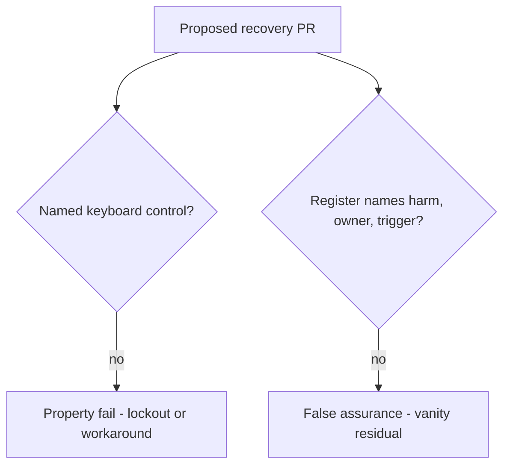

# 1.4-LO-08 — Review a register that lists tools instead of harm

**Kind:** code-review  
**Loop step:** Review  
**Lab:** `labs/1.4/1.4-risk-register/vulnerable/` as a SecureCollab PR  
**Standards:** WCAG 2.2 (final); NIST CSF 2.0 GV; Saltzer and Schroeder psychological acceptability (1975, seminal).

Intended findings live only in `content/assessment/keys/1.4.md` — not here.

## What you are reviewing

A colleague ships a recovery confirm and a “risk register.” Your job is to label each claim **property**, **mechanism**, or **false assurance**, and to say which 1.1 cell breaks if they ship.

## Mental model: four seeded smells to find yourself

Do not open the keys file. For each smell, write the label and the rewrite.

- Confirm button has no accessible name  
- Destructive or confirming action distinguished only by red vs green  
- Mouse-only drag-to-confirm  
- Risk register lists residual as “users should be careful”

Also reject: client trust as the TCB; closing a finding without a retest; keys in learner notes; live-target “we should try this on staging clinic.”

## Misconceptions this module refuses

- Accessibility is a separate compliance track from security  
- Friction always increases security  
- Work factor applies only to attackers, not to legitimate users stuck in a flow  
- SAMM or scanner color is residual risk  
- Coercion is solved by CSS  

## Practice

Write three review notes a maintainer could act on. Each note: observation, property or false assurance, suggested structural change, residual you will **not** delete. Do not open the keys file.

## Transfer

Clinic mouse-only step-up: write the same four smell names as they would appear in that UI (unnamed dialog, color-only continue, pointer-only, residual “clinicians should be careful”).

## Usability

WCAG 2.2 2.1.1, 1.4.1, and 2.5.8 apply to the control. They are not a privacy policy.

## Non-goals

Do not merge by adding a comment “will fix a11y later.” That comment is a residual without an owner.
