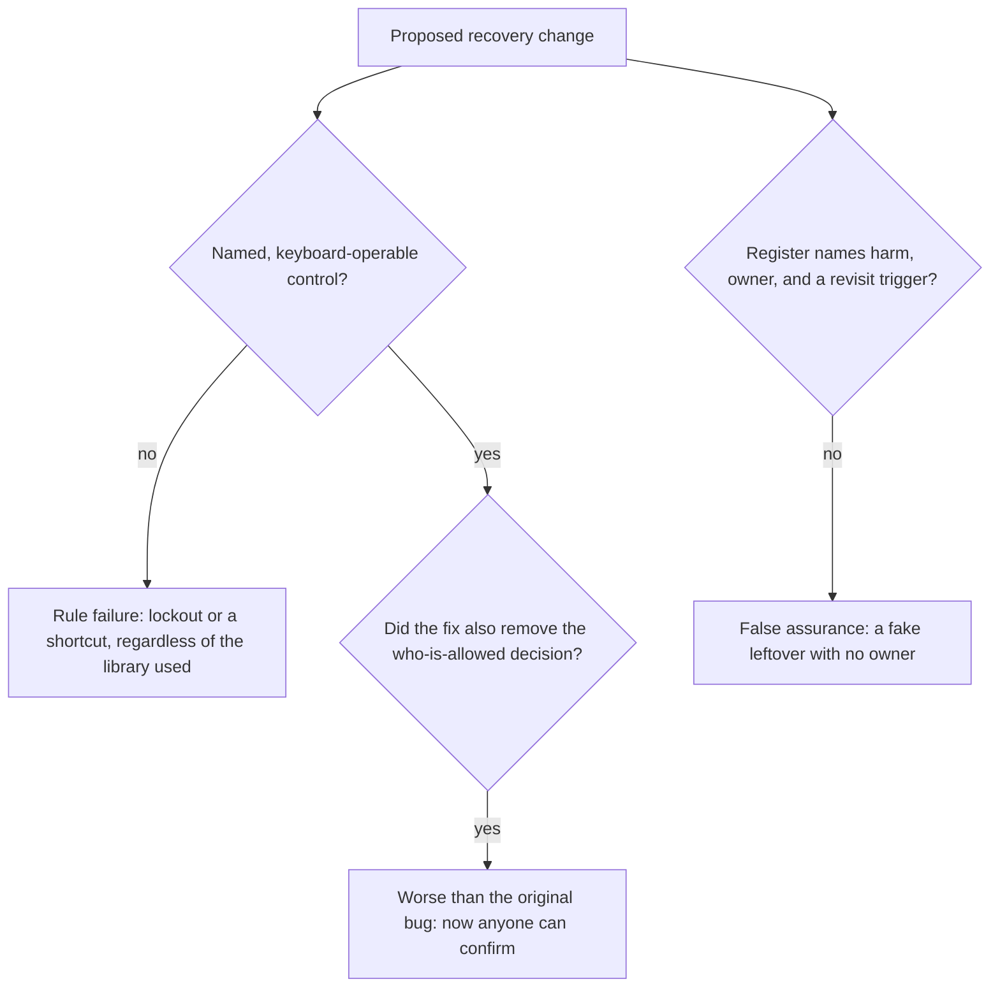

# Review a risk list that names tools instead of harm

**Kind:** code-review
**Loop step:** Review

## What you are reviewing

Review a proposed recovery-confirm change and its accompanying risk register entry together, because a plausible-looking fix and an honest register entry are two separate claims that a reviewer has to check independently — a register can say all the right words while the actual object it describes still fails, and a genuinely fixed object can still be paired with a register entry that quietly deletes a real residual. Mark each claim you find as **rule**, **tool**, or **false assurance**, and for each one, say specifically whether lockout, a shortcut that leaks, or a missing record would land in production if the change ships as written. Open the confirm widget itself and the register row describing it; an accessibility badge sitting in a marketing deck is not something you need to open, because it answers a different question than the one this review is checking.

The review's actual bar is whether `test_recovery_control_is_usable_and_accessible` and its five companion tests in `labs/1.4/1.4-risk-register/tests/test_recovery_a11y.py` would pass against the proposed change, not whether someone on the team wrote "will fix accessibility later" in a comment. A comment promising future work is not evidence about the code in front of you.

## Picture: problems to find, but name them yourself first

Start at the control's declared properties and at the register's leftover column, not at whatever tool names appear in the pull request description — a PR that says "added react-aria" has told you nothing about whether *this specific* control ended up with a name, keyboard support, and a non-color cue.



The third question is the one most reviews skip, because a change that fixes accessibility and simultaneously weakens the underlying authority check *looks* like pure progress if you only check the accessibility half. A confirm button that is now named, keyboard-operable, and reachable by anyone regardless of ownership is not a fix; it is the coercion and impersonation problem with better UX.

## The submission under review

You are handed the following PR description and the accompanying register row, exactly as a teammate submitted them. Do not assume either is honest; that is the thing you are checking.

> **PR: "Improve recovery confirm accessibility"**
> Switched the recovery confirm button to a red/green drag-to-confirm slider so it's more obvious which action is destructive. Updated the risk register: "Residual: users should be careful when recovering their account."

Apply the four-question checklist below to this submission, in this order, before you read any further in this lesson:

1. Does the changed control have an accessible name a screen reader could announce — not merely a visual label?
2. Is the confirm action distinguished from cancel by more than color alone?
3. Is the control operable without a pointer, or does "drag" already answer that question?
4. Does the register's leftover entry name a specific harm with an owner and a revisit trigger, or does it read like a phrase that could apply to any change whatsoever?

Write down your answer to each question — pass or fail, and why — before comparing against anything else. The point of asking in this order is that a PR description full of confident-sounding language ("more obvious," "updated the risk register") is exactly the kind of submission a reviewer approves on a skim; each question forces you to check the object itself rather than the description of it.

Also reject, on sight, regardless of how the rest of the change reads: trusting the browser itself as a vault for anything sensitive; closing a finding in the tracker without re-running `--impl fixed` to confirm the fix actually holds; a key or examiner note appearing in learner-facing notes where it does not belong; and "we should try this against the staging clinic environment" as a verification plan, which this course's laboratory policy forbids regardless of whether staging is nominally non-production.

## Worked example: reading a submitted diff the way this review expects

A submitted change includes this object, replacing the vulnerable fixture:

```text
{"id": "confirm-recovery", "name": "Confirm", "color": "green", "mouse_only": False}
```

Read it the way this review expects, before running anything. `mouse_only` is now `False` — the obvious defect from Lesson 03 is gone. `name` is now a non-empty string — the second obvious defect is also gone. Someone skimming for the two named problems from that lesson would approve this diff. But there is no `keyboard` key anywhere in the object, and Lesson 03 and Lesson 04 both established that a checker requiring only "not flagged mouse-only" accepts this silently, which is exactly the fail-open-by-omission gap this module keeps returning to. Run `is_usable_accessible` from the fixed checker against this exact object and it correctly returns `False`, because the fixed checker requires positive evidence of `keyboard`, not merely the absence of `mouse_only`. A reviewer who only checks for the two flags named in the bug report — and this diff genuinely fixes both of them — still has to check for the property the bug report never mentioned, which is why "does it pass the actual test suite" is a stronger review question than "does it fix the two things I was told to look for."

## Common mix-ups this module refuses

- Treating accessibility as a compliance track that runs on a separate timeline from security work, rather than as part of the same security claim.
- Assuming friction always increases security, when Lesson 01's two-effort picture showed it can just as easily produce a bypass.
- Counting only attacker effort and ignoring the legitimate user stuck in the flow, which is the mistake that produces friction theater.
- Treating a maturity score or a scanner turning from red to yellow as if it were itself a named, owned residual risk.
- Assuming coercion is solved by CSS, layout, or any other purely visual change to the control.

## Use it somewhere new

You are handed a second submission: a clinic's second-factor dialog, described in its own PR as "a quick continue button so clinicians can get back to the chart fast." Apply the same four-question checklist to this new submission independently — do not assume it fails the same way the notes-app one did, and do not assume it fails at all. Write your pass/fail answer to each of the four questions before deciding whether this is the same defect wearing new words or a genuinely different situation. Getting the same four *categories* right without independently checking whether each one actually applies here would mean you memorized this module's specific examples rather than learned the method.

## Can people still use it

Keyboard operability, a cue that is not color alone, and a target large enough to hit reliably apply to the control itself, not to the product's marketing claims about the control. They are not a privacy policy layered on top of a separately real fix — meeting them for this journey *is* the fix this module teaches, restated one more time because it is the single most common thing a review misses.

## What this page is not doing

A mouse-only confirm accompanied only by a "will fix accessibility later" comment is not a deferred nice-to-have; it is leftover lockout with no owner and no trigger, and a reviewer who approves it as-is has approved exactly that. Answer keys are not on this site; the intended findings for this seeded review live only in `content/assessment/keys/1.4.md`.
