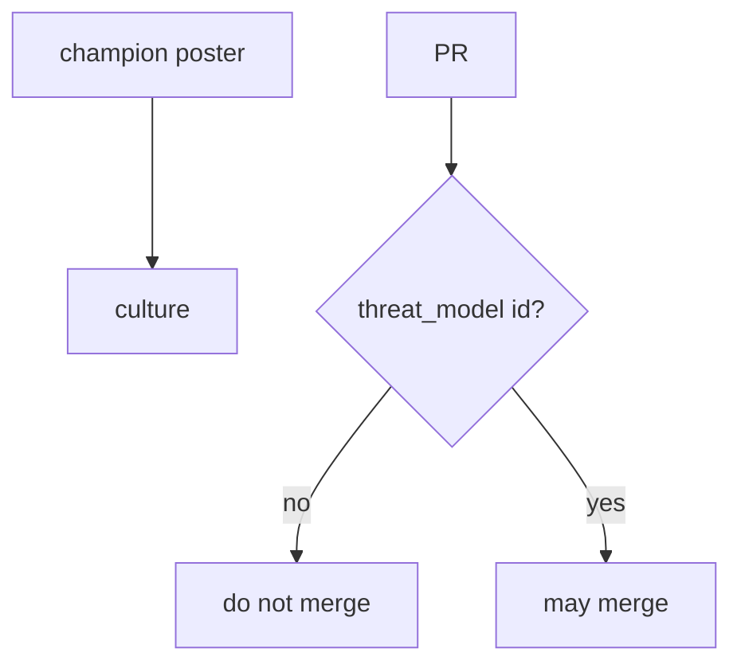
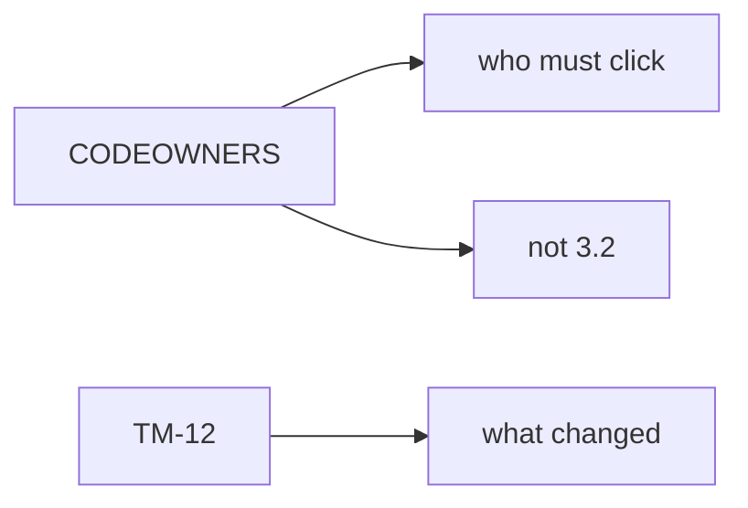

# Culture is the merge check, not a poster

**Kind:** concept-model
**Loop step:** 1 Property

## The rule

The notes app treats a material change — identity, stored data, mobile, or a queue — as a threat-modeling event (3.2). **Culture is whether that change can merge without a threat-model identifier.** A champion poster on the wall, a CODEOWNERS file, or a box that says “HIPAA training complete” is **not** that check.

> `merge_ok({})` must be false. `merge_ok({"threat_model": "TM-12"})` may be true.

What must not happen: **merge without a threat-model identifier**. That is honesty of the process evidence you show before the change lands. If the merge is green while the identifier is missing, those surfaces ship with no 3.2 model.

A design-review guide is vocabulary for “think about security while you design.” It is not `merge_ok`. A process-maturity score measures whether a practice exists somewhere in the company. An unverified “secure by design” page talks about manufacturer ownership. It does not stamp the pull request. An extra advanced row — for example “document the dangerous function” — is a reason to *require* a threat model. It is not the merge check itself. A later draft of the design-review guide stays a **draft**.

## Picture: poster vs merge check



## Picture: CODEOWNERS is not a threat model



**A tool, not the rule:** CODEOWNERS, a maturity score, a training checkbox, or a “secure by design” pledge.

## Why it happens, what it costs, how you stop it, how you notice, how you recover

| Slice | For this rule |
|---|---|
| Why it happens | Security treated as a later phase |
| What has to be true first | `merge_ok({})` is true |
| Trigger | Identity, data, or mobile change with no threat-model id |
| What it costs | Surfaces land without a 3.2 model |
| How you stop it | Require a threat-model id on those surfaces |
| How you notice | `merge_blocked_no_tm` |
| How you recover | Open a threat model, then merge |

## What the framework does vs what you still have to check

Required reviewers on GitHub are not a threat model. A stale threat-model id is an age problem for 3.2 — still better than none, still not a rubber stamp forever.

An empty change is deny — files in `labs/10.1/10.1-lab`. Fake pull-request dicts only. No live GitHub orgs.

## What the tool cannot do

- A hotfix path must still *record* a threat-model id after the fact.
- Counting closed vulnerability tickets is a vanity score, not this check.
- Exceptions without an expiry date (E6) are silent holes.

## Can people still use it

The merge screen has to say which surface still needs a threat-model id, in words, not only a red X. Do not hide the gap behind a poster.

## Practice

Write the merge checklist line. Then run:

```text
python3 -m pytest labs/10.1/10.1-lab/tests --impl vulnerable
python3 -m pytest labs/10.1/10.1-lab/tests --impl fixed
```

## Use it somewhere new

An exception path (E6) that still names the missing threat model and when it expires. A clinic that treats “HIPAA training complete” as enough to merge.

## What this page is not doing

Do not use live GitHub orgs. This page does not finish Gate 10 or M4. Do not use ready-made attack recipes. Answer keys are not on this site.
